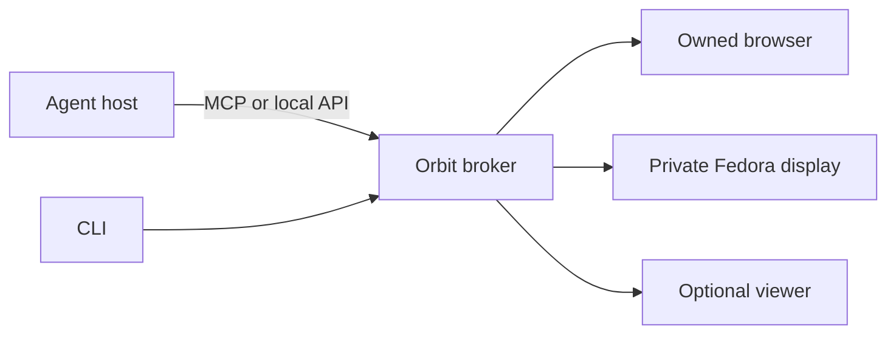

# Sbar Orbit

Local application workspaces for tool-capable AI agents.

**Experimental alpha, Apache-2.0.** Orbit gives an agent an owned browser or private Fedora display. You can keep working, open a viewer when needed, pause, take control and resume. It does not attach to your personal browser profile.



## Start

Requires Linux user cgroup delegation, Bun and Chrome/Chromium. The native backend needs the separate [Fedora bootstrap](docs/fedora-results.md).

```sh
bun install --frozen-lockfile --ignore-scripts
./bin/sbar-orbit serve
```

The broker prints a socket path. Set `ORBIT_SOCKET` to that value in another terminal, then use `./bin/sbar-orbit session create` or generate MCP configuration with `./bin/sbar-orbit connector-config`. [CLI guide](docs/cli.md).

## Scope

The alpha includes browser/native lifecycle tests and a successful scripted 10-minute viewer run. See [validation](docs/validation.md). Human participation, wider account/application compatibility, clean-machine installation, macOS and Windows remain separate gates.

Display separation is not a security sandbox. Applications retain the OS user's permissions. Closed agent applications without custom tools are not automatically supported.

| Guide | Purpose |
|---|---|
| [Architecture](docs/architecture.md) | Components and control flow |
| [Stories and acceptance](docs/acceptance.md) | User outcomes and checks |
| [Roadmap](docs/roadmap.md) | Remaining milestones |
| [Connectors](docs/connectors.md) | MCP host setup |
| [Resource limits](docs/resources.md) | Aggregate CPU/RAM limits |
| [Preview](docs/preview.md) | Viewing and takeover |
| [Accounts](docs/accounts.md), [files](docs/files.md) | Explicit shared state |
| [Packaging](docs/packaging.md) | Versioned source artifacts |
| [Research](docs/research.md) | Primary technical sources |

[Contributing](CONTRIBUTING.md) · [Security](SECURITY.md) · [Changelog](CHANGELOG.md) · [Apache-2.0 license](LICENSE)
