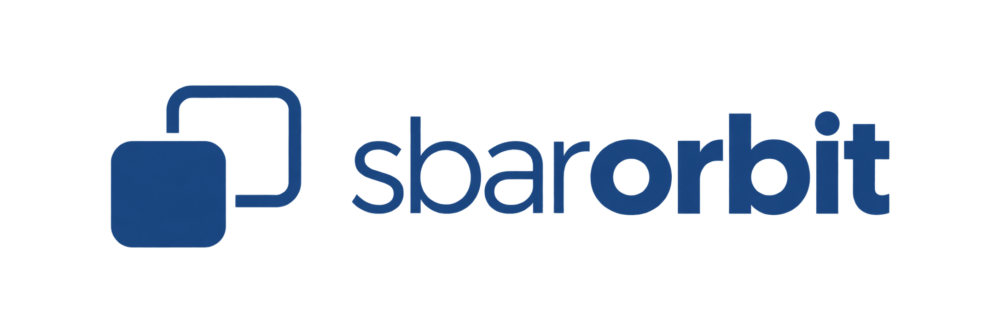
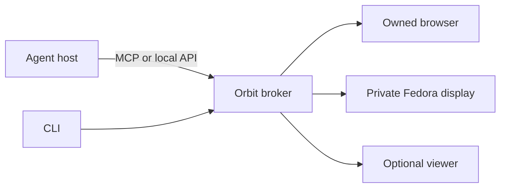

<picture>
  <source media="(prefers-color-scheme: dark)" srcset="brand/logo/lockup-latin-white.png">
  
</picture>

# Sbar Orbit

Local application workspaces for tool-capable AI agents. The mark is two surfaces offset on the diagonal: the screen you keep, and the one Orbit opens beside it. They never touch. [Brand](docs/brand.md).

**Experimental alpha, Apache-2.0.** Orbit gives an agent an owned browser or private Fedora display. You can keep working, open a viewer when needed, pause, take control and resume. It does not attach to your personal browser profile.



## Start

Requires Linux user cgroup delegation, Bun and Chrome/Chromium. The native backend needs the separate [Fedora bootstrap](docs/fedora-results.md).

```sh
bun install --frozen-lockfile --ignore-scripts
./bin/sbar-orbit serve
```

The broker prints a socket path. Set `ORBIT_SOCKET` to that value in another terminal, then use `./bin/sbar-orbit session create` or generate MCP configuration with `./bin/sbar-orbit connector-config`. [CLI guide](docs/cli.md).

## Scope

The alpha includes browser/native lifecycle tests and a successful scripted 10-minute viewer run. See [validation](docs/validation.md). Human participation, wider account/application compatibility, clean-machine installation, macOS and Windows remain separate gates.

Display separation is not a security sandbox. Applications retain the OS user's permissions. Closed agent applications without custom tools are not automatically supported.

| Guide | Purpose |
|---|---|
| [Architecture](docs/architecture.md) | Components and control flow |
| [Stories and acceptance](docs/acceptance.md) | User outcomes and checks |
| [Roadmap](docs/roadmap.md) | Remaining milestones |
| [Connectors](docs/connectors.md) | MCP host setup |
| [Resource limits](docs/resources.md) | Aggregate CPU/RAM limits |
| [Preview](docs/preview.md) | Viewing, takeover, tabs and surface size |
| [Theming](docs/theming.md) | Matching the desktop colour scheme |
| [Accounts](docs/accounts.md), [files](docs/files.md) | Explicit shared state |
| [Packaging](docs/packaging.md) | Versioned source artifacts |
| [Research](docs/research.md) | Primary technical sources |
| [Separate workspace review](docs/separate-workspace-review.md) | Whether this is the best approach, what was refuted, and what a real session costs |
| [Porting](docs/porting.md) | How the approach ports to other Linux desktops, to Windows and to macOS, by capability tier |
| [Autonomy](docs/autonomy.md) | Running without a human checkpoint: the policy, the prior art it borrows from, and what bounds it |
| [Desktop presence](docs/desktop-presence.md) | Status source, edge panel and working indicator, what remains proposed |
| [Appearance](docs/appearance.md) | Applications in a private display look like the desktop |
| [Brand](docs/brand.md) | The mark, the name, the palette and where each asset is used |

[Contributing](CONTRIBUTING.md) · [Security](SECURITY.md) · [Changelog](CHANGELOG.md) · [Apache-2.0 license](LICENSE)
