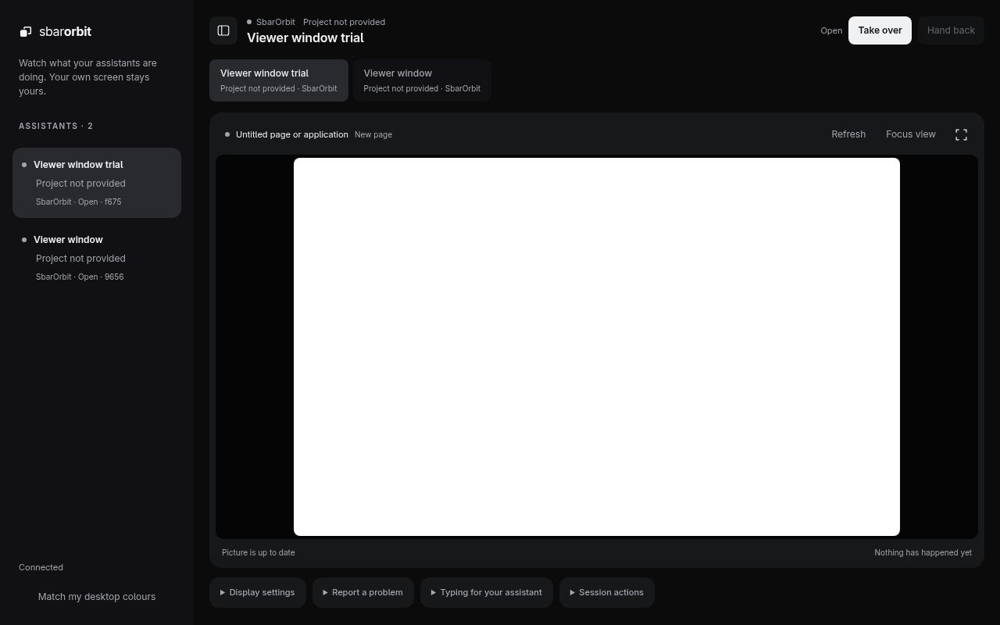
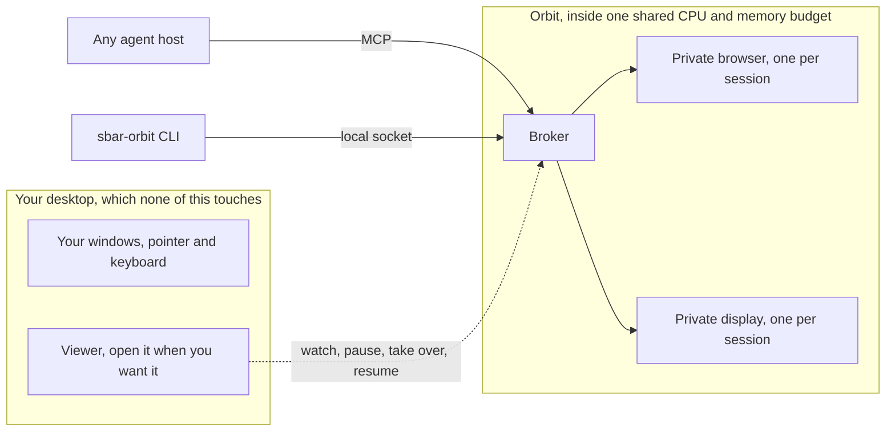
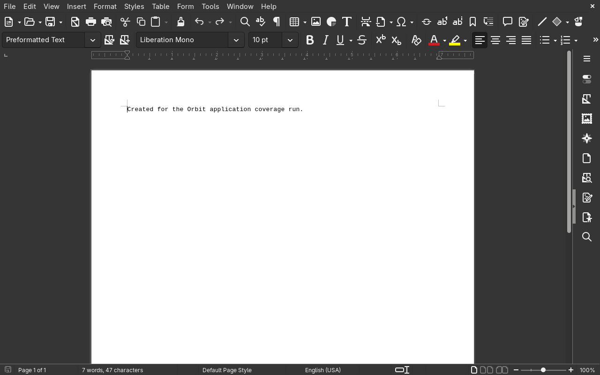
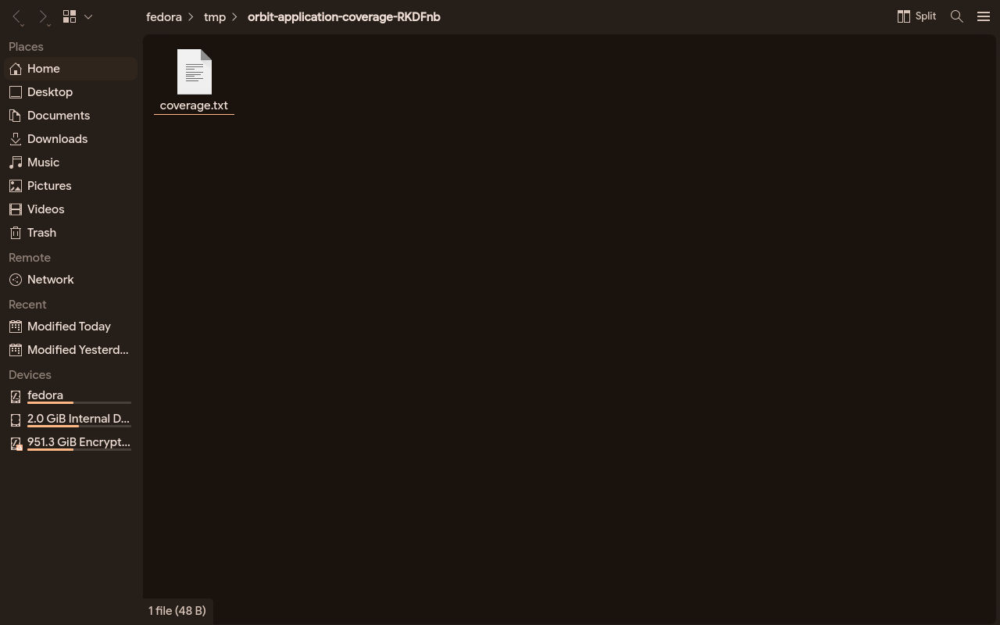

<picture>
  <source media="(prefers-color-scheme: dark)" srcset="brand/logo/lockup-latin-white.png">
  
</picture>

# Sbar Orbit

Local application workspaces for tool-capable AI agents. The mark is two surfaces offset on the diagonal: the screen you keep, and the one Orbit opens beside it. They never touch. [Brand](docs/brand.md).

**Experimental alpha, Apache-2.0.** Orbit gives an agent an owned browser or a private display of its own. You can keep working, open a viewer when needed, pause, take control and resume. It does not attach to your personal browser profile, and the viewer itself opens in a browser window that is Orbit's own, never a tab of yours.





## What it costs an agent

Measured 14 September 2026 on the development host, through the broker's own socket, one browser
session on a real public page; reproduce any line with the CLI in [cli](docs/cli.md).

| Step | Round trip | What comes back |
|---|---|---|
| `session.create` | 431 ms | a session id |
| `navigate` to a public page | 2248 ms | 37 bytes, the time is the network and the page |
| `observe`, image | 87 to 112 ms | a 41 to 58 KiB JPEG at 1280 by 800 |
| `observe`, metadata only | 2 ms | 258 bytes: title, location, tabs, pointer |
| `read` a selector | 43 ms | the element's text |
| `scroll` | 32 ms | 16 bytes |

Orbit itself is not where an agent's time or money goes. Every call above is under a tenth of a
second except the page load, which is the page's. What costs is the model turn around each call, and
above all each image: a 1280 by 800 frame is roughly 1,400 input tokens for a vision model and several
seconds of thinking, every time. An agent that alternates `act` and `observe` with an image after
every action is paying for pictures it did not need. The cheap loop is `read` for text and the
metadata observation for where it is, with an image only when the layout itself is the question; the
[agent interface](docs/agent-interface.md) and the [orbit-usage skill](skills/orbit-usage/SKILL.md)
say the same in the agent's own terms.

<p>


</p>

Two of the fifteen applications launched into a private display, one at a time, on 14 September 2026;
all fifteen mapped. [Validation](docs/validation.md) has the list, the times and what each cost.

## What is actually supported

Orbit's native backend is measured on exactly one host class: Fedora 44, wlroots, cgroup delegation.
The browser backend is measured on four: that host, a GitHub Ubuntu 24.04 runner where `bun run verify`
passed 233 tests on 14 September 2026, a Windows 11 guest where the published release archive
installs and an agent host drives a browser session through MCP, and a GitHub `macos-26-arm64` runner
where the one command install, the launch agent, a browser session and the containment experiment all
ran on 18 September 2026. Every statement about non Fedora Linux beyond what containers of Debian,
Ubuntu, Arch and openSUSE on that one host could show is reasoning rather than a test, which the tier
table marks `Limited`. `sbar-orbit doctor --report` prints which row of the
[support tiers](docs/support-tiers.md) applies to your machine; it needs no broker, and it is safe to
paste into an issue.

One thing to read before trusting a number on macOS: **the resource budget there is advisory, not a
kernel ceiling.** macOS has no cgroup and no job object, so Orbit measures its own process groups
from the kernel and refuses work that would not fit, rather than stopping work that is already over.
`enforcement` reads `advisory` and every dimension is listed as unbounded.
[What macOS measured](docs/macos-measured.md) has the numbers and the limits.

`Reasoned` means installing here produces a test report, not a bug report. `Refused` means a primary
source says it cannot work, so Orbit throws `UNSUPPORTED` rather than degrading quietly, and the tracker
does not accept a bug for it. `Failed` means it ran here and did not pass, and the result is kept rather
than retried into silence.

**No telemetry.** No counters, no ping, no crash upload, no opt in prompt. The only thing that ever
leaves the machine is a report you generated, read and pasted yourself.

## Start

Requires Bun and Chrome, Chromium or Edge. On Linux it also needs user cgroup delegation, which is where
the shared budget lives; on Windows that budget is a named job object instead and there is nothing to
delegate. The native backend is Linux only and needs the separate [Fedora bootstrap](docs/fedora-results.md).

```sh
git clone https://github.com/M7MMAD-OMAR/sbar-orbit
cd sbar-orbit
./install.sh
```

On Windows the same command is `install.cmd`, and it is the same installer behind both doors:

```bat
git clone https://github.com/M7MMAD-OMAR/sbar-orbit
cd sbar-orbit
install.cmd
```

One command, and it shows every step as it happens. It checks what the machine already has, prepares
dependencies from the frozen lockfile, links the `sbar-orbit` command into `~/.local/bin`, installs and
starts the broker service and the desktop mark, writes the agent connector configuration, then verifies
that the installed broker answers. `./install.sh --dry-run` reports the same steps and changes nothing.

Two of those steps differ on Windows and say so in the report rather than claiming a pass: the command
is a `.cmd` shim rather than a symlink, and no service is installed, because a Chromium family browser
will not run in Windows session 0, so the broker belongs in your own session. `verify` is skipped for
that reason too, with the commands to start one yourself. Start it with `sbar-orbit.cmd serve`.

It installs nothing that needs root. Bun, a browser and the capture tools stay your package
manager's job, and the run prints the exact command for each one it finds missing rather than reporting
a success you would discover was false minutes later. It is not a measurement either: it says what was
installed, not what was proven to work.

### Or from a package registry

```sh
bun add -g sbar-orbit
sbar-orbit install
```

`0.1.0-alpha.4` is on the npm registry and was installed back from it and run before this was written. The checkout above is still the path that has been run to completion on a machine; [packaging](docs/packaging.md) says exactly what the registry path has and has not shown.

### Or hand it to an agent

Any agent with a shell can do the whole installation. Give it the Orbit source directory and this:

```text
Install Sbar Orbit on this machine.

1. Clone https://github.com/M7MMAD-OMAR/sbar-orbit into a directory that will stay where it is, and
   work there. If I have already given you the source, use that instead and clone nothing.
2. Read docs/agent-install.md in that directory. It is the contract. This message is only the trigger.
3. Plan before acting: run ./install.sh --dry-run --json and read the JSON. Branch on the fields,
   never on the prose.
4. Run ./install.sh --json. Exit 0 means installed, exit 1 means not installed. Read steps[] to see
   which step stopped it.
5. Run a remedy only when its agentMayRun is true. Everything else is mine: print its command, or its
   message and packages when it carries no command, and stop. Never run it yourself, never add sudo
   to a command that does not have it, and never use sudo for anything.
6. Report back: every step with its state, the capabilities object, and the remedies you did not run.
   Say plainly what is installed and what is not. Do not describe an installation as verified: the
   run reports installation state, not a measurement.
7. Do not open, automate, read or copy my own browser profile at any point, for any reason.
```

The prompt is short on purpose: it points at [the contract](docs/agent-install.md) rather than
restating it, so it cannot drift away from the installer. The contract carries the commands, the JSON
shape, the exit codes, every refusal an agent should expect, and the `agentMayRun` flag that marks the
line between what an agent may run and what it hands back. No model, host or vendor is assumed:
it needs a shell and the ability to read JSON.

The individual steps remain available, which is what to reach for when only one of them is wanted:

```sh
bun install --frozen-lockfile --ignore-scripts
./bin/sbar-orbit service install
```

That installs the broker and the desktop mark and starts both with your desktop, which is the default: a
thing meant to be waiting for your agents should be running. `./bin/sbar-orbit service install
--no-autostart` writes the units and enables nothing. To run it in the foreground instead, use
`./bin/sbar-orbit serve`, which prints a socket path to set as `ORBIT_SOCKET` in another terminal.

Then `./bin/sbar-orbit session create`, or generate MCP configuration with
`./bin/sbar-orbit connector-config`. A right click on the mark opens the settings, which are searchable,
and `./bin/sbar-orbit config search WORD` is the same settings from a terminal. [CLI guide](docs/cli.md).

## Main agent commands

With the Orbit skill selected, type just `off`, `on`, or `status`. For example:
`$sbar-orbit off` or `$orbit-usage off`. The agent resolves the conversation ID.
The default suggestion is `status`, which reads usage state without changing it.
The shell commands below are for direct CLI use.

```sh
export ORBIT_CONVERSATION_ID=unique-task-id  # keep this ID for this conversation
sbar-orbit usage status
sbar-orbit usage off       # reject new Orbit calls in this scope
sbar-orbit usage on        # re-enable only when you ask
sbar-orbit session create
sbar-orbit session observe SESSION_ID --metadata
sbar-orbit session observe SESSION_ID --output /absolute/new-image.jpg
sbar-orbit act SESSION_ID '{"type":"read","selector":"h1"}'
sbar-orbit session stop SESSION_ID
```

MCP has the equivalent `orbit_usage` tool with `mode: "on"`, `"off"` or `"status"`.
Without an explicit conversation ID its switch is connection-local and resets on
reconnect. CLI and MCP share a persistent switch only when launched with the same
ID. A host sharing one MCP process across chats must provide separate scopes.
Off does not close applications, cancel accepted work or remove tool definitions.

The [portable orbit-usage skill](skills/orbit-usage/SKILL.md) makes an explicit
"Do not use Orbit in this conversation" take priority over automatic selection.
It includes setup for CLI/MCP scope and compact observations. Metadata mode avoids
screenshot capture; image mode preserves the title, tabs/windows and dimensions
alongside the image. CLI file output keeps base64 out of the text context.

[Usage, host integration, research and measured limits](docs/agent-interface.md).

## Scope

The alpha includes browser/native lifecycle tests, a scripted 10-minute viewer run, fifteen native applications mapped one at a time, a clean-machine installation in a container with a systemd user session, the mint extension loaded and measured in owned browsers, and one real account carried through a profile restart without a typed password. See [validation](docs/validation.md) and the [roadmap](docs/roadmap.md) for what each of those does and does not show. Windows is measured and
`Limited`: the suite runs on a Windows 11 guest at 218 pass and 0 fail with 102 skipped, the published
release installs there, and an agent host reaches a browser session through the connector Orbit writes.
102 skips is the honest half of that figure, since the private display, the systemd units, D-Bus, the
keyring and btrfs snapshots are Linux capabilities and are not ported. See
[what Windows measured](docs/windows-measured.md).

macOS is measured and `Limited` as of 18 September 2026: the one command install, the launch agent,
a browser session driven through the installed command, and a containment run where a supervisor was
SIGKILLed and left **0 of 10 Chrome processes alive after 105 ms**. Three things are openly not
proven there and are listed rather than buried: the budget is advisory rather than kernel enforced,
the no prompt guarantee has not been seen on a person's real account with a real Chrome history, and
three browser driven suites time out on a small runner for reasons not yet established. See
[what macOS measured](docs/macos-measured.md).

Display separation is not a security sandbox. Applications retain the OS user's permissions. Closed agent applications without custom tools are not automatically supported.

| Guide | Purpose |
|---|---|
| [Architecture](docs/architecture.md) | Components and control flow |
| [Stories and acceptance](docs/acceptance.md) | User outcomes and checks |
| [Roadmap](docs/roadmap.md) | Remaining milestones |
| [Connectors](docs/connectors.md) | MCP host setup |
| [Resource limits](docs/resources.md) | Aggregate CPU/RAM limits |
| [Preview](docs/preview.md) | Viewing, takeover, tabs and surface size |
| [Viewer design](docs/viewer-design.md) | The viewer's palette, elevation and working signals |
| [Theming](docs/theming.md) | Matching the desktop colour scheme |
| [Accounts](docs/accounts.md), [files](docs/files.md) | Explicit shared state |
| [Packaging](docs/packaging.md) | Versioned source artifacts |
| [Research](docs/research.md) | Primary technical sources |
| [Separate workspace review](docs/separate-workspace-review.md) | Whether this is the best approach, what was refuted, and what a real session costs |
| [Porting](docs/porting.md) | How the approach ports to other Linux desktops, to Windows and to macOS, by capability tier |
| [What Windows measured](docs/windows-measured.md) | Every Windows result on a live guest, including the defects only a real machine found |
| [What macOS measured](docs/macos-measured.md) | Every macOS result on a real host: the numbers, the advisory budget, and what is still not proven |
| [Support tiers](docs/support-tiers.md) | What is known to work, on which host class, on what evidence, and which report to file |
| [Autonomy](docs/autonomy.md) | Running without a human checkpoint: the policy, the prior art it borrows from, and what bounds it |
| [Desktop presence](docs/desktop-presence.md) | Status source, edge panel and working indicator, what remains proposed |
| [Appearance](docs/appearance.md) | Applications in a private display look like the desktop |
| [Brand](docs/brand.md) | The mark, the name, the palette and where each asset is used |

## Support the work

Orbit is Apache-2.0, runs entirely on your own machine, and sends nothing anywhere: no telemetry, no
account, nothing metered. That is the point of it, and it is also the reason there is nothing behind
it but time.

If it saved you some, you can buy me a coffee:

<a href="https://www.buymeacoffee.com/m7mmadomar"></a>

A report from a machine this project has never touched is worth as much. Orbit is measured on exactly
one host class, so `sbar-orbit doctor --report` from another distribution, desktop or operating system
is evidence this project cannot produce for itself. [Support tiers](docs/support-tiers.md) says which
report yours is, and [CONTRIBUTING.md](CONTRIBUTING.md) says where it goes.

[Contributing](CONTRIBUTING.md) · [Security](SECURITY.md) · [Changelog](CHANGELOG.md) · [Apache-2.0 license](LICENSE)
