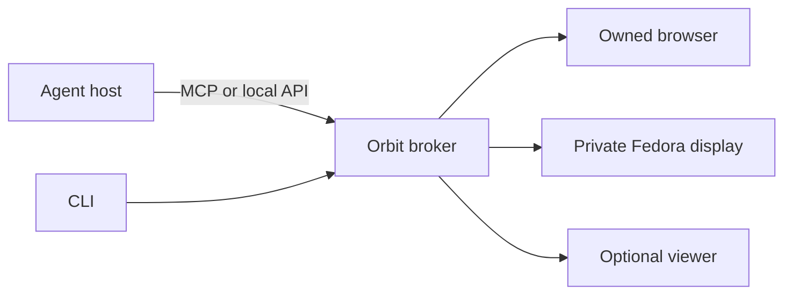

<picture>
  <source media="(prefers-color-scheme: dark)" srcset="brand/logo/lockup-latin-white.png">
  
</picture>

# Sbar Orbit

Local application workspaces for tool-capable AI agents. The mark is two surfaces offset on the diagonal: the screen you keep, and the one Orbit opens beside it. They never touch. [Brand](docs/brand.md).

**Experimental alpha, Apache-2.0.** Orbit gives an agent an owned browser or private Fedora display. You can keep working, open a viewer when needed, pause, take control and resume. It does not attach to your personal browser profile.



## What is actually supported

Orbit is measured on exactly one host class: Fedora 44, wlroots, cgroup delegation. There is no macOS,
Windows or non Fedora Linux machine in this project's reach, so every statement about those platforms is
reasoning about vendor documentation and not a test. `sbar-orbit doctor --report` prints which row of the
[support tiers](docs/support-tiers.md) applies to your machine; it needs no broker, and it is safe to
paste into an issue.

`Reasoned` means installing here produces a test report, not a bug report. `Refused` means a primary
source says it cannot work, so Orbit throws `UNSUPPORTED` rather than degrading quietly, and the tracker
does not accept a bug for it. `Failed` means it ran here and did not pass, and the result is kept rather
than retried into silence.

**No telemetry.** No counters, no ping, no crash upload, no opt in prompt. The only thing that ever
leaves the machine is a report you generated, read and pasted yourself.

## Start

Requires Linux user cgroup delegation, Bun and Chrome/Chromium. The native backend needs the separate [Fedora bootstrap](docs/fedora-results.md).

```sh
./install.sh
```

One command, and it shows every step as it happens. It checks what the machine already has, prepares
dependencies from the frozen lockfile, links the `sbar-orbit` command into `~/.local/bin`, installs and
starts the broker service and the desktop mark, writes the agent connector configuration, then verifies
that the installed broker answers. `./install.sh --dry-run` reports the same steps and changes nothing.

It installs nothing that needs root. Bun, Chrome and the Fedora capture tools stay your package
manager's job, and the run prints the exact command for each one it finds missing rather than reporting
a success you would discover was false minutes later. It is not a measurement either: it says what was
installed, not what was proven to work.

### Or hand it to an agent

Any agent with a shell can do the whole installation. Give it the Orbit source directory and this:

```text
Install Sbar Orbit in the source directory I have given you.

1. Read docs/agent-install.md in that directory. It is the contract. This message is only the trigger.
2. Plan before acting: run ./install.sh --dry-run --json and read the JSON. Branch on the fields,
   never on the prose.
3. Run ./install.sh --json. Exit 0 means installed, exit 1 means not installed. Read steps[] to see
   which step stopped it.
4. Run a remedy only when its agentMayRun is true. Everything else is mine: print its command, or
   its message when it carries no command, and stop. Never run it yourself, never add sudo to a
   command that does not have it, and never use sudo for anything.
5. Report back: every step with its state, the capabilities object, and the remedies you did not run.
   Say plainly what is installed and what is not. Do not describe an installation as verified: the
   run reports installation state, not a measurement.
6. Do not open, automate, read or copy my own browser profile at any point, for any reason.
```

The prompt is short on purpose: it points at [the contract](docs/agent-install.md) rather than
restating it, so it cannot drift away from the installer. The contract carries the commands, the JSON
shape, the exit codes, every refusal an agent should expect, and the `agentMayRun` flag that marks the
line between what an agent may run and what it hands back. No model, host or vendor is assumed:
it needs a shell and the ability to read JSON.

The individual steps remain available, which is what to reach for when only one of them is wanted:

```sh
bun install --frozen-lockfile --ignore-scripts
./bin/sbar-orbit service install
```

That installs the broker and the desktop mark and starts both with your desktop, which is the default: a
thing meant to be waiting for your agents should be running. `./bin/sbar-orbit service install
--no-autostart` writes the units and enables nothing. To run it in the foreground instead, use
`./bin/sbar-orbit serve`, which prints a socket path to set as `ORBIT_SOCKET` in another terminal.

Then `./bin/sbar-orbit session create`, or generate MCP configuration with
`./bin/sbar-orbit connector-config`. A right click on the mark opens the settings, which are searchable,
and `./bin/sbar-orbit config search WORD` is the same settings from a terminal. [CLI guide](docs/cli.md).

## Scope

The alpha includes browser/native lifecycle tests and a successful scripted 10-minute viewer run. See [validation](docs/validation.md). Human participation, wider account/application compatibility, clean-machine installation, macOS and Windows remain separate gates.

Display separation is not a security sandbox. Applications retain the OS user's permissions. Closed agent applications without custom tools are not automatically supported.

| Guide | Purpose |
|---|---|
| [Architecture](docs/architecture.md) | Components and control flow |
| [Stories and acceptance](docs/acceptance.md) | User outcomes and checks |
| [Roadmap](docs/roadmap.md) | Remaining milestones |
| [Connectors](docs/connectors.md) | MCP host setup |
| [Resource limits](docs/resources.md) | Aggregate CPU/RAM limits |
| [Preview](docs/preview.md) | Viewing, takeover, tabs and surface size |
| [Theming](docs/theming.md) | Matching the desktop colour scheme |
| [Accounts](docs/accounts.md), [files](docs/files.md) | Explicit shared state |
| [Packaging](docs/packaging.md) | Versioned source artifacts |
| [Research](docs/research.md) | Primary technical sources |
| [Separate workspace review](docs/separate-workspace-review.md) | Whether this is the best approach, what was refuted, and what a real session costs |
| [Porting](docs/porting.md) | How the approach ports to other Linux desktops, to Windows and to macOS, by capability tier |
| [Support tiers](docs/support-tiers.md) | What is known to work, on which host class, on what evidence, and which report to file |
| [Autonomy](docs/autonomy.md) | Running without a human checkpoint: the policy, the prior art it borrows from, and what bounds it |
| [Desktop presence](docs/desktop-presence.md) | Status source, edge panel and working indicator, what remains proposed |
| [Appearance](docs/appearance.md) | Applications in a private display look like the desktop |
| [Brand](docs/brand.md) | The mark, the name, the palette and where each asset is used |

[Contributing](CONTRIBUTING.md) · [Security](SECURITY.md) · [Changelog](CHANGELOG.md) · [Apache-2.0 license](LICENSE)
