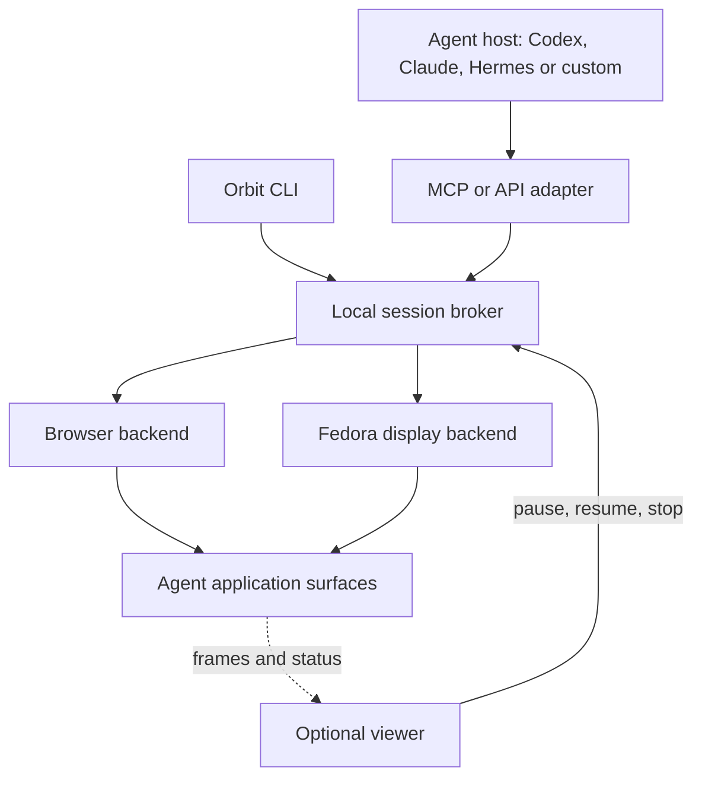
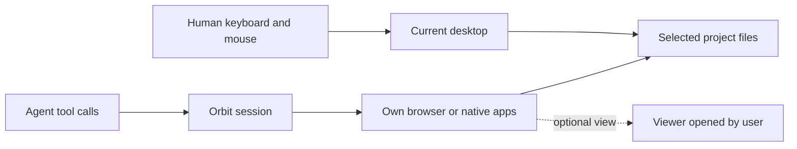
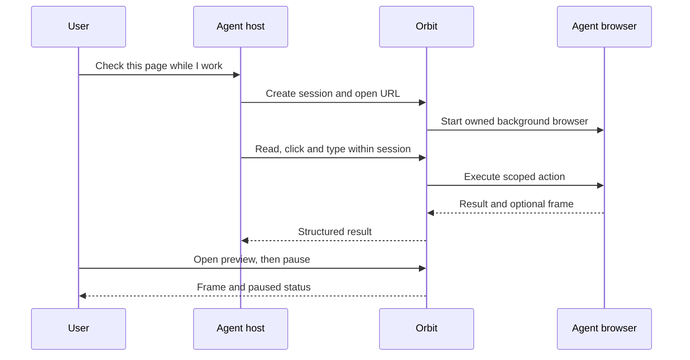

# Architecture

## One installation, several entry points

The broker owns session IDs, process lifetimes, profiles and action ordering. An adapter never silently falls back to host mouse input. The browser backend uses Playwright/CDP. The desktop backend requires a separate display, capture path and input path, all pointing to that same session.

MCP registration belongs to each agent host. The broker belongs to the OS user. Start on demand first; evaluate `systemd --user` on Fedora, launch agents on macOS and a user process/service on Windows after platform tests. No kernel driver in the first design.

## Two workspaces on the same OS

Shared files require ownership conventions or worktrees when two actors edit the same paths. Shared OS identity does not imply shared live browser state. A named Orbit account snapshot may carry login state between fresh temporary browser profiles; concurrent users of that name need an exclusive lease. Credentials remain local and must not enter logs or screenshots by default.

## A typical request

## Implemented prototype contract

The browser lifecycle and MCP adapter are implemented. The [preview](preview.md) adds `preview.open` on the local socket and a restricted loopback viewer. `session.control` accepts manual browser or native input only while paused; it is not an MCP tool. Observation runs independently of the input queue so waiting actions do not freeze the viewer. The optional [Fedora backend](fedora-results.md) adds native input and capture to this lifecycle, with two-display and viewer integration tests. Named account snapshots now restore synthetic login state; real-service compatibility and browser crash recovery remain open. Native processes have tested pipe-triggered supervision and descendant cleanup.

`session.create({backend, profileKey?, accountName?})` returns `{sessionId, state, backend, capabilities, accountName?}`. `profileKey` is a session lease label; `accountName` selects a saved browser account. There is no implemented `projectRoot` file-permission boundary. `session.act({sessionId, requestId, action})` accepts browser navigation, semantic actions or session-local coordinates only when supported. `session.observe`, `session.pause`, `session.resume`, and `session.stop` address that ID.

Serialize actions within one session; allow concurrency between sessions. Track request IDs so retries cannot duplicate a click. Pause rejects new actions and drains accepted work before reporting `paused`; stop closes owned processes and cancels pending work. Stop closes only owned processes. Errors include `UNSUPPORTED`, `SESSION_CLOSED`, `PROFILE_BUSY`, `PAUSED`, and `DEADLINE_EXCEEDED`.

Use stdio for local MCP adapters and a permission-restricted local socket for the broker. An optional viewer transport binds loopback, validates origin and requires a per-run token. A cloud chat cannot reach a local socket directly; any remote bridge is a separate feature and is not enabled by default.

The final build must deny unsupported tools rather than switching to `ydotool`, host portals or the personal browser. This policy controls Orbit operations; it does not constrain arbitrary programs running outside Orbit.
