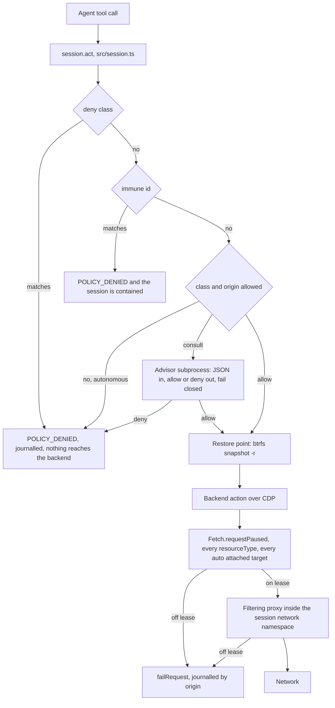

# Autonomy, and the prior art that bounds it

> How to read this: every project row states what its source actually implements. A claim a project
> makes but does not ship is marked. A claim this survey checked and could not confirm is marked
> **not confirmed** and is not used to support a decision. Tier words are the ones in
> [the porting plan](porting.md) section 2: **Measured**, **Limited**, **Failed**, **Reasoned**, **Refused**.

Written 11 September 2026, against the alpha in this repository and on top of
[the separate workspace review](separate-workspace-review.md). Fifteen candidate findings were
written and each was handed to an independent skeptic. None of the load bearing mechanisms below was
refuted outright; four were corrected, and the corrected form is what this document carries.

The question is not whether to allow autonomy. That is decided. The question is what mechanism makes
an agent survivable when it holds the person's real logged in sessions and no person is watching.

## 1. The short answer

**What already exists in open source, shipped and readable.** A pre authorised permission policy with
a mode ceiling that a session can lower and never raise, and a named set of actions that no autonomy
level clears (Claude Code, read from the shipped binary). A clean split between who decides and what
the process can physically reach, plus a rule language whose files carry their own test cases
(OpenAI Codex). Filesystem and network confinement of an arbitrary process at the OS level, without a
container, with a deny by default network allowlist (Anthropic Sandbox Runtime). A browser profile
clone with a tested transient file list and a three point navigation check (browser-use). The
capability invariant that untrusted data may only narrow what an agent may do (CaMeL). Undo as
restore to a recorded state rather than as a computed inverse, with a refusal set around it (jj,
Aider). Free per action restore points on btrfs.

**What Orbit is alone in doing.** No surveyed project holds the person's real credentials and removes
the human checkpoint at the same time. browser-use clones the real profile and puts only a navigation
filter in front of it. Playwright MCP drives the person's real browser and says in its own README
that it is not a security boundary. CaMeL has no credential model at all. Sandbox Runtime confines a
process, not an identity. Orbit is proposing the combination those projects each avoid, so the parts
that bound it have to be Orbit's own.

**What Orbit must build itself.** A named immune set for account level actions, because no existing
action vocabulary can express money movement or a recovery email change. A reversibility axis separate
from the authorisation axis. A per action restore point. The advisor contract. Enforcement of the
origin lease below the browser rather than in the navigation path. A secret service that serves one
item rather than twenty five.

**What is already in this repository and should not be redesigned.** `src/policy.ts` exists and is
wired: `src/session.ts` line 151 calls `decide()` on the resolved action before anything reaches the
backend, line 152 journals every decision including the denials, and `src/clone.ts` calls
`requireBoundedOrigins()` so a session carrying real logins cannot be created with an unbounded
origin set. The spine is real. Everything in section 3 is an addition to it, not a replacement.

## 2. The projects

| Project | What it really implements | What Orbit borrows | What Orbit refuses |
|---|---|---|---|
| **anthropics/claude-code** (read from the shipped binary at `~/.local/share/claude/versions/2.1.268`; the public repo is docs and issues) | Six permission modes in a literal array with an integer rank and a clamp that returns a requested mode only when its rank is at or below the session ceiling, so a session cannot raise its own autonomy. A five line map from mode to behaviour: `bypassPermissions` allows, `dontAsk` denies, `auto` routes to a model classifier. A circuit breaker table keyed by name with `bypassImmune` and `classifierRouted` booleans; four breakers are immune to bypass and are never shown to the classifier. Deny rules survive bypass. `PreToolUse` is an external subprocess returning `{permissionDecision, permissionDecisionReason}` with a matcher so it is not spawned on calls that do not match | `dontAsk`, not `bypassPermissions`, is the mode the owner described: never prompt, and deny anything not pre approved. The rank clamp, in Orbit's existing monotone shape. The immune table as a small named set with stable ids. The `PreToolUse` subprocess shape as the advisor contract, with typed decision reasons in the journal | `bypassPermissions` itself: allow by default with a human prompt as the only backstop, and the backstop has been removed. The `auto` classifier as the only gate: a model judging a model on attacker controlled input, which is why the binary keeps `classifierRouted: false` on its serious breakers. The Bash command string as a rule grain: the same binary needs an interpreter eval flag table and a subcommand splitter to patch a grain that was wrong to begin with. Orbit's equivalent mistake would be matching on a URL string |
| **openai/codex** (`codex-rs/protocol/src/protocol.rs`, `codex-rs/execpolicy`) | Two orthogonal enums. `AskForApproval` is `UnlessTrusted`, `OnRequest`, `Granular`, `Never`; `Granular` is five booleans, one per approval channel, and a closed channel auto rejects. `SandboxPolicy` is `danger-full-access`, `read-only`, `external-sandbox`, `workspace-write` with writable roots; `NetworkAccess` is a separate enum defaulting to `Restricted`; a `WritableRoot` carries read only subpaths so the agent cannot rewrite its own permissions, `.git/hooks` named in the comment. `execpolicy` is a Starlark `prefix_rule` over ordered argv tokens with alternatives, decisions `allow`, `prompt`, `forbidden`, and `match`/`not_match` examples validated when the file loads. Effective decision is the strictest severity across all matching rules. Preview, prefix rules only | The two axis split, which is the most useful single idea here: Orbit's approval axis is the advisor setting and its sandbox axis is what the session can physically reach. Autonomy is approval `Never` plus a tight sandbox, which is a supported combination there. Ordered structural prefix matching as the rule grain. Policy files that carry their own test cases and refuse to load when a rule stops matching its example. Read only subpaths inside a writable root, applied to the cloned profile: `Preferences`, `Local State`, `Secure Preferences` and `Extensions` stay read only even though the clone is writable | `decision = "prompt"` as a load bearing outcome: with nobody there a prompt is an unattended allow or an unattended deny. `danger-full-access`. `OnRequest`, where the model decides when to ask, since under injection the model's judgement about when to ask is the thing under attack. The process sandbox crates themselves, and the all or nothing `network_access` toggle, which has no per domain grain and does not solve Orbit's problem |
| **anthropics/sandbox-runtime** (5,204 stars, beta research preview) | Filesystem and network restriction of an arbitrary process at OS level without a container: `bubblewrap` plus a network namespace on Linux, `sandbox-exec` on macOS, and a host HTTP and SOCKS5 proxy for network filtering. JSON config with `allowRead`/`denyRead`, `allowWrite`/`denyWrite`, and `network.allowedDomains`/`deniedDomains` deny by default. Domains match wildcard patterns such as `*.example.com`; TLS termination is an explicit opt in (`network.tlsTerminate`). A blocked request returns "Connection blocked by network allowlist" from the proxy and a blocked read returns `Operation not permitted` from the kernel | The enforcement altitude, which is the whole point. The origin lease belongs below the browser: the session's browser in a network namespace whose only route is a per session filtering proxy with the allowlist fixed at creation. Then the lease binds every request the browser makes for any reason, and the proxy log is the per session record of origins actually contacted, produced as a side effect. Two allowlists, not one: origins the task needs, and paths the session may write, with the person's real profile denied for read and write so a clone can never be re read or overwritten. The allowlist syntax, which is already settled there, rather than inventing one | Treating it as a boundary for the agent's whole host. `deniedDomains` as the primary control: against a real logged in profile a denylist is a list of everywhere the person's identity could be spent, and it cannot be complete. Assuming `bubblewrap` exists: that belongs in the probe in `src/platform.ts` beside `filteredBusProxy`, and a host without it drops a tier rather than running the clone unconfined |
| **browser-use/browser-use** (114k stars, MIT) | The profile clone, shipped: `CHROME_PROFILE_TRANSIENT_FILE_PATTERNS = ('Singleton*', '*.lock', '*-journal', 'LOCK', 'LOCKFILE')`, a `copytree` of only the named profile subdirectory plus `Local State` into a temp directory, and a `RuntimeError` naming the fix when the profile is locked rather than letting Chrome take its own branch. `security_watchdog.py` enforces domains at exactly three points: before navigation, after navigation to catch redirects (recovering by navigating to `about:blank` rather than killing the session), and on tab creation. There is no request level filtering anywhere in the codebase: the one `Fetch.requestPaused` handler, at `session.py:2113`, exists for proxy auth and continues every request unfiltered | The transient file list, a superset of Orbit's `Singleton*` strip. The copy scope: the profile subdirectory plus `Local State`, not the whole 5.25 GiB user data directory. The lock detect, clean up, refuse path. The three point navigation check, including the redirect catch and the `about:blank` recovery, which is the implementable form of the review's mitigation 3. Keep Orbit's reflink, which is strictly better than their byte copy | Calling a navigation allowlist an egress boundary. Once the clone carries the person's cookies, a page on an allowed origin can `fetch`, XHR, beacon or load an image from any host, and the browser attaches those cookies. Copying the whole default profile and relying on the allowlist to make it safe, which is a credential handover with a navigation filter in front of it. Glob patterns in the allowlist: their own `_log_glob_warning` records that `*.example.com` also matches the apex, and a decoy host in a URL's userinfo portion defeats string matching. Compare parsed exact origins, which `src/policy.ts` already does. **Not confirmed:** the claim that browser-use refuses to construct an agent holding secrets without a domain restriction. `InsecureSensitiveDataError` and `allow_insecure_sensitive_data` do not exist in the repository; `service.py` logs a warning and continues. Orbit's `requireBoundedOrigins()` goes past browser-use, it does not borrow from it |
| **microsoft/playwright-mcp** (37k stars, Apache-2.0) plus the Playwright extension | Three profile topologies: a persistent per workspace profile whose path carries a hash of the client's workspace root, an isolated in memory profile, and an extension that drives a tab in the person's already running browser. The extension ships the surrounding machinery: the person picks the tab, each connected client gets its own named and colour coded tab group, a tab belongs to one client at a time, the person drags tabs in and out to change what a client can reach, and a per connection approval dialog is suppressed by a `PLAYWRIGHT_MCP_EXTENSION_TOKEN` the extension displays for the person to copy | The pre authorisation token as an artifact rather than a flag: permission granted once, in advance, by the person, held by the broker, and revocable by deleting it. It originates with the person, which is the stronger version. Visible, hand adjustable scope while the session runs, rendered in Orbit's own viewer, which already owns pause and takeover. The per workspace profile hash, as the naming scheme that avoids `PROFILE_BUSY` between concurrent agents | The topology. The extension drives a tab in the person's visible window, which is an R1 violation by construction. Also the origin flags as a control, quoting the project rather than inventing a caveat: `--allowed-origins` and `--blocked-origins` each carry "does not serve as a security boundary and does not affect redirects", `--secrets` is documented as a convenience and not a security feature, and the README's security section says the server is not a security boundary. A project that states what it does not implement is the right citation for why Orbit's lease cannot live in the navigation path |
| **google-research/camel-prompt-injection** (arXiv 2503.18813; 387 stars, 3 commits, explicitly unmaintained and "not an officially supported Google product") | A real capability system. A privileged LLM sees only the user query and emits restricted Python; it never sees tool output, only variable references. A quarantined LLM parses untrusted data into a schema declared in advance and has no tools. A custom interpreter tracks data flow and attaches to every value a capability of `SOURCES` (where it came from) and `READERS` (who may see it). A Python policy function runs before every tool call against the capabilities of its arguments and returns `Allowed()` or `Denied(reason)`; the shipped workspace policy really does contain `can_readers_read_value(participants_set, kwargs["title"])`. 77 percent of AgentDojo tasks solved against 84 percent undefended | The invariant, in one variable. Orbit cannot emit a whole program up front, but it can hold the property: the permitted effect set is fixed at `session.create`, and tainted data may only narrow it. The two level split in the cheap place: the broker dereferences credentials and page values at CDP call time instead of putting them in the model's context. The `sources` and `readers` pair as the shape of the journal record, so the log says where a value came from and which origins were permitted to see it | CaMeL itself. It requires a complete program before acting, which forecloses the browsing loop Orbit exists to provide, and its authors call a capability system a full stack redesign with CHERI as the cautionary precedent. Its policy authoring model, which puts the burden on the user to codify and maintain policies and names de classification prompts and user fatigue as open problems; the owner has removed the person, so a design whose escape hatch is asking them is unavailable. The phrase "provable security" about anything Orbit ships: the paper's own section 7 demonstrates three working side channels and section 9.3 says prompt injection is not solved |
| **arXiv 2506.08837**, Design Patterns for Securing LLM Agents against Prompt Injections (ETH Zurich, IBM, Google, Microsoft, Invariant Labs). **A paper. No repository, no code, and the ten case studies are worked examples** | Six patterns that each enforce some isolation between untrusted data and the agent's control flow: Action-Selector, Plan-Then-Execute, LLM Map-Reduce, Dual LLM, Code-Then-Execute, Context-Minimization. One governing principle: "once an LLM agent has ingested untrusted input, it must be constrained so that it is impossible for that input to trigger any consequential actions, that is, actions with negative side effects on the system or its environment" | The principle, as the sentence the security section is built around. Plan-Then-Execute at the only altitude Orbit can enforce it, the lease rather than the plan: the SET of effects is fixed before the first page loads even though the sequence is not. Context-Minimization restated as a broker emission policy, because the broker cannot edit an MCP client's transcript: Orbit declines to return raw page text and returns the structured value the agent asked for. The paper's own filing of sandboxing and user confirmation as best practices, separate from and weaker than the patterns, which is the right way to describe Orbit's viewer now that the checkpoint is gone | Presenting any of it as an implemented defense. The naive reading of Plan-Then-Execute: the paper is explicit that a fixed plan still lets an injection control the arguments, its example being an injection that arbitrarily alters the body of an email that was always going to be sent. For Orbit that is exactly a fixed lease with attacker chosen text typed into an allowed form on an allowed origin. Action-Selector for the browser backend, because click, type and navigate are the whole attack surface, so hardcoding them restricts nothing |
| **btrfs** (in tree; `kdave/btrfs-progs` v7.1 installed here), pattern named from **openSUSE/snapper** | Copy on write snapshots of a subvolume, and reflinked copies of files. Snapper's transaction pattern is a pre and post snapshot pair bracketing a change, so what changed is a diff of the pair rather than stored data | The four step recipe, measured here 11 September 2026: create the session profile directory as a subvolume, reflink the person's profile into it once, take `btrfs subvolume snapshot -r` per action as the restore point, restore by swapping the path with the browser stopped and never by copying back. Measured on a Chrome shaped tree of 20,006 files at 319 MiB: snapshot 7 ms cold and 70 ms warm at 0.00 B exclusive, against 510 ms for a reflink copy of the same tree. Budget the 70 ms, because a per action loop hits the commit. Inverted for a single 200 MiB file, so this is the file count case. A cross subvolume `cp --reflink=always` from the real Chrome profile succeeded at 0.00 B exclusive, so the chain does not silently fall back to a full copy. The pre and post pair by name | Snapper's `rollback`, which swaps the filesystem default subvolume and expects a reboot. overlayfs, which buys nothing at 70 ms and adds a mount that needs a user namespace. A plain `cp` fallback where reflink is absent, already refused in the porting plan. **Corrected, and this inverts the usual advice:** on this machine `btrfs subvolume delete` returns EPERM unprivileged for both read only and read write subvolumes, clearing the `ro` property does not help, and `user_subvol_rm_allowed` is not in the `/home` mount options; `rm -rf` succeeds. Orbit deletes its own restore points with `rm -rf`. Also: `/home/sbarah` is a plain directory, not a subvolume, so step one is a prerequisite rather than a given |
| **Aider-AI/aider** (49k stars; `aider/commands.py`, `raw_cmd_undo`) | Auto commit after each edit, then a one step undo that is mostly refusal conditions: refuse when the last commit is not in the tool's own ledger of hashes it authored, when there is no repository, when HEAD has no parent, when any touched file is dirty, when a touched file did not exist in the parent, when the commit has more than one parent, and when it has already been pushed. Only then `git checkout HEAD~1 <file>` per file and `git reset --soft HEAD~1` | The authored by me ledger: Orbit restores only a point it took, keyed by the `requestId` that produced it, and refuses when the world has moved past it. The refusal set as the design principle, since undo is offered only when the tool can prove the world still matches what it recorded. Orbit's analogues: refuse if the person took control through `session.control` since the point, refuse if the profile was written since the point with no newer point, and refuse if any action after the point was classified `remote-write`, because rolling the workspace back while a message stays sent produces a workspace that lies about what happened | git as the storage mechanism for a multi gigabyte binary profile: it would defeat the reflink sharing that makes the clone free and would leave decryptable cookie jars in an object database that outlives the session. The one step depth, since an autonomous run needs to rewind to an arbitrary earlier action. The `--soft` reset shape, which deliberately leaves changes staged for a human to review |
| **jj-vcs/jj** (31.5k stars), the operation log | Every command that modifies the repository writes an operation record; operations form a DAG with parent pointers. Each carries a view (bookmark, tag and git ref positions, heads, the working copy commit per workspace) and metadata: timestamp, username, hostname, description. `jj op log`, `jj undo`, `jj op revert`, `jj op restore`. The working copy is snapshotted automatically before commands run, except under `--at-op`, where the documentation states that automatic snapshotting does not take place | The central idea, and it decides Orbit's design: undo is restore to a recorded state, never compute an inverse. Orbit must not try to synthesise an un-click, an un-type or a cookie deletion, because for a browser the inverse is unknowable. Rewinding to action 40 then costs what rewinding to action 412 costs. The per operation metadata set, almost verbatim, as the journal envelope. The `--at-op` rule: while a historical or person driven state is loaded, automatic restore points stop, which is Orbit's paused state where `session.control` accepts the person's input | The assumption that makes it complete. jj owns every mutation of the repository; Orbit does not own every mutation of a browser profile, because page script, service workers and the three of the person's extensions that started in the measured clone all write between actions. An Orbit journal is a record of the agent's decisions, not a complete record of state change, and must say so. Also `undo` as an agent facing capability: an agent that can rewind its own history can erase evidence. The btrfs restore point handle is Orbit's own design, not jj's, since jj documents no storage mechanism |

On platform coverage rather than autonomy: `trycua/cua`, `microsoft/UFO`, `microsoft/WindowsAgentArena` and `xlang-ai/OSWorld` were checked and belong in [the porting plan](porting.md) section 5, not here. The short version: cua's driver and UFO's shipped mode both act in the person's own visible windows, which is the row the review already refuted; UFO2's isolated Picture-in-Picture desktop is described in the paper and its own FAQ says "Picture-in-Picture mode is planned for future releases", so it is not shipped prior art; WindowsAgentArena and OSWorld both reach isolation only with a full virtual machine and neither ships a host desktop provider, which is the strongest external evidence for the Windows and macOS refusals.

## 3. Orbit's autonomous mode

Autonomy is bounded by a decision made before the session starts. A human confirmation step and a
pre authorised policy are the same mechanism at different times: the confirmation asks at the moment
of the action, the policy asks once in advance and answers on the person's behalf. `src/policy.ts`
already says this and already implements the spine. What follows is what is missing.

### 3.1 The policy object

Present in `src/policy.ts` today:

```ts
type SessionPolicy = {
  mode: "supervised" | "autonomous";
  origins: string[] | "any";   // exact parsed origins, wildcards refused, never widened
  allow: ActionClass[];        // read | navigate | write | irreversible
  deny: ActionClass[];         // evaluated first, never lifted
};
```

Three additions, each one a checked borrow:

```ts
type SessionPolicy = {
  // ... the four fields above, unchanged
  advisor?: { command: string[]; match: Rule[]; timeoutMs: number };  // Claude Code PreToolUse shape
  readOnlyProfilePaths: string[];                                     // Codex WritableRoot, inside the writable clone
  rules: Rule[];                                                      // Codex prefix_rule, structural not textual
};
```

`readOnlyProfilePaths` is built, as a module constant in `src/clone.ts` holding `["Preferences", "Secure Preferences", "Local State", "Extensions"]`. Two limits found while building it. It freezes FILES only and never the directories holding them, because a read only directory cannot have its entries unlinked and the session profile is deleted when the session stops: freezing a directory traded "an extension could be added" for "a copy of the person's live cookies cannot be removed", which is the worse of the two. And it is a file mode on files the same user owns, so it stops the browser writing them in the ordinary course and is not containment against a program that changes them back. The original note read:
the clone is writable, and the paths that would let the session rewrite its own settings, content
permissions or extension set are not. Reversibility is deliberately not a policy field. It is a
property of each action record in section 5, because a session cannot promise in advance that a
remote service will be reversible.

`immune` is deliberately not a field. The immune set is a module level constant in `src/policy.ts`
with stable ids, not something a session declares, because a per session immune list is a per session
way to omit one.

### 3.2 The grain of a rule

A rule matches the resolved action structurally, in order, with alternatives. It never matches a URL
as a string.

```ts
type Rule = {
  id: string;                       // stable, appears verbatim in the journal
  backend?: "browser" | "fedora";
  verb: string | string[];          // action type, alternatives allowed
  origin?: string | string[];       // exact parsed origin
  pathPrefix?: string;              // matched on whole path segments, never substring
  method?: string;                  // request layer only
  decision: "allow" | "deny" | "consult";
  reason: string;
  match?: Example[];                // validated when the policy file loads
  notMatch?: Example[];
};
```

Rules are evaluated after the immune table and before the class check, and the strictest severity
across all matching rules wins. A rule can lower a decision, never raise one: it can turn an allowed
class into a `consult` or a `deny` for one origin and path, and it can never turn a class level deny
or an immune id into an allow.

One further property comes with the grain, and it is the reason to write rules in a file at all. A
policy file that carries its own examples refuses to load when a rule stops matching the case it was
written for, so an origin rule cannot silently stop covering the thing the owner wrote it for.

The immune table is separate, because `ActionClass` cannot express it. `irreversible` is one bucket
holding `launch` and `download`; money movement, a password or recovery email change, a message send,
an account deletion and an OAuth grant are account level facts, not action types.

| Immune id | Matched on | Consultable | Overridable |
|---|---|---|---|
| `money-movement` | origin plus path prefix plus method at the request layer | no | no |
| `credential-change` | origin plus path prefix plus method | no | no |
| `message-send` | origin plus path prefix plus method | no | no |
| `account-deletion` | origin plus path prefix plus method | no | no |
| `oauth-grant` | origin plus path prefix, plus the presence of an authorisation response type | no | no |

The honest limit belongs beside the table, not in a footnote: these match a request, never a button
label. Orbit cannot tell a send button from any other button without reading attacker controlled page
text, and `src/policy.ts` already records that a click on a send button is indistinguishable from any
other click. The immune table catches the request the click causes, which is later and narrower than
catching the intent, and it catches nothing where the site's request shape is unknown to Orbit.

### 3.3 Where it is enforced



Three depths, and they are not interchangeable.

| Point | Covers | Does not cover | Status |
|---|---|---|---|
| `session.act` in `src/session.ts`, over the action the broker resolved | Everything the agent asks for | Anything the page does on its own | **Implemented**, wired today at line 151. No named test in `docs/validation.md` covers it, so no tier word applies yet |
| Request interception over every resource type, with documents fetched one redirect hop at a time | Subresources, XHR, beacons, popups, iframes, meta refresh, javascript navigation, server side redirects, service worker fetches and WebSocket upgrades | A request that never crosses the interception layer | **Limited**: built and measured after this survey. Eleven page initiated routes off the allowed origin, all eleven blocked; before the redirect hop check, one of eleven walked through. The service worker and socket rows carry positive controls, because a route that never fires would otherwise report as blocked: the worker's own same origin fetch arrived, and the page recorded the socket as refused rather than never opened. See `experiments/origin-lease.ts`. Orbit already speaks CDP, so the cost is the round trip per request and owning `continueRequest`, `failRequest` and `continueWithAuth` |
| A per session filtering proxy, with the browser in a network namespace whose only route is that proxy | Every request the browser makes for any reason | Anything inside an allowed origin | **Reasoned**, not built. Needs a `bubblewrap` probe beside `filteredBusProxy` in `src/platform.ts` |

The first point is advisory with respect to the page. That was the state when this survey was
written, and it was the survey's most useful finding: an allowlist checked where the agent navigates
stops the agent, and stops nothing else. The second point has since been built and measured, so the
review's mitigation wording and the porting plan have been corrected to match.

### 3.4 The advisor

A fourth outcome, not a reuse of `ask`. `PolicyDecision` today documents `ask` as supervised mode
only, meaning a person is waiting; overloading it would make the supervised path ambiguous.

```ts
type PolicyDecision =
  | { outcome: "allow" }
  | { outcome: "deny"; reason: string; ruleId?: string }
  | { outcome: "ask"; reason: string }       // supervised only, a person is waiting
  | { outcome: "consult"; reason: string };  // autonomous only, the advisor subprocess decides
```

The contract, borrowed from `PreToolUse`:

- The broker spawns the advisor command with one JSON object on stdin and reads one JSON object back:
  `{decision: "allow" | "deny", reason}`. There is no third answer, because there is nobody to ask.
- Its input is the redacted journal record of the pending action plus the journal tail, never page
  text and never typed characters. An advisor that reads the page is one more thing to inject.
- A matcher in rule syntax decides when it runs, so it is not spawned on reads.
- Fail closed on non zero exit, on timeout and on unparsable output, the way Codex's command clamp
  fails closed on its own crash. The reason recorded is the failure, not a guess.
- It is never consulted on an immune id, and it can never widen origins or add an action class.

The advisor is a second opinion on the part of the action space the policy deliberately left open. It
is not a security boundary, and the document must not call it one: it is a model, judging a model,
and the closest shipped analogue keeps its serious breakers away from the classifier entirely.

### 3.5 On a deny

A deny is terminal for that action, and the session keeps running. Concretely:

1. The action never reaches the backend. `session.act` already throws before `enqueue`.
2. `POLICY_DENIED` carries the reason and the rule id, with no page content, so the agent can replan
   inside the lease rather than stalling. Refusing usefully is what lets autonomy finish alone.
3. The denial is journalled with the same weight as an allow. A log that records only what happened
   cannot show what was attempted.
4. Nothing pauses and nothing waits. `POLICY_CONFIRMATION_REQUIRED` is unreachable in autonomous mode
   by construction, because `decide()` returns `deny` rather than `ask` for that mode.
5. An immune deny additionally contains the session: `write` and `irreversible` are removed from
   `allow` for the rest of its life through `narrow()`. An autonomous agent that has just attempted a
   password change is either compromised or wrong, and in both cases the next action should not run.
   This containment is Orbit's own choice, not a borrowed mechanism.

`narrow()` exists and is correct, and no request reaches it: `session.narrow` is not in the dispatch
list in `src/session.ts`. That is the rank clamp with no caller, and it is one of the smallest items
in section 7.

## 4. Injection, stated honestly

The setting is the worst case in the literature and it should be written as such. The agent holds a
clone of a 5.25 GiB Chrome profile in which 142 of 142 cookies decrypt. Every page it reads is
attacker controlled input. There is no person in the loop. The governing principle from arXiv
2506.08837 is the standard to measure against: once an agent has ingested untrusted input, it must be
constrained so that it is impossible for that input to trigger any consequential actions, that is,
actions with negative side effects on the system or its environment.

Orbit will not reach that standard. What it can do is bound the blast radius, and the bound must be
decided before the first page loads.

| Defense | Real or theatre | Why |
|---|---|---|
| An origin lease fixed at `session.create` and monotone thereafter | **Real**, and it is the one that survives injection | A page can say anything; the set of reachable origins was closed before the page was read. Implemented for the agent's own actions today, in `src/policy.ts` and `src/clone.ts` |
| A taint flag that freezes the lease once any page content has been returned | **Real**, cheap, not built | The CaMeL invariant in one boolean: after the first observation, no request may add an origin, enable a class or raise a lease, while narrowing is always accepted |
| Enforcing the lease below the browser, in a network namespace behind a filtering proxy | **Real**, not built | The only version that binds page script, beacons and redirect chains rather than the agent's stated intention |
| The immune table, matched at the request layer | **Real but narrow** | It catches a known request shape on a known origin. It cannot catch an unknown site's send endpoint, and it never sees a button label |
| A clone rather than the live profile | **Real for local state** | Nothing the agent does reaches the person's own browser. This is why local reversibility is by construction rather than by an undo mechanism |
| The broker holding credentials and dereferencing at CDP call time | **Real for the model's context** | The value never enters the transcript. It does nothing once the browser already carries a live cookie, which is Orbit's case |
| Declining to return raw page text, returning the structured value instead | **Real, and it is an emission policy** | The broker cannot prune an MCP client's transcript; it can only decline to emit. Keeps an injection from persisting across every later turn of a long run |
| A model classifier, or the advisor, as the gate | **Theatre if it is the only gate** | A model judging a model on attacker controlled input. Useful as a second opinion inside the allowed space, worthless as the boundary |
| Prompt filtering, or instructing the agent to ignore injected instructions | **Theatre** | No surveyed project implements this as a control, and the taxonomy paper does not list it as a pattern |
| Placeholder substitution for secrets | **Theatre in Orbit's setting** | browser-use's own example notes that screenshots reach the model, and it does nothing once the page holds a live session cookie |
| Glob or suffix matching on domains | **Theatre** | browser-use's own warning helper records that `*.example.com` matches the apex, and a decoy host in a URL's userinfo portion defeats string matching. Compare parsed exact origins |
| Human confirmation on irreversible actions | **Removed by decision, and weaker than the patterns anyway** | The taxonomy paper files confirmation as a best practice distinct from the patterns and names fatigue and habituation as its failure mode |

The case none of this touches, stated plainly: an injection served by an origin the agent is
legitimately allowed to write to. A fixed lease does not stop an injection from choosing what gets
typed into an allowed form on an allowed origin, and the paper says so in its own example. That is
not a gap Orbit closes later. It is the residual risk of the feature, and the reason the immune table
and the containment rule exist at all.

## 5. Reversibility

Authorisation and reversibility are different questions and need different axes. This is the Codex
two axis split applied a second time. `read | navigate | write | irreversible` answers "may this
run". It does not answer "can this be taken back".

| Reversibility class | What it means | Undo mechanism | Completeness |
|---|---|---|---|
| `workspace` | Changed only files inside the session profile subvolume | Restore the btrfs snapshot taken before the action | Complete |
| `profile-only` | Changed browser state in the clone: cookies, storage, settings | The clone is a fork and is deleted at `session.stop` | Complete, and moot: it never reached the person's browser |
| `remote-read` | Nothing changed, but a disclosure happened and an access log entry exists on the person's account | None | Nothing to undo; it still belongs in the journal |
| `remote-write` | The remote service changed: a message sent, an order placed, a setting saved | None that Orbit owns | Zero |
| `unknown` | Orbit cannot tell | Treated as `remote-write` | Zero |

The honest boundary in one sentence: automatic undo is complete for the workspace, complete and
irrelevant for the clone, and empty for the remote service. The immune table exists precisely because
undo cannot cover the last row.

### The mechanism, measured

1. Create the session profile directory as a btrfs subvolume rather than with `mkdir`. `/home/sbarah`
   is a plain directory, so this is a prerequisite and not a given.
2. Reflink the person's profile into it once: 620 ms for 5.25 GiB at 0.00 B exclusive, already in
   `src/clone.ts`. A cross subvolume `cp --reflink=always` from the real profile was verified not to
   fall back to a byte copy.
3. Take `btrfs subvolume snapshot -r` before each `write` or `irreversible` action. Budget 70 ms warm,
   not the 7 ms cold best case, because a per action loop hits the commit. Zero exclusive bytes.
4. Restore by swapping the profile path to the snapshot with the browser stopped. Never copy back,
   and never compute an inverse.
5. Delete restore points by clearing `ro` and then `rm -rf`. The earlier note said clearing `ro`
   does not help, and that is true of `btrfs subvolume delete` and false of `rm -rf`. Measured again
   while building this: `btrfs subvolume delete` on a read only snapshot prints a success line and
   leaves the snapshot in place, `rm -rf` on one fails with "Read-only file system", and
   `btrfs property set -ts PATH ro false` followed by `rm -rf` succeeds unprivileged. That recipe is
   `removeRestorePoint`, and it matters more than it looks: a restore point is a copy of the person's
   live cookies, so one that cannot be deleted is a credential that outlives its session.

6. Do not remove the profile directory in order to make it a subvolume. Written that way first, and
   on a filesystem without subvolumes it deleted the session profile and returned false, after which
   every browser session failed to start into a directory that was no longer there. The subvolume is
   made beside it and renamed over it, and a filesystem that says no leaves the directory untouched.

Two properties of the restore point record, both borrowed:

- `restorePoint.consistent` is true only when the browser was quiesced and the commit window has
  passed. This repository measured cookies staying in browser memory for about 35 seconds, so a mid
  action snapshot is an up to 35 second stale and possibly torn restore point. It is still worth
  taking; it is not worth labelling consistent.
- Automatic restore points stop while the session is paused and the person is driving through
  `session.control`, which is jj's `--at-op` rule. The person's writes are not the agent's to snapshot
  over, and they are not the agent's to discard either.

Restore refuses, in Aider's shape, when: the point was not taken by this session for this
`requestId`; the person took control since the point; the profile was written since the point with no
newer point; or any action after the point was classified `remote-write`. The last refusal is the
important one, because rolling a workspace back while a message stays sent produces a workspace that
lies about what happened.

## 6. The journal

The journal is what replaces the person watching. It is the only artifact that answers, afterwards,
where the person's identity went.

### The record

`JournalEntry` in `src/policy.ts` already carries `sequence`, `sessionId`, `actor`, `actionType`,
`actionClass`, `origin`, `outcome`, `reason` and `inputLength`, and `src/session.ts` writes one for
every decision including the denials. The redaction is already right in shape: origin and not URL,
length and not content. Five additions:

| Field | Why |
|---|---|
| `at` | A timestamp, absent today. Any human rendering prints 12 hour times |
| `requestId` | The key a restore point is stored under, so an entry and its restore point name each other |
| `ruleId`, `decidedBy` | `policy`, `advisor`, `immune` or `request-layer`. Claude Code types its decision reasons for exactly this reason, and an untyped log cannot say whether the advisor was even consulted |
| `reversibility`, `restorePoint` | The second axis, and the handle that makes undo a restore rather than an inverse |
| `afterOrigins` | The origins read since the previous restore point. This is CaMeL's `SOURCES` and `READERS` pair in the cheapest usable form: it is what lets a reader ask which page was on screen when the agent did this |

Durability is missing and matters. The journal today is an in memory array in `src/session.ts`,
spliced at 10,000 entries and lost when the broker stops. An autonomous session's record must outlive
both the session and the broker: append each entry to a per session file with mode 0600 under the
runtime state directory, and keep `session.journal` as the read path.

One session creation entry, written before the first action, carrying: the policy verbatim; the clone
provenance (source profile id, reflinked true or false, size, and the aggregate cookie counts only);
the browser binary and the keyring item name it owns; the bus grant and its measured breadth.

### Redaction

| Recorded | Never recorded | Why |
|---|---|---|
| Origin | The full URL | Path and query carry identifiers, tokens and search terms |
| `inputLength` | The characters typed | A journal that quoted input would carry passwords |
| The structured value the action produced, by size | Page text, and any screenshot | Page content is the person's real account contents, and it is also the injection payload |
| Aggregate cookie counts, as the repository already requires | Any cookie name, host or value | The existing rule in the porting plan, unchanged |
| The keyring item name, for example `Chrome Safe Storage` | The item list, and any secret | The item name is branding and is needed to explain which binary owns the profile. The 25 items a filtered bus can enumerate are the exposure, and enumerating them into a log would double it |
| That the filtered bus grant was taken, and its known breadth | Anything read over that bus | The review measured the breadth; the journal should state it rather than imply the grant was narrow |

The advisor's stdin is the same redacted record. Otherwise an advisor transcript becomes a second,
unredacted copy of everything the journal refuses to hold.

## 7. What to implement first

Ordered. Each item is one change with one test.

| | Item | Test |
|---|---|---|
| 1 | ~~Stop forcing `--password-store=basic`, and launch the binary that owns the profile~~ **Done.** Measured against the real profile: 142 of 142 cookies decrypt, a share of 1.0 | Closed |
| 2 | ~~`consult` as a fourth outcome, and the advisor subprocess~~ **Done.** `src/advisor.ts`, with the rule grain in `src/policy.ts`. Every failure path denies and names itself: a crash reported `exited with code 137`, a hang decided at 2001 ms against a 2000 ms budget, and a non zero exit, unparsable output, a non object, an answer that is neither allow nor deny, an answer of `ask`, a missing command and an empty command all deny | Closed |
| 3 | ~~The immune table, and the containment rule~~ **Done.** Five ids matched on whole path segments, method and query. Measured end to end against the most permissive policy the parser produces, autonomous with every class allowed, nothing denied and an advisor answering allow to everything: the immune action was refused, the advisor never saw it, and `allow` went from `read, navigate, write, irreversible` to `read, navigate` for the rest of the session | Closed |
| 4 | Expose `session.narrow` in the dispatch list, and set a taint flag the first time an observation returns page content | **Half done.** `session.narrow` is exposed and measured: narrowing to `read` held, asking for `read, navigate, write` back returned `read`, and an empty request is refused. The taint flag is not built |
| 5 | ~~Journal envelope and durability~~ **Done**, except `afterOrigins`. Appended to a 0600 per session file under the workspace, outside the profile that is deleted at stop. Measured: first line is the agreement the rest was judged against, every action carries `at` and `requestId`, and a read of the file found no URL path, no query and no selector | Closed but for `afterOrigins` |
| 6 | ~~Restore points~~ **Done**, as `src/restore.ts`, minus restore by path swap. The session profile is made a subvolume where the filesystem allows one, a point is taken before each action a snapshot could actually undo, and the refusal set is enforced by `canRestoreTo`. Snapshots measured at 0.00 B exclusive. Two corrections to the plan below | Closed but for the swap |
| 7 | Request layer enforcement: `Fetch.enable` over every resource type with `Target.setAutoAttach`, judging origin, path prefix and method | An off lease image beacon on an allowed page fails and is journalled by origin |
| 8 | Egress below the browser: `bubblewrap` probe in `src/platform.ts`, network namespace, per session filtering proxy with the lease fixed at creation, proxy log as the origins contacted record | A denied origin is unreachable from page script, not only from `session.act`. A host without `bubblewrap` drops a tier rather than running unconfined |

Items 1, 2 and 3 are done, and item 4 is half done. Items 5 and 6 remain broker TypeScript over
machinery that exists. Item 7 is built in a different form than proposed, through request
interception rather than raw `Fetch.enable`, and measured at eleven of eleven page initiated routes
blocked. Item 8 remains, and it is the one that makes the lease hold against a browser that does not
route a request through the interception layer at all, so it should not be deferred quietly.

Reproduce items 2 and 3 with `bun run scripts/limited.ts bun run experiments/advisor-session.ts`.

## 8. What nobody has solved

Listed so the frontier is visible and so none of these is quietly assumed away.

1. **An injection served by an allowed origin.** Every defense surveyed, including CaMeL, stops at the
   boundary of the origin it trusts. CaMeL's own section 9.3 says prompt injection is not solved, and
   its section 7 demonstrates three working side channels against its own guarantee.
2. **The semantic intent of a click.** Nobody can distinguish a send button from any other button
   without reading attacker controlled text. The immune table catches the resulting request on known
   shapes and nothing on unknown ones.
3. **Remote undo.** No project surveyed can take back a remote write. Aider's nearest analogue is a
   refusal to undo a pushed commit, which is an acknowledgement of the same wall.
4. **A secret service that serves exactly one item.** This is open question 5 in the review and it is
   the difference between a shippable clone and a credential handover. Nothing surveyed does it, and
   the measured filtered bus enumerates 25 login keyring items to reach one cookie key.
5. **A per origin credential grant for a real browser session.** Sandbox Runtime restricts a process,
   not an identity. Playwright MCP's token is a connection grant, not an origin scoped credential. The
   extension hybrid in the review is the candidate and it is unbuilt, with two of its preconditions,
   whether `chrome.cookies.getAll` returns `HttpOnly` cookies and whether partition keys survive,
   still open documentation lookups.
6. **An external reviewer that is not itself an injection target.** No surveyed project ships a model
   reviewer as a security control, and the closest, Claude Code's classifier, is deliberately kept
   away from its own serious breakers.
7. **Whether a real service tolerates a forked session.** Not established: whether major services
   invalidate a session that appears from a second concurrent client, and whether a token rotation
   inside the fork logs the person out of their own browser.
8. **Whether MCP rule syntax accepts an argument specifier.** Not established in this survey. If it
   does not, a host level rule can allow or deny the whole `orbit_act` tool but cannot say "only
   these origins", which is another reason origins must be enforced in the broker regardless.