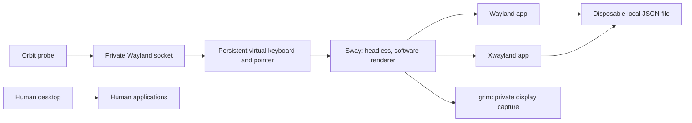

# Fedora native display proof

Verified 10 September 2026 on Fedora 44, inside the existing Hyprland session. Both a native Wayland GTK 3 app and the same fixture running through Xwayland accepted independent text and clicks. Captures show the saved text. The native prototype now connects to the broker, CLI, MCP schema and shared viewer.



## Evidence

| Check | Actual result |
|---|---|
| Display | One private `HEADLESS-1` output, 1280 x 800; no DRM backend requested |
| Wayland | Saved `Orbit wayland independent input` |
| X11 | Saved `Orbit x11 independent input` |
| Capture | PNG for each backend, visually inspected against saved state |
| Host observation | 3 samples, no owned app or compositor PID in Hyprland clients or active window |
| Shutdown | Owned compositor exited with code 0 |
| File access | Fixtures wrote their own JSON on this filesystem, without a VM |

Frozen result: [validation summary](validation.md). Screenshots are generated under `output/native/`. Sampling cannot exclude brief interference between samples. Shared account workflows, file dialogs and concurrent editing are not covered by this fixture.

## Reproduce

From the project root on this Fedora machine:

```sh
bun run scripts/limited.ts bash experiments/fedora-display/bootstrap.sh
bun run scripts/limited.ts /usr/bin/python3 experiments/fedora-display/probe.py
```

Bootstrap downloads and unpacks Sway 1.11, wlroots 0.19.3 and libliftoff 0.5.0 into ignored `.runtime/`. It installs no system packages or services. Existing prerequisites are `dnf download`, `rpm2cpio`, `cpio`, `curl`, a C compiler, Wayland client and xkbcommon development files, `wayland-scanner`, `Xwayland`, `grim`, system Python with GTK 3 bindings, and `hyprctl` for read-only host sampling. Pinned Fedora RPMs must still be available from configured repositories. This is a workstation proof, not a portable installer.

Each run makes a new mode-700 runtime directory. The compositor environment removes host display endpoints and uses `WLR_BACKENDS=headless`, `WLR_RENDERER=pixman` and one output. Input connects to that exact private socket; capture uses its runtime and display. IPC always specifies the private Sway socket. The fixture has no working session D-Bus connection. Logs remain in the temporary directory for diagnosis.

## What changed after failures

Short-lived `wtype` input produced missing or wrongly mapped characters with Xwayland. The final helper keeps a standard US keymap, virtual keyboard and pointer alive across both tests. It waits for a mapped window and allows 500 ms for application focus to settle. This delay needs an observable readiness replacement before production. The helper supports printable ASCII, clicks and Ctrl+V paste. Only Ctrl+A, Ctrl+S, Ctrl+O, Ctrl+L, Enter, Tab and Escape are currently accepted as agent key actions. Other shortcuts and dragging remain unsupported. Vertical scrolling is described below.

## Broker integration

After bootstrap and broker startup:

```sh
bun run src/cli.ts session create fedora
```

Use the returned session ID with the existing pause, resume, observe and stop commands. Native agent actions are:

| Action | Fields |
|---|---|
| `launch` | `argv`: absolute executable plus arguments; `toolkit`: `wayland` or `x11` |
| `pointer` | Integer `x`, `y` within 1280 x 800; left click |
| `text` | Up to 2048 printable ASCII characters |
| `key` | Ctrl+A, Ctrl+S, Ctrl+O, Ctrl+L, Enter, Tab or Escape, delivered to the private virtual keyboard |
| `paste` | Up to 2048 UTF-16 code units, including Arabic and emoji; private clipboard and Ctrl+V |

Launch starts a fresh process with private display endpoints, waits for its window and returns its PID. Existing single-instance apps may forward to a previous process, so use fresh application state. This behavior is not yet verified outside the GTK fixture. The native launcher is not permission containment and does not make arbitrary same-user commands safe.

`ORBIT_TEST_NATIVE=1 bun run verify tests/fedora.test.ts` verifies two private displays, Wayland and X11 form round trips, capture, pause rejection, manual control, independent stop, closed-session errors and surviving-session input. A second test creates and launches through an MCP SDK client, then operates the real viewer in a headless browser. Its screenshot is `output/native/viewer.png`. These optional tests require bootstrap; a skipped test is not evidence of native support. Native shortcut controls are disabled in the viewer until implemented.

## Next gate

Test file dialogs, a declared clipboard policy and an ordinary application beyond the fixture. Native crash supervision now passes the cases below; browser crash recovery is a separate gate.

## Native failure recovery

Each compositor and launched native application runs beneath a small Linux supervisor. The broker keeps its input pipe open; broker death closes the pipe and triggers cleanup. The supervisor uses [Linux child subreaping](https://man7.org/linux/man-pages/man2/PR_SET_CHILD_SUBREAPER.2const.html) to collect descendants that outlive their parent, first requests termination, then kills and reaps remaining owned children. The input helper already exits when its broker pipe closes. No host compositor or unrelated process is addressed.

`ORBIT_TEST_NATIVE=1 bun run verify tests/native-crash.test.ts` verifies:

- Killing the broker leaves no running process in its sampled native tree; a fresh broker creates a working display and rejects stale IDs.
- A detached descendant that ignores graceful termination is killed and reaped when the supervisor pipe closes.
- Killing one compositor closes its session and application; another display still produces frames.

These are injected process failures, not power-loss, kernel-stall or every-daemon guarantees. The supervisor itself being killed independently is not covered. Account snapshots preserve only the last explicit save. Keep host endpoints unavailable and return explicit unsupported errors. Native account integration and a 10-minute simultaneous human-work session remain open.

## Technical sources

- [wlroots backend configuration](https://github.com/swaywm/wlroots/blob/master/docs/env_vars.md): explicit backend and renderer selection.
- [Virtual pointer protocol](https://github.com/swaywm/wlr-protocols/blob/b010a03648b88d143236de193bddbfea0c08bc84/unstable/wlr-virtual-pointer-unstable-v1.xml) and [virtual keyboard protocol](https://github.com/atx/wtype/blob/v0.4/protocol/virtual-keyboard-unstable-v1.xml): session-local input primitives. Bootstrap checks downloaded protocol hashes and preserves licenses in `.runtime/`.
- [Hyprland 0.56.2 startup](https://github.com/hyprwm/Hyprland/blob/v0.56.2/src/Compositor.cpp): its normal backend selection includes DRM and Wayland fallback, so this probe does not start a second Hyprland instance.

## Unicode paste

`paste` writes UTF-8 text to a foreground `wl-copy` provider connected to the private compositor. Orbit verifies that private selection using `wl-paste`, then sends Ctrl+V through its existing private virtual keyboard. No host clipboard is read or changed. The selection remains available within that session until replaced or closed. This requires installed `wl-copy` and `wl-paste`; there is no host fallback.

The bounded test `ORBIT_TEST_NATIVE=1 bun run verify tests/native-paste.test.ts` passed 2 tests and 17 assertions in 2.70 seconds. It pasted mixed Arabic, Latin and emoji text into a GTK 3 entry on Wayland, then Xwayland, using one private display. Each app reported the exact text, saved it and exited. The test also rejects malformed Unicode, prohibited control characters and oversized input.

Paste acknowledgement means the shortcut was delivered, not that the application finished consuming the selection. The first test clicked Save too early and saw empty text. The corrected test waits for the fixture's actual text-change event before saving. Agents must verify application state before subsequent dependent actions. Applications that ignore Ctrl+V, terminal-specific paste shortcuts and rich content still need dedicated tests. Existing `text` remains printable ASCII keyboard input.

The provider intentionally does not use `--paste-once`: clients may request the selection multiple times. See the [wl-clipboard maintainer's explanation](https://github.com/bugaevc/wl-clipboard/issues/107) and [project documentation](https://github.com/bugaevc/wl-clipboard).

### Clipboard isolation between sessions

`ORBIT_TEST_NATIVE=1 bun run verify tests/clipboard-isolation.test.ts` passed 1 test and 9 assertions in 3.02 seconds under the shared resource caps. Two simultaneously open private displays hosted a Wayland GTK app and an Xwayland GTK app. Each received a distinct Arabic/emoji selection. After the second selection was installed, the first app requested its existing clipboard through its Paste button and recovered only its own text. After stopping the first session, the second app still recovered its own selection. Both application processes were gone after cleanup.

The test deliberately changes each entry with keyboard input before requesting the clipboard again, so unchanged text cannot produce a false pass. It verifies these two private displays and their clipboard lifetimes. It does not inspect or sample the human clipboard, and it is not a broad application-compatibility test.

## Real text editor workflow

GNOME Text Editor 50.1, GTK 4.22.4 and GtkSourceView 5.20.0 completed one selected-file workflow on the private Wayland display. Orbit launched a standalone instance with temporary XDG config/data/cache/state directories, opened a disposable file, selected all, pasted Arabic/emoji and Latin text, and invoked Ctrl+S. Reading the file from disk matched the expected UTF-8 content exactly. A second sentinel file remained unchanged and the editor process exited after session stop.

[validation summary](validation.md). Reproduce with `bun run scripts/limited.ts bun run experiments/native-editor.ts`. The captured application image is `output/native/editor.png`; disk readback, rather than the title-bar save indicator, establishes persistence.

Early attempts exposed two application details. An explicit final newline in the pasted text produced an extra saved newline, consistent with [GtkSourceView's implicit trailing newline](https://api.pygobject.gnome.org/GtkSource-5/class-Buffer.html). Another attempt selected content before asynchronous file loading/focus settled. The passing probe clicks the editor at a known location and uses short application-specific delays before selection, paste and save. This is a real app proof with those assumptions, not a general readiness solution. Concurrent file editing and comprehensive filesystem write auditing remain open; checking one sentinel does not prove the app cannot write elsewhere.

### File picker in the private display

The same editor also passed an actual file-picker workflow. Starting with no file argument, Orbit sent Ctrl+O, opened the location field with Ctrl+L, pasted only the temporary file path and confirmed with Enter. The chooser was captured on the private display and visually inspected. Subsequent Arabic/emoji editing and Ctrl+S produced exactly the expected bytes on disk; the sentinel file stayed unchanged and the application exited after stop.

[validation summary](validation.md). Reproduce with `bun run scripts/limited.ts bun run experiments/native-editor.ts --dialog`. Images: `output/native/file-dialog.png` and `output/native/editor-dialog-result.png`. This tests GNOME Text Editor's chooser with private display endpoints and its host session bus removed. Portal-backed dialogs, other applications and simultaneous file editing are not proven. The application-specific focus and settle limitations above still apply.

## Combined-suite transport fix

Two combined browser/native runs each passed 17 tests and failed the first two-display native test. The diagnostic run identified `swaymsg` failing to receive its private IPC response; no resource-limit events occurred. The same native test passed in isolation. [validation summary](validation.md).

The native backend now sends bounded requests directly to its explicit private Unix socket. It handles fragmented frames, rejects truncated/malformed responses, validates reply types and lengths, and enforces a five-second deadline. It performs no host socket discovery or unrestricted retry. This follows the [Sway 1.11 IPC protocol](https://raw.githubusercontent.com/swaywm/sway/1.11/sway/sway-ipc.7.scd). The precise underlying reason for the old client's receive failure remains unproven.

After this change the combined suite passed all 19 tests and 180 assertions in 39.029 seconds, with no skips. It used 3.15% average machine CPU, 693,981,184 bytes peak cgroup memory, zero swap and zero memory/task-limit events. [validation summary](validation.md) and [validation summary](validation.md). Reproduce with `ORBIT_TEST_NATIVE=1 bun run scripts/limited.ts bun run experiments/measured-suite.ts`; the combined run has a 180-second timeout. This is one complete run, not sustained or repeated reliability evidence. Real account and model-host tasks remain outside these tests.

## Actual model edits a native application

Codex CLI completed a GNOME Text Editor task through the real Orbit MCP tools. It launched one Wayland editor on a private display with fresh application state, observed the document, read a random six-digit code absent from its prompt, selected and replaced the text using pointer/key/paste actions, observed the replacement, saved and stopped. The final model answer matched the original code. Disk readback exactly matched the requested Arabic, emoji and unique Latin text, including the editor's final newline. A neighboring unselected file stayed unchanged and the launched editor PID exited.

[validation summary](validation.md) and [validation summary](validation.md). Reproduce with `bun run scripts/limited.ts bun run experiments/native-model-task.ts`. The experiment permits only the exact editor launch, four Orbit tools and one Fedora session, disables shell/web tools, and limits the model process to 120 seconds under the shared resource caps. No fixed click coordinates or original code are supplied in the prompt. The model chooses focus using screenshots.

This is one model-driven native Wayland workflow, beyond the scripted GTK fixtures and editor probe. It does not establish all-app compatibility, X11 model coverage, concurrent file ownership, human takeover, continuous no-interference telemetry or repeated reliability. Three private-display PNGs were returned; the saved image was visually inspected.

Claude Code also passed the same editor task through the identical Orbit tools: three screenshots, correct original-code readback, exact Arabic/emoji file replacement, unchanged neighboring file and a closed application. [validation summary](validation.md) and [validation summary](validation.md). Run `bun run scripts/limited.ts bun run experiments/native-model-task.ts claude`; omitting the host still selects Codex. Claude uses a temporary strict MCP config, disables built-in tools and hooks, avoids session persistence and has a $1 API budget ceiling. Both hosts use existing authentication. No persistent connector settings changed.

These are individual successful tasks with the same Wayland application, not repeated reliability or X11 model tests. The selected host only changes the command and response parsing; file verification and application checks are shared.

## Vertical scrolling (unreleased)

Native agents can send `{"type":"scroll","x":200,"y":200,"deltaY":3}` through CLI, broker RPC or MCP. Coordinates are integers inside 1280 x 800. `deltaY` is a nonzero integer wheel-step count from -20 to 20: positive scrolls down, negative up. It is not a requested pixel distance; applications choose their scroll amount. The private pointer moves to the requested point without clicking, then sends vertical wheel events. Pause rejects agent scroll actions. The viewer does not yet expose native wheel control.

The integration test observes actual GTK text-view vertical adjustments, verifies reverse direction, unchanged horizontal position, invalid input rejection and resume. Wayland works with the default input configuration. GTK 3 through Xwayland currently needs the explicitly opted-in application environment `GDK_CORE_DEVICE_EVENTS=1` in this test. Its default XInput2 path receives wheel events but did not move content in the local trial; changing the fixture widget, clicking first and adding a diagnostic delay did not resolve that failure. No delay or automatic environment override was retained. This remains an open compatibility issue, not a claim of unrestricted X11 scrolling support.

```sh
ORBIT_TEST_NATIVE=1 bun run verify tests/native-scroll.test.ts
```

Rebuild the private input helper using the documented bootstrap after updating its source. The initial tagged alpha archive predates this action.
