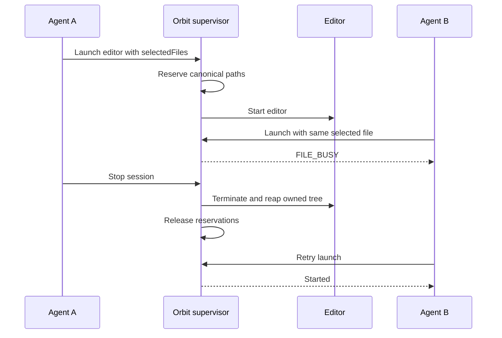

# Selected files and concurrent edits

Native launches can declare existing files with `selectedFiles`. Each file is reserved for that application tree. A cooperating second launch receives `FILE_BUSY` before its app starts; ending the owning application tree or stopping its session releases the reservation.



## Usage

Pass the same native action through CLI, API or MCP. Use existing absolute canonical file paths in both the declaration and application arguments. Launch applications with fresh state as described in the native guide.

```json
{
  "type": "launch",
  "toolkit": "wayland",
  "argv": ["/usr/bin/gnome-text-editor", "--standalone", "/absolute/project/notes.txt"],
  "selectedFiles": ["/absolute/project/notes.txt"]
}
```

The launch result includes `selectedFiles` as canonical paths. Up to 32 existing regular files can be reserved per launch. Missing files, relative paths, directories and multiply linked files are rejected with `INVALID_REQUEST`. Symbolic aliases resolve to the same reservation. If acquisition of any file fails, earlier reservations from that attempt are released.

## Scope and lifecycle

This is cooperative coordination, not a filesystem sandbox. An app can still access other files allowed by the OS user, and a launch that omits the declaration is not protected. Use a separate worktree or copies when concurrent changes are intentional. Worktree creation and merging are not automated here.

Reservations use stable canonical-path keys, so an editor's atomic file replacement does not drop its reservation. Moving the selected path, changing its symlink target after launch or introducing new hard links is outside this protocol. The private shared registry lives at `/tmp/orbit-file-leases-UID`; empty lock files are retained and must not be unlinked while Orbit runs. Linux releases the actual kernel locks when their descriptors close. Implementation uses the [Python flock interface](https://docs.python.org/3/library/fcntl.html#fcntl.flock).

The application supervisor retains the descriptors through descendant cleanup after broker pipe EOF. Independent SIGKILL of that supervisor can release locks before an app dies, so that failure mode and same-user bypass are not covered. No promise of general conflict prevention is made for undeclared or externally edited files.

## Verified evidence

Two independent brokers launched private displays. GNOME Text Editor A reserved a file, accepted Arabic text and saved exact bytes. B received `FILE_BUSY` before and after A's save. Stopping A removed its app PID; B then opened the same file and stopped. The targeted native run passed 5 tests and 31 assertions, including existing native crash tests.

The supervisor test separately covers canonical/symbolic alias collisions, atomic replacement, rollback after partial multi-file acquisition, invalid paths, independent files and retention during parent-pipe EOF while an app ignores graceful termination. This is one local result, not repeated reliability or all-application coverage.

Run under the shared resource cap:

```sh
ORBIT_TEST_NATIVE=1 bun run verify tests/file-leases.test.ts tests/native-file-leases.test.ts tests/native-crash.test.ts
```

The subsequent [validation summary](validation.md) passed 7 tests and 63 assertions, including the stronger partial-acquisition rollback case. TypeScript checking also passed. All test processes exited after the runs.
