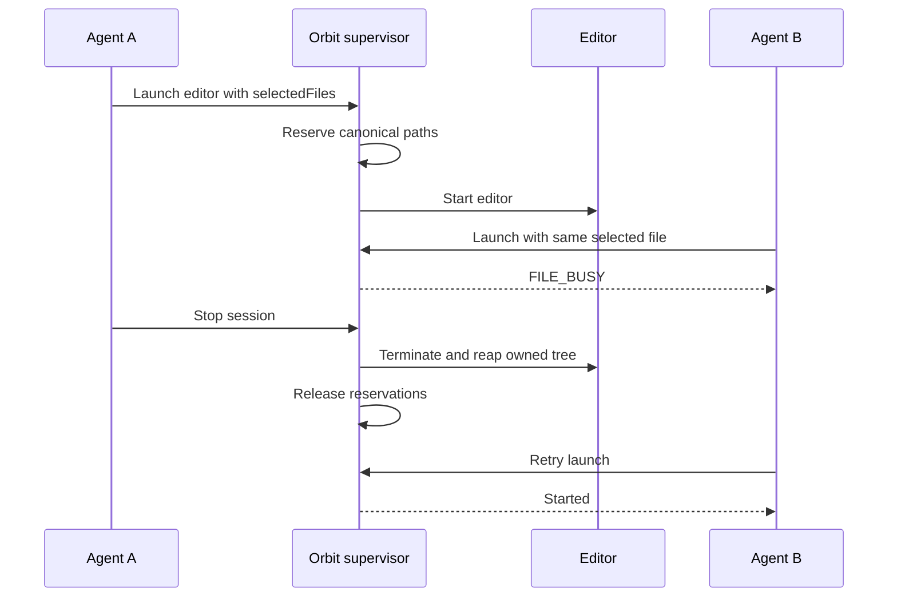

# Selected files and concurrent edits

Native launches can declare existing files with `selectedFiles`. Each file is reserved for that application tree. A cooperating second launch receives `FILE_BUSY` before its app starts; ending the owning application tree or stopping its session releases the reservation.


```mermaid
sequenceDiagram
    participant A as Agent A
    participant O as Orbit supervisor
    participant E as Editor
    participant B as Agent B
    A->>O: Launch editor with selectedFiles
    O->>O: Reserve canonical paths
    O->>E: Start editor
    B->>O: Launch with same selected file
    O-->>B: FILE_BUSY
    A->>O: Stop session
    O->>E: Terminate and reap owned tree
    O->>O: Release reservations
    B->>O: Retry launch
    O-->>B: Started
```

## Usage

Pass the same native action through CLI, API or MCP. Use existing absolute canonical file paths in both the declaration and application arguments. Launch applications with fresh state as described in the native guide.

```json
{
  "type": "launch",
  "toolkit": "wayland",
  "argv": ["/usr/bin/gnome-text-editor", "--standalone", "/absolute/project/notes.txt"],
  "selectedFiles": ["/absolute/project/notes.txt"]
}
```

The launch result includes `selectedFiles` as canonical paths. Up to 32 existing regular files can be reserved per launch. Missing files, relative paths, directories and multiply linked files are rejected with `INVALID_REQUEST`. Symbolic aliases resolve to the same reservation. If acquisition of any file fails, earlier reservations from that attempt are released.

## Scope and lifecycle

This is cooperative coordination, not a filesystem sandbox. An app can still access other files allowed by the OS user, and a launch that omits the declaration is not protected. Use a separate worktree or copies when concurrent changes are intentional. Worktree creation and merging are not automated here.

Reservations use stable canonical-path keys, so an editor's atomic file replacement does not drop its reservation. Moving the selected path, changing its symlink target after launch or introducing new hard links is outside this protocol. The private shared registry lives at `/tmp/orbit-file-leases-UID`; empty lock files are retained and must not be unlinked while Orbit runs. Linux releases the actual kernel locks when their descriptors close. Implementation uses the [Python flock interface](https://docs.python.org/3/library/fcntl.html#fcntl.flock).

The application supervisor retains the descriptors through descendant cleanup after broker pipe EOF. Independent SIGKILL of that supervisor can release locks before an app dies, so that failure mode and same-user bypass are not covered. No promise of general conflict prevention is made for undeclared or externally edited files.

## Verified evidence

Two independent brokers launched private displays. GNOME Text Editor A reserved a file, accepted Arabic text and saved exact bytes. B received `FILE_BUSY` before and after A's save. Stopping A removed its app PID; B then opened the same file and stopped. The targeted native run passed 5 tests and 31 assertions, including existing native crash tests.

The supervisor test separately covers canonical/symbolic alias collisions, atomic replacement, rollback after partial multi-file acquisition, invalid paths, independent files and retention during parent-pipe EOF while an app ignores graceful termination. This is one local result, not repeated reliability or all-application coverage.

Run under the shared resource cap:

```sh
ORBIT_TEST_NATIVE=1 bun run verify tests/file-leases.test.ts tests/native-file-leases.test.ts tests/native-crash.test.ts
```

The subsequent [validation summary](validation.md) passed 7 tests and 63 assertions, including the stronger partial-acquisition rollback case. TypeScript checking also passed. All test processes exited after the runs.

## Optional Zen exact-file bridge

Zen can request up to 16 existing host files at launch. The option is explicit and applies only to that private Zen instance:

```json
{
  "type": "launch-app",
  "app": "zen",
  "profile": "active",
  "network": "public-web",
  "sharedFiles": ["/absolute/project/notes.txt"]
}
```

The selected file appears at `/orbit/shared/1/notes.txt` inside private Zen. Orbit mounts that exact host file by a verified file descriptor, so an in-place write changes the same inode the host sees. No neighboring file or parent directory is mounted. This is separate from Zen's copied browser profile and does not grant the browser access to the person's display or pointer. Omitting `sharedFiles` leaves the existing private Zen filesystem unchanged.

The bridge rejects symbolic path components, directories, sockets, files with multiple hard links, and files inside the live Zen Flatpak data tree, Orbit session directory or host user runtime. Orbit's selected-file lease applies for the lifetime of the private application tree. The lease coordinates cooperating Orbit launches; another host process may still edit or replace a file.

This first tier supports direct reads and in-place writes to selected files. Applications that save through a temporary file and atomic rename may fail because only a file, not its parent directory, is mounted. If the host replaces the selected pathname, Zen can keep writing the old inode. The bridge does not yet provide a safe-save protocol, directory collaboration, automatic conflict resolution, or direct host download export. A website upload still sends a snapshot of file bytes to that service; live collaboration inside a website depends on the website's own account and document model.

The 28 September 2026 targeted run passed 13 tests and 84 assertions. Its supervisor test leased a disposable host file, mounted it through the Zen policy, changed the same host inode, and kept an unselected sibling hidden. A separate private display pilot launched the installed Zen binary with a disposable empty profile and reported one private window and the selected mount path. Its first-run welcome screen initially covered the local page. A later pilot opened `/orbit/shared/1/probe.html` in that private Zen instance and OCR matched a fixed marker from the disposable file. The person's live Zen profile was not used in either file pilot. In-app writing and atomic save through Zen are not measured.

## Document portal research

Fedora's running document portal provides a FUSE mount at `/run/user/1000/doc`. A separate research adapter grants one selected regular file through `Documents.Add` with a unique temporary ID, then binds only that ID's directory into bubblewrap. In a disposable test, the private process could read and write the selected file, could not see an unselected sibling, and had no host home, runtime directory or session bus. A direct write kept the host inode. Writing a temporary file beside the exported path and renaming it over the document succeeded, changed the host inode, and left the portal path reading the new content. Replacing the host pathname also made the portal path read the replacement. This matches the [document portal API](https://flatpak.github.io/xdg-desktop-portal/docs/doc-org.freedesktop.portal.Documents.html) and the host's measured behavior.

The path tracking has a decisive limit. After export, replacing the selected host path with a symbolic link made portal reads fail, but replacing it with a hard link to a different, unexported file owned by the same user exposed that file through the existing grant. The portal does not reapply Orbit's single-link check after the grant. Therefore [the adapter](../src/native/document_portal.py) is research only and is not connected to Zen or other launchers. The exact file descriptor mount above remains the active Zen behavior.

The adapter uses the same canonical file validation as the exact-file bridge, asks for a fresh temporary ID, binds only that ID's FUSE subtree, and calls `Documents.Delete` on cleanup. The [targeted synthetic tests](../tests/native-document-portal.test.ts) passed 4 cases, including atomic rename, hard-link substitution, rejection and cleanup. Upstream [portal code](https://github.com/flatpak/xdg-desktop-portal/blob/main/document-portal/document-portal.c) creates a unique ID when `reuse_existing` is false, so deleting that ID does not remove another application's grant. No native Zen run used this adapter.

## Atomic exchange research

The [disposable experiment](../experiments/safe-save-rename-exchange.py) compares an unsafe pathname write with a staged save using Linux `RENAME_EXCHANGE`. A hard-link replacement made the unsafe write change an unselected decoy. With the exchange, the displaced host inode stayed at the candidate name rather than being unlinked. Synthetic late host saves, symbolic and hard-link replacements, and a second save during conflict handling left every observed byte version recoverable from the selected name, candidate name, held descriptor or copied artifact.

This is a data preservation finding, not a safe-save implementation. [Linux renameat2](https://man7.org/linux/man-pages/man2/rename.2.html) provides atomic exchange but no condition that the target still has its granted inode. The broker detects a conflicting inode only after the selected name has briefly changed. A rollback can race another host save and put the newest host version at the artifact name instead of the selected name. Production would need a private file view that intercepts application saves, durable conflict artifacts and recovery state. No Orbit launcher uses this experiment, and no Zen or native application save through such a broker has been measured.

The seven disposable cases passed under the shared resource cap with `bun run scripts/limited.ts /usr/bin/python3 experiments/safe-save-rename-exchange.py`.
