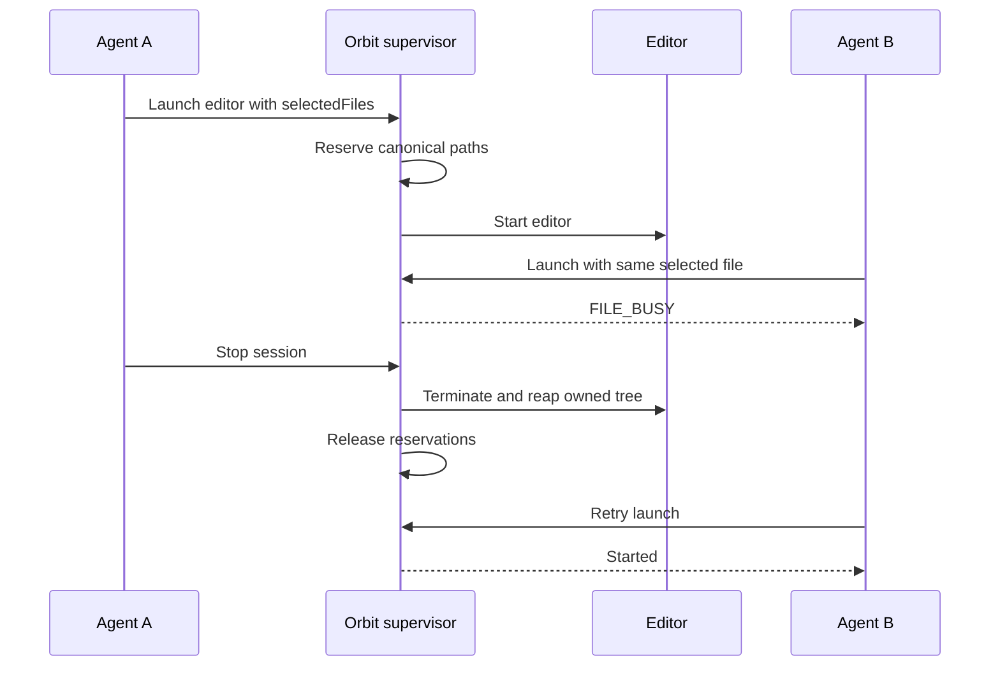

# Selected files and concurrent edits

Native launches can declare existing files with `selectedFiles`. Each file is reserved for that application tree. A cooperating second launch receives `FILE_BUSY` before its app starts; ending the owning application tree or stopping its session releases the reservation.


```mermaid
sequenceDiagram
    participant A as Agent A
    participant O as Orbit supervisor
    participant E as Editor
    participant B as Agent B
    A->>O: Launch editor with selectedFiles
    O->>O: Reserve canonical paths
    O->>E: Start editor
    B->>O: Launch with same selected file
    O-->>B: FILE_BUSY
    A->>O: Stop session
    O->>E: Terminate and reap owned tree
    O->>O: Release reservations
    B->>O: Retry launch
    O-->>B: Started
```

## Usage

Pass the same native action through CLI, API or MCP. Use existing absolute canonical file paths in both the declaration and application arguments. Launch applications with fresh state as described in the native guide.

```json
{
  "type": "launch",
  "toolkit": "wayland",
  "argv": ["/usr/bin/gnome-text-editor", "--standalone", "/absolute/project/notes.txt"],
  "selectedFiles": ["/absolute/project/notes.txt"]
}
```

The launch result includes `selectedFiles` as canonical paths. Up to 32 existing regular files can be reserved per launch. Missing files, relative paths, directories and multiply linked files are rejected with `INVALID_REQUEST`. Symbolic aliases resolve to the same reservation. If acquisition of any file fails, earlier reservations from that attempt are released.

## Scope and lifecycle

This is cooperative coordination, not a filesystem sandbox. An app can still access other files allowed by the OS user, and a launch that omits the declaration is not protected. Use a separate worktree or copies when concurrent changes are intentional. Worktree creation and merging are not automated here.

Reservations use stable canonical-path keys, so an editor's atomic file replacement does not drop its reservation. Moving the selected path, changing its symlink target after launch or introducing new hard links is outside this protocol. The private shared registry lives at `/tmp/orbit-file-leases-UID`; empty lock files are retained and must not be unlinked while Orbit runs. Linux releases the actual kernel locks when their descriptors close. Implementation uses the [Python flock interface](https://docs.python.org/3/library/fcntl.html#fcntl.flock).

The application supervisor retains the descriptors through descendant cleanup after broker pipe EOF. Independent SIGKILL of that supervisor can release locks before an app dies, so that failure mode and same-user bypass are not covered. No promise of general conflict prevention is made for undeclared or externally edited files.

## Verified evidence

Two independent brokers launched private displays. GNOME Text Editor A reserved a file, accepted Arabic text and saved exact bytes. B received `FILE_BUSY` before and after A's save. Stopping A removed its app PID; B then opened the same file and stopped. The targeted native run passed 5 tests and 31 assertions, including existing native crash tests.

The supervisor test separately covers canonical/symbolic alias collisions, atomic replacement, rollback after partial multi-file acquisition, invalid paths, independent files and retention during parent-pipe EOF while an app ignores graceful termination. This is one local result, not repeated reliability or all-application coverage.

Run under the shared resource cap:

```sh
ORBIT_TEST_NATIVE=1 bun run verify tests/file-leases.test.ts tests/native-file-leases.test.ts tests/native-crash.test.ts
```

The subsequent [validation summary](validation.md) passed 7 tests and 63 assertions, including the stronger partial-acquisition rollback case. TypeScript checking also passed. All test processes exited after the runs.

## Optional Zen exact-file bridge

Zen can request up to 16 existing host files at launch. The option is explicit and applies only to that private Zen instance:

```json
{
  "type": "launch-app",
  "app": "zen",
  "profile": "active",
  "network": "public-web",
  "sharedFiles": ["/absolute/project/notes.txt"]
}
```

The selected file appears at `/orbit/shared/1/notes.txt` inside private Zen. Orbit mounts that exact host file by a verified file descriptor, so an in-place write changes the same inode the host sees. No neighboring file or parent directory is mounted. This is separate from Zen's copied browser profile and does not grant the browser access to the person's display or pointer. Omitting `sharedFiles` leaves the existing private Zen filesystem unchanged.

The bridge rejects symbolic path components, directories, sockets, files with multiple hard links, and files inside the live Zen Flatpak data tree, Orbit session directory or host user runtime. Orbit's selected-file lease applies for the lifetime of the private application tree. The lease coordinates cooperating Orbit launches; another host process may still edit or replace a file.

This first tier supports direct reads and in-place writes to selected files. Applications that save through a temporary file and atomic rename may fail because only a file, not its parent directory, is mounted. If the host replaces the selected pathname, Zen can keep writing the old inode. The bridge does not yet provide a safe-save protocol, directory collaboration, automatic conflict resolution, or direct host download export. A website upload still sends a snapshot of file bytes to that service; live collaboration inside a website depends on the website's own account and document model.

The 28 September 2026 targeted run passed 13 tests and 84 assertions. Its supervisor test leased a disposable host file, mounted it through the Zen policy, changed the same host inode, and kept an unselected sibling hidden. A separate private display pilot launched the installed Zen binary with a disposable empty profile and reported one private window and the selected mount path. Zen's first-run welcome screen covered the attempted local page, so reading the shared file through Zen's UI is not yet measured. The person's live Zen profile was not used in this file pilot.
