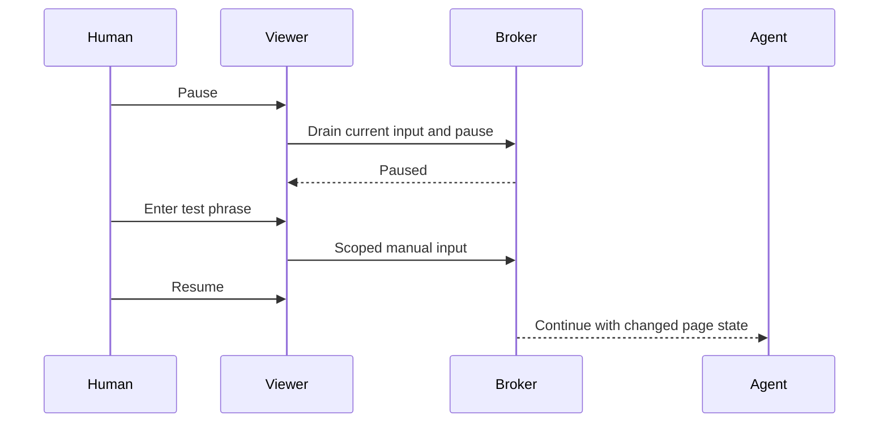

# Human work and takeover trial

Status: preparation only. The 600-second automated run passed, but no human participation is inferred from it or from desktop activity.

## User flow

1. Start one bounded Orbit session and let the agent work while you use another application.
2. Open the optional viewer, choose Pause, and wait for Paused.
3. Enter a disposable test phrase in the agent's page and submit it.
4. Resume. Verify that the agent reads the changed result and continues.
5. Close the viewer and verify that work continues. Stop the session at the end.

## Record and judge

| Check | Required evidence |
|---|---|
| Human kept working | Explicit participant confirmation, not inferred from focus changes |
| No Orbit focus interference | Focus/client observations plus events, matched to owned PIDs; include errors, unknown event ownership and sampling gaps |
| Pause and takeover | Pause acknowledgement, rejected agent input while paused, exact disposable phrase readback and successful work after resume |
| Viewer is optional | Work succeeds after viewer close |
| Cleanup and resources | Owned processes exit; no host fallback; shared cap and memory-event deltas recorded |

The new `experiments/hyprland-focus.ts` monitor is read-only. It uses `hyprctl` queries and the documented [Hyprland event socket](https://wiki.hypr.land/IPC/). It keeps only ownership flags, counts and elapsed times in its returned report. Window titles, classes, addresses, PIDs and keystrokes are not persisted. Raw query/event data exists transiently in memory while being parsed.

Event attribution uses the latest sampled client/PID map. Newly created or very short-lived windows can remain unresolved. An unresolved event, dropped connection or sample error must be reported; absence of a detected owned window alone is not proof of continuous non-interference. This tool is not a keyboard or pointer recorder.

The monitor's parser/privacy tests and a short live connection/cleanup test pass. The experimental `experiments/human-handoff.ts` runner starts the participant trial. A submitted phrase alone does not prove human participation; confirmation and interpretation remain required.
