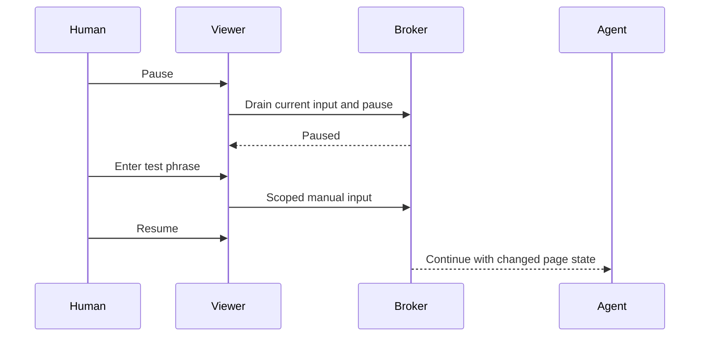

# Human work and takeover trial

Status: the automated half has run; the participant half has not. The monitor and the runner are in place, and a trial may be running; no human participation is inferred from a run or from desktop activity until the participant confirms it.

## Running it

```sh
ORBIT_SOCKET="$XDG_RUNTIME_DIR/sbar-orbit/broker.sock" bun run scripts/limited.ts bun run experiments/human-handoff.ts
```

With `ORBIT_SOCKET` naming a broker that answers, the trial attaches to it, so it can run beside a
managed installation on this workstation, which is the case the trial is for. That broker is never
closed by the trial. Without it the runner starts a private broker of its own. The run prints the
viewer link and the disposable phrase once, and rewrites `output/human-handoff-<id>/report.json` as
it goes.

Two consequences of attaching, both printed in the report's own `limitations`:

- The browser belongs to the managed broker rather than to this process, so the monitor's owned set
  is every process in the shared `sbarorbit.slice`, which also counts any other agent's sessions
  running at the same time.
- The memory guard reads the slice's live headroom through `budgetHeadroom()` and stops the trial
  before the shared ceiling, rather than comparing against a fixed number that a managed broker has
  already spent. A fixed threshold made the trial abort immediately whenever Orbit was already
  running, which is the one situation it needs to work in.

## Concurrent run, 20 September 2026

One browser session ran for the full 600 seconds on the **managed** broker on this workstation, with
four other agents' sessions live on the same broker and the same shared slice, while the desktop
carried the person's own applications. The driver completed **555 submissions**, each a click, a fill
and a readback that had to match the value it wrote. The read-only Hyprland monitor sampled **1184
times** across the run, and the result is flat: no sample had an Orbit-owned active window, no sample
had an Orbit-owned window visible at all, all **9** delivered focus events were unattributed to
Orbit, `errors` was 0, `unresolvedFocusEvents` was 0, and the largest gap between samples was
1288 ms.

What that settles and what it does not:

- It settles the no-interference half at the tier the monitor can reach. Over ten minutes of
  concurrent activity, Orbit never took focus and never mapped a window on the person's desktop,
  while working the whole time. The monitor is read-only, keeps no titles, classes, addresses, PIDs
  or keystrokes, and is not a keyboard or pointer recorder, so it cannot exclude every transient
  focus change.
- The covered set is Orbit's own window class. The session is headless, and a viewer opened by the
  person runs in their own browser, outside the measured Orbit scope, so this is **not** a
  measurement of a viewer window. It is a measurement that the browser session itself stayed off the
  desktop.
- It does **not** settle the human half. Nothing paused, so `manualPhraseAccepted` and
  `pausedObserved` are false, no input was rejected while paused, and the disposable phrase was
  never read back. The run ended `incomplete`, which is the honest status for it.
- It is not participant confirmation of concurrent work. The desktop was in use, but this
  measurement does not establish that a person was at it, and a submitted phrase would not have
  proved who submitted it either.

The runner attaches to the managed broker rather than starting its own, and both consequences are
printed in the report: the owned set is the whole shared slice, so the other agents' sessions count
as Orbit processes, and the attached broker's own startup and workspace are outside the trial.

## User flow

1. Start one bounded Orbit session and let the agent work while you use another application.
2. Open the optional viewer, choose Pause, and wait for Paused.
3. Enter a disposable test phrase in the agent's page and submit it.
4. Resume. Verify that the agent reads the changed result and continues.
5. Close the viewer and verify that work continues. Stop the session at the end.



## Record and judge

| Check | Required evidence |
|---|---|
| Human kept working | Explicit participant confirmation, not inferred from focus changes |
| No Orbit focus interference | Focus/client observations plus events, matched to owned PIDs; include errors, unknown event ownership and sampling gaps |
| Pause and takeover | Pause acknowledgement, rejected agent input while paused, exact disposable phrase readback and successful work after resume |
| Viewer is optional | Work succeeds after viewer close |
| Cleanup and resources | Owned processes exit; no host fallback; shared cap and memory-event deltas recorded |

The new `experiments/hyprland-focus.ts` monitor is read-only. It uses `hyprctl` queries and the documented [Hyprland event socket](https://wiki.hypr.land/IPC/). It keeps only ownership flags, counts and elapsed times in its returned report. Window titles, classes, addresses, PIDs and keystrokes are not persisted. Raw query/event data exists transiently in memory while being parsed.

Event attribution uses the latest sampled client/PID map. Newly created or very short-lived windows can remain unresolved. An unresolved event, dropped connection or sample error must be reported; absence of a detected owned window alone is not proof of continuous non-interference. This tool is not a keyboard or pointer recorder.

The monitor's parser/privacy tests and a short live connection/cleanup test pass. The experimental `experiments/human-handoff.ts` runner starts the participant trial. A submitted phrase alone does not prove human participation; confirmation and interpretation remain required.
