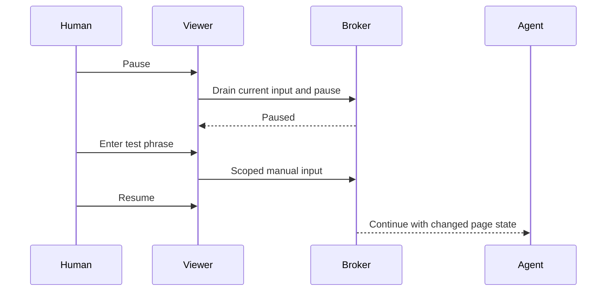

# Human work and takeover trial

Status: the mechanism has been measured end to end with a scripted participant; a person at the keyboard is still unmeasured. The monitor and the runner are in place, and a human trial may be running; no human participation is inferred from a run or from desktop activity until the participant confirms it.

## Running it

```sh
ORBIT_SOCKET="$XDG_RUNTIME_DIR/sbar-orbit/broker.sock" bun run scripts/limited.ts bun run experiments/human-handoff.ts
```

With `ORBIT_SOCKET` naming a broker that answers, the trial attaches to it, so it can run beside a
managed installation on this workstation, which is the case the trial is for. That broker is never
closed by the trial. Without it the runner starts a private broker of its own. The run prints the
viewer link and the disposable phrase once, and rewrites `output/human-handoff-<id>/report.json` as
it goes.

Two consequences of attaching, both printed in the report's own `limitations`:

- The browser belongs to the managed broker rather than to this process, so the monitor's owned set
  is every process in the shared `sbarorbit.slice`, which also counts any other agent's sessions
  running at the same time.
- The memory guard reads the slice's live headroom through `budgetHeadroom()` and stops the trial
  before the shared ceiling, rather than comparing against a fixed number that a managed broker has
  already spent. A fixed threshold made the trial abort immediately whenever Orbit was already
  running, which is the one situation it needs to work in.

## Concurrent runs, 20 September 2026

Three browser sessions each ran on the **managed** broker on this workstation, with other agents'
sessions live on the same broker and the same shared slice, while the desktop carried the person's own
applications. The driver completed **555 submissions** in the first, **558** in the second and **546**
in the third, each a click, a fill and a readback that had to match the value it wrote.

**The first two readings were wrong, and this is the correction rather than a quiet replacement.** The
first reported 1184 samples with no Orbit-owned focus anywhere, which is the right answer reached from
an owned set that could not have contained one: the monitor was reading
`sbarorbit.slice/cgroup.procs`, and that file holds **0 processes**, because the managed broker's
processes live one level down in `sbarorbit.slice/sbar-orbit.service`, and `cgroup.procs` never lists a
child cgroup. An empty file then parsed to a set holding **pid 0**, since `"".split(/\s+/)` is `[""]`
and `Number("")` is 0, while `sanitizeFocus` reports pid 0 for "no active window". The two zeros
matched each other, so the first reading was vacuous and the second was actively wrong: its 1207
samples included **four claiming an owned active window and two focus events claiming the same**, on a
desktop where `visibleOwnedCount` was 0 in every sample and no Orbit window existed at all.

Both causes are fixed, and both are held by tests in `tests/hyprland-focus.test.ts`: a pid is a
positive integer or it is not a process, pid 0 is never an owner, and the owned set is read from the
whole cgroup subtree rather than one cgroup of it. The report now prints the size of that set, because
an empty owned set makes every observation read as "nothing was owned" and is therefore not evidence
of anything.

The fix was checked first on a 95 second run, deliberately ended: the owned set covered **74
processes** and its 187 samples showed no Orbit-owned focus.

**The measurement is the third run, the first ten minutes taken with the corrected harness.** The owned
set covered **30 processes**, the managed broker's browser among them. Across **1197 samples**
`activeOwned` was false in every one, `visibleOwnedCount` was 0 in every one, no focus event was
attributed to Orbit, `errors` and `unresolvedFocusEvents` were both 0, and the largest gap between
samples was 703 ms.

What that settles and what it does not:

- It settles the no-interference half at the tier the monitor can reach: over ten minutes of concurrent
  activity the browser session never took focus and never mapped a window on the person's desktop while
  working the whole time. The monitor is read-only, keeps no titles, classes, addresses, PIDs or
  keystrokes, and is not a keyboard or pointer recorder, so it cannot exclude every transient focus
  change.
- The covered set is Orbit's own window class. The session is headless, and a viewer opened by the
  person runs in their own browser, outside the measured Orbit scope, so this is **not** a
  measurement of a viewer window. It is a measurement that the browser session itself stayed off the
  desktop.
- It does **not** settle the human half. Nothing paused, so `manualPhraseAccepted` and
  `pausedObserved` are false, no input was rejected while paused, and the disposable phrase was never
  read back. All three runs ended `incomplete`, which is the honest status for them.
- It is not participant confirmation of concurrent work. The desktop was in use, but none of these
  measurements establishes that a person was at it, and a submitted phrase would not have proved who
  submitted it either.

The runner attaches to the managed broker rather than starting its own, and both consequences are
printed in the report: the owned set is the whole shared slice subtree, so other agents' sessions
count as Orbit processes, and the attached broker's own startup and workspace are outside the trial.

## Scripted participant, 20 September 2026

The takeover path itself is measured, without a person, by driving the participant's side through
`session.control`, which is the method the viewer's own manual input calls. `experiments/human-handoff.ts
--auto-participant` pauses the session about twenty seconds into a run, then points, types and presses
the way a person does: focus the field by coordinate, insert the phrase, press the button.

One run, 92 seconds, every clause observed separately:

| Clause | Observed |
|---|---|
| Pause acknowledged | `pausedObserved: true` |
| Agent input refused while paused | `refusedWhilePaused: 1`, `["read #result during pause"]` |
| The participant's phrase accepted by the page | `scriptedParticipantSubmitted: true` |
| The agent read the changed result after the resume | `agentReadManualResult: "Accepted"` |
| Work continued from the changed page | `resumedAfterManual: true`, `submissionsAfterResume: 64` |
| The trial cleaned up after itself | `sessionStoppedByTrial: true` |

`mechanismVerified` is true for that run, and it is computed from all six clauses rather than set at
one moment.

**This is not participant confirmation and the report refuses to make it one.** `participant` reads
`scripted`, `humanParticipationConfirmed` stays false in every run, and the limitation is printed in
the report's own list: driving the same method a viewer calls measures the mechanism, not a person
using it. What is still missing is the one thing no script can supply, a person at the keyboard saying
that nothing about Orbit disturbed their work.

Both modes use the same page. The participant's two controls sit at fixed coordinates so a scripted
participant can reach them exactly as a person reaches them by pointing.

## User flow

1. Start one bounded Orbit session and let the agent work while you use another application.
2. Open the optional viewer, choose Pause, and wait for Paused.
3. Enter a disposable test phrase in the agent's page and submit it.
4. Resume. Verify that the agent reads the changed result and continues.
5. Close the viewer and verify that work continues. Stop the session at the end.



## Record and judge

| Check | Required evidence |
|---|---|
| Human kept working | Explicit participant confirmation, not inferred from focus changes |
| No Orbit focus interference | Focus/client observations plus events, matched to owned PIDs; include errors, unknown event ownership and sampling gaps |
| Pause and takeover | Pause acknowledgement, rejected agent input while paused, exact disposable phrase readback and successful work after resume |
| Viewer is optional | Work succeeds after viewer close |
| Cleanup and resources | Owned processes exit; no host fallback; shared cap and memory-event deltas recorded |

The new `experiments/hyprland-focus.ts` monitor is read-only. It uses `hyprctl` queries and the documented [Hyprland event socket](https://wiki.hypr.land/IPC/). It keeps only ownership flags, counts and elapsed times in its returned report. Window titles, classes, addresses, PIDs and keystrokes are not persisted. Raw query/event data exists transiently in memory while being parsed.

Event attribution uses the latest sampled client/PID map. Newly created or very short-lived windows can remain unresolved. An unresolved event, dropped connection or sample error must be reported; absence of a detected owned window alone is not proof of continuous non-interference. This tool is not a keyboard or pointer recorder.

The monitor's parser/privacy tests and a short live connection/cleanup test pass. The experimental `experiments/human-handoff.ts` runner starts the participant trial. A submitted phrase alone does not prove human participation; confirmation and interpretation remain required.
