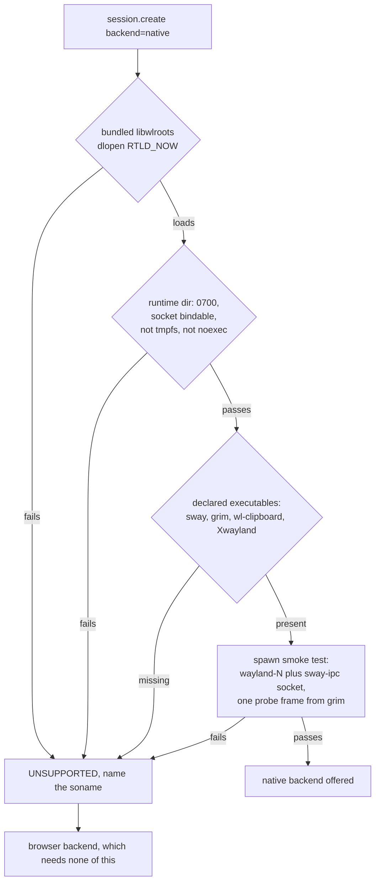
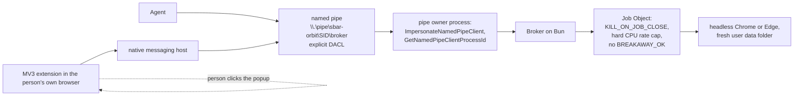

# Porting plan

> How to read this: every row is tiered. **Measured** ran on the owner's workstation and its command
> is in this repository. **Reasoned** is vendor documentation with no host to test on. **Refused**
> has a primary source saying it cannot work. There is no Windows, macOS or non Fedora Linux host in
> this project's reach, so nothing outside the first column has been run.

Written 11 September 2026 against the alpha in this repository, on the findings of
[the separate workspace review](separate-workspace-review.md). Seventeen candidate designs were
written for this plan and each was handed to an independent skeptic. Twelve were refuted, six of
those with high confidence. This document carries the corrected form, not the proposed form.

The scope is narrow and stated first: how the Orbit approach ports off this one workstation, and what
an experimental community release needs in order to be honest about it.

Everything called measured was run on the owner's Fedora 44, Hyprland, btrfs workstation. Everything
about Windows and macOS is reasoning from vendor documentation. There is no Windows host, no macOS
host and no non Fedora Linux host in this project's reach, and that limit shapes every section below
rather than sitting in a disclaimer at the end.

## 1. What ports, what needs a per platform design, and what cannot exist

### Ports unchanged

These are platform independent because they are Orbit's own contract, not a borrowed primitive.

| Layer | Why it ports |
|---|---|
| The broker contract: `session.create`, `act`, `observe`, `pause`, `resume`, `stop`, request ID deduplication, per session action serialization, concurrency between sessions | Pure bookkeeping over whatever the backend is |
| The error vocabulary, including `UNSUPPORTED`, `PAUSED`, `RESOURCE_BOUNDARY_LOST`, `DEADLINE_EXCEEDED` | Already the mechanism by which Orbit refuses instead of degrading |
| The refusal discipline in `docs/architecture.md`: deny an unsupported tool rather than switch to host input, host portals or the person's browser | A policy, and the only reason R1 holds structurally rather than by luck |
| The owned headless browser shape over CDP: fresh profile, `--headless`, loopback CDP, endpoint read from `DevToolsActivePort` | Chrome behaves the same on all three systems; only the launch wrapper and the containment differ |
| The loopback viewer: origin validation, per run token, explicit observation decoupled from the input queue | Loopback TCP is the same everywhere |
| Redaction discipline: aggregate cookie counts only, no cookie name, host or value in any artifact | A rule about what code may read, not about the OS |

### Needs a per platform design

| Layer | Linux today | Windows | macOS |
|---|---|---|---|
| Containment and cleanup | `sbarorbit.slice`, a `CPUQuota` and `memory.max` sized to the machine, `CPUWeight=10`, plus `src/native/supervise.py` as subreaper | Job Object with `KILL_ON_JOB_CLOSE` and a hard CPU rate cap | One `launchd` job per session in `gui/$UID`, killed by process group on job death |
| Resource accounting | `cpu.stat`, `memory.current`, `memory.events`, `pids.*` read from the cgroup | `QueryInformationJobObject` plus summed `GetProcessMemoryInfo`, plus a completion port for the event counters | No kernel ceiling. A broker side sampler over `proc_pid_rusage`, reported as advisory |
| Broker transport | `AF_UNIX` at `$XDG_RUNTIME_DIR/sbar-orbit/broker.sock`, mode 0600 | Named pipe with an explicit DACL, because `AF_UNIX` on Windows carries no peer credentials | `AF_UNIX` under `~/Library/Application Support`, with a 103 byte path ceiling |
| Browser resolution | Fixed list in `src/runtime-paths.ts` | Registry `App Paths` plus the standard install roots | Bundle identifier to `.app`, verified by `codesign` |
| Real sessions | Profile clone, keyring reached through a filtered bus | Extension mint through a native messaging host. A clone is refused | Unresolved. A clone is mechanically plausible and every failure mode is a dialog on the person's screen |
| Private display | Bundled headless wlroots | Does not exist in a form that satisfies both requirements | Does not exist |

### Cannot exist on some platforms

Each of these is refused, not deferred. A primary source or a vendor decision says no.

| Capability | Where it cannot exist | The deciding fact |
|---|---|---|
| Private display plus the person's real applications | Windows, macOS | Every mechanism that reaches the person's running applications drives their visible windows. Every mechanism that isolates discards the state R2 asks for |
| A second concurrent interactive or GUI session for one user | Windows, macOS | Not a supported configuration on Windows 11 Pro or Home. No Apple API creates a second Aqua session for an already logged in user |
| Real sessions from a profile copy | Windows | `GetAppBoundEncryptionSupportLevel` returns `kNotUsingDefaultUserDataDir` for any non default user data directory, and returns before the policy branch |
| A kernel enforced memory ceiling on the session tree | macOS | `RLIMIT_AS` and `RLIMIT_RSS` are either unenforced on Darwin or kill Chrome outright, because V8 reserves hundreds of gigabytes of address space |
| Attaching to the person's running browser over CDP | All three | Chrome 136 blocked default profile debugging, and it is the screen takeover R1 forbids |

### Verdict on every reviewed design

Nothing is filed as a gate where a skeptic refuted the mechanism. The word in the verdict column is
the instruction.

| Design | Verdict | What changed |
|---|---|---|
| Bundled nested wlroots, headless plus pixman | Ship narrowly | Valid on glibc, full desktop stack, logind session. Not the single Linux design. Runtime directory must leave tmpfs |
| GPU renderer with the render device pinned | Fallback, opt in | Mechanism holds. Detection replaced entirely |
| Prefer `ext-image-copy-capture-v1`, in process capture client | Changed | Bundle `grim`. Drop the in process client and the host compositor portability framing |
| Host compositor first, vendored distro package second | Prototype, Fedora and openSUSE only | Fetch a declared executable set. Digest keyed probe. `ldd -r` plus a real start |
| Compositor in a rootless container | Wayland only | X11 refused until Orbit owns the display identity. Scope placed in Orbit's slice by construction |
| Pinned source build of wlroots and sway | Dead as written | Three of its four meson flags name options upstream does not have |
| Branding matched keyring clone | Changed | The path scoped keyring grant is false. The session gets full `org.freedesktop.secrets` TALK |
| Flatpak profile cloned out and launched outside | Gate | The blanket refusal was replaced after measurement: a Flatpak Chrome profile decrypted 115 of 115 cookies under the system Chrome binary, so the keyring item is shared by branding rather than by sandbox. That tree was a leftover from an uninstalled application, so a live Flatpak browser is still unproven. `src/platform.ts` now refuses on branding, not on packaging |
| Launch inside the sandbox, Flatpak or Snap | Dead | `flatpak run` puts the browser in its own `app.slice` scope, measured here. R4 is lost by construction |
| W1 Job Object browser | Gate | Containment primitives are right. The accounting port is redesigned |
| W2 Named pipe transport | Changed | Bun cannot serve HTTP over a pipe name. Peer identification needs a process that owns the pipe |
| W3 Extension mint plus native messaging host | Gate, and not first | No external path wakes a stopped MV3 service worker |
| macOS launchd owned headless Chrome | Prototype | Keychain flag restored. `RLIMIT_CPU` deleted from the budget story |
| macOS APFS clonefile profile handoff | Refuse for now | No macOS host. Copy primitive semantics unfetched. R1 is unknown, not yes |
| The zero dialog TCC contract | Changed | Four refusal rows survive. The Keychain row is a gate, not a solved row |
| Three tier capability statement | Changed | Five tiers, and the delegation probe was wrong on the reference host |
| GitHub issue forms and labels | Changed | The program readable fact the routing needs does not exist yet |

## 2. Capability tiers

Five tiers, because the evidence on this project has five states and collapsing them prints a pass
over a recorded failure. `Failed` has exactly one member today. It exists because deleting it would
make `docs/validation.md` say the opposite of what it says.

| Tier | Exact promise |
|---|---|
| **Measured** | A named test in `docs/validation.md` ran on a host of this class and passed, and the command that reproduces it is in this repository |
| **Limited** | It ran here and passed inside a stated limit: a fixture rather than the real thing, or a subset of the capability. The limit is printed beside the tier, never omitted |
| **Failed** | It ran here and did not pass. The result is preserved, not retried into silence |
| **Reasoned** | The platform documents the primitive. No host of this class is in this project's reach and no test has run on one. Installing here produces a test report, not a bug report |
| **Refused** | A primary source says it cannot work. Orbit throws `UNSUPPORTED` rather than degrading, and the tracker does not accept a bug for it |

### The matrix

Host classes, not release names. Fedora 44 on Hyprland with cgroup delegation is the only Measured
class that exists.

| Capability | Fedora 44, wlroots host | Linux, other glibc distro | Linux, musl or no desktop stack | Windows 10 1809 and later | macOS 13 and later |
|---|---|---|---|---|---|
| Owned headless browser, fresh profile | Measured | Measured, 1 host: `bun run verify` on an Ubuntu 24.04.5 runner, 233 pass, 0 fail, 14 September 2026 | Reasoned | Limited: Chrome launched and rendered under a job object on a runner, no broker yet | Limited: Chrome launched and rendered on a runner, no broker yet |
| Private display, real desktop applications | Limited: nineteen GNOME, KDE, LibreOffice, Qt and Xwayland applications launched, a file was saved, and the GTK file chooser works with no session bus at all, G10 | Limited, in containers: the bundled compositor on Arch and openSUSE, the family's own on Debian and Ubuntu, G2 and G5 | Refused for musl, the bundle is glibc linked | Refused | Refused |
| Viewer and pause | Measured | Reasoned | Reasoned | Reasoned | Reasoned |
| Human takeover and resume | Failed: `docs/validation.md` records the manual resume workflow not completed, and "Human takeover remains unconfirmed" | Reasoned | Reasoned | Reasoned | Reasoned |
| One core budget, participant acceptance | Failed: participant stopped the trial at about 123 seconds over CPU cost. A scheduling defect was found and fixed, and no second trial has run | Reasoned | Reasoned | Reasoned | Reasoned |
| One core budget, measured share | Measured: 10.4% of one core idle, 58.0% working with a viewer at 1 FPS | Reasoned | Reasoned | Reasoned | Reasoned |
| Real sessions, profile clone | Limited: the clone and decrypt path is measured, 167 of 167 cookies cloned and 142 of 142 decrypted, and the capability is not shippable at that evidence because the session holds keyring wide TALK and has no relock re check | Reasoned, and only where reflink and a secret service both answer | Refused without reflink | Refused, App Bound Encryption | Reasoned, and every failure mode is a dialog on the person's screen |
| Real sessions, extension mint | Not in this release | Not in this release | Not in this release | Reasoned | Reasoned |
| Flatpak or Snap browser as the launch path | Refused | Refused | Refused | Not applicable | Not applicable |

A Measured row that rests on one external host prints `Measured, 1 host, issue #N` in the evidence
column of the proposed `docs/support-tiers.md`. That is the evidence column doing its job, not a sixth tier.

## 3. Linux by desktop, and by distribution

### The finding, stated before the detail

The private display does not depend on the person's desktop at all. Orbit spawns its own bundled sway
against `WLR_BACKENDS=headless` with a scrubbed environment, so GNOME on Mutter, Plasma on KWin, sway,
river, Wayfire, Xfce, i3 and Hyprland are the same case. Which capture or input protocols the host
compositor implements is outside the blast radius, and the aggregated Mutter and KWin support table
that an earlier draft treated as decisive decides nothing here.

What the design does depend on is the host's C library, its shared library set, and whether a logind
session exists. Those are distribution questions, not desktop questions.



### What the nested display depends on

| Dependency | Status | What it means for a port |
|---|---|---|
| glibc | Hard. The bundled `libwlroots-0.19.so` and `libliftoff.so.0` are glibc linked | Alpine and any musl host is Refused, not Reasoned |
| 30 `DT_NEEDED` entries in the bundled libwlroots, of which 2 are vendored | Measured here: `readelf -d` reports 30 `NEEDED`, and only libwlroots and libliftoff ship in `.runtime/sway` | The remaining 28 must match the host's soname set. A same soname library missing a versioned symbol passes a presence check and dies at exec, so presence is not the probe |
| A full desktop stack already installed | Hard, and it contradicts the server target an earlier draft claimed | `libEGL`, `libgbm`, `libvulkan`, `libwacom`, `libdisplay-info` and thirteen `libxcb-*` sonames are hard `DT_NEEDED` entries even on the pixman path that never calls them. A host with no desktop stack is refused by Orbit's own probe |
| A logind session for the broker | Hard for the broker, unknown for the compositor | `sbar-orbit.service` is a `systemd --user` unit on a socket under `/run/user/UID`, so a headless server needs `loginctl enable-linger`. Whether the compositor itself starts with no logind session at all is a gate |
| A render node | Not required. `WLR_RENDERER=pixman` needs no DRM device, no seat and no udev | This is why pixman stays the default |
| `grim` | Currently the host's binary at an absolute path, `src/fedora.ts` line 303 | Bundle it beside the bundled sway. That removes the only host version dependency in the frame path |

### Two portability defects in the shipped path

Both must land before any preflight rewrite, because both are hazards the current probe set cannot see.

**The runtime directory is on tmpfs.** `src/fedora.ts` creates it with `mkdtemp("/tmp/orbit-native-")`,
and `findmnt -no FSTYPE /tmp` on this workstation returns `tmpfs`. tmpfs pages are charged to the
Orbit slice, which is one of the recorded slice starvation causes. Move the session directory under
the workspace root, which is already on btrfs here, and probe the filesystem type rather than only
whether a 0700 directory can be created.

**The environment scrub is load bearing and must be written down completely.** The shipped code
deletes `DISPLAY`, `WAYLAND_DISPLAY`, `WAYLAND_SOCKET`, `SWAYSOCK`, `I3SOCK`,
`HYPRLAND_INSTANCE_SIGNATURE`, `NOTIFY_SOCKET` and `XAUTHORITY`, and repoints
`DBUS_SESSION_BUS_ADDRESS` at a socket that does not exist. `NOTIFY_SOCKET` and the dead bus address
are the two that keep notifications and portal activation dialogs off the person's screen. Any
reimplementation that omits them inherits a live session bus and leaks to the desktop.

### The distribution bootstrap

One `CompositorAdapter` with two ordered sources, replacing the Fedora only bootstrap script and the
fixed paths in `src/runtime-paths.ts`.

**Source A, a host `sway` from PATH.** Used with no download when it passes the contract probe. The
probe result is keyed to the binary's identity, path plus size plus digest plus mtime, and re run on
mismatch. A recorded pass that outlives a host upgrade is the repo's own rule inverted: a cached proof
of existence is existence again.

**Source B, the distribution's own binary packages extracted into a private prefix.** Never installed.
`dnf download --resolve` then `rpm2cpio | cpio -idu` on the rpm families; `apt-get download` then `ar x`
on the deb families; `pacman -Sw` then untar on Arch. Three corrections to the naive form:

- The fetch is driven by a **declared executable set**, not by the loader graph. `ldd` reports sonames,
  not sibling binaries, so it can never discover `grim`, `wl-clipboard` or `Xwayland`, all three of
  which `src/preflight.ts` currently gates on and none of which live in the vendored prefix today.
- Loader closure is tested with `ldd -r` plus an actual headless start. Plain `ldd` performs no
  relocation resolution, so a vendored library missing a symbol version from a host library passes
  cleanly and dies at exec.
- `pkexec`, `sudo` and PackageKit are banned in the adapter. Any leg that reaches privilege raises a
  polkit authentication dialog in the person's own session, which no environment scrub can suppress
  because it is not Orbit's process.

The cost figure, 9.9 MiB on disk in one download with no root and no compiler, is measured for `dnf`
only. `apt-get download` against a stale index, `apt-file search`, `pacman -F` and `zypper download`
are each unverified and each may need an index sync. The affirmative ABI argument, that a fetched
package is matched to the host because it is the distribution's build, is false on rolling releases:
downloading the current sway onto an un upgraded Arch system is the textbook partial upgrade break.

**Verdict: prototype on Fedora and openSUSE. Do not claim Debian, Ubuntu or Arch until the contract
probe has passed on a real host of that family.**

Measured since, on 14 September 2026, in containers rather than on real hosts:
`experiments/linux-families/run.sh` runs the contract probe on Debian 13, Ubuntu 24.04, Arch and
openSUSE Tumbleweed. The bundled Fedora build loads and runs on Arch and Tumbleweed and is refused by
soname on Debian stable and Ubuntu LTS, and Source B, the family's own packages unpacked into a
private prefix, starts on all four. The gate rows below carry the numbers. A container has no
screen, no GPU and no systemd user session, so every one of those results is tier `Limited`; what
it changes is that Debian, Ubuntu and Arch now have a measured path rather than a reasoned one.

### The egress tier, and where it exists

A session whose origins are bounded gets a browser with no network of its own: an empty network
namespace whose only route out is a unix socket into a proxy that holds the lease. It is built on
`bwrap --unshare-net --unshare-pid`, which is unprivileged user namespaces, so it exists exactly where
those do. The probe asks for a sandbox rather than looking for the binary, because unprivileged user
namespaces can be present, absent, or present and administratively disabled, and only trying tells the
three apart.

| Host | What the tier is expected to be | Why it is not asserted |
|---|---|---|
| Fedora 44, this host | `namespace`. Measured | Measured, `confinedEgress: true`, and the wired lease measured end to end |
| Debian, Ubuntu, Arch, openSUSE | `namespace`, Limited: measured in containers on 14 September 2026, G29 | `bwrap` and `socat` are packaged on all four and the network namespace confined a fetch in each; a real host's AppArmor `userns` policy is the half a container cannot answer |
| A rootless container | Limited: a user namespace nested inside rootless podman on all four families, and confined the network; podman refused the `--proc /proc` half of Orbit's shape | The pid half is the container's limit, measured the same day, G29 |
| Windows | `in-browser`, with no equivalent designed | There is no `--unshare-net`. What exists is a Windows Filtering Platform filter or a network compartment, both of which are a different design and one of which needs a driver. G28 |
| macOS | `in-browser`, with no equivalent designed | No network namespaces. `pf` is system wide and root only, and a per process filter means a Network Extension, which means an entitlement and a signed installer. G30 |

On any host where the tier is `in-browser`, the lease is the request interception inside the browser,
which holds a page that misbehaves and not a browser that does. That is a real difference in what the
session guarantees, so it is printed by `doctor`, written into the session's first journal line, and
never silently substituted.

### The container variant, for atomic hosts

Silverblue, Kinoite and Bazzite have no `dnf` in the host image and `rpm-ostree install` mutates the
deployment and needs a reboot, which Orbit must not require. A rootless OCI image carrying the
compositor is the only route there. The applications stay on the host, because a container's
applications are not the person's applications.

Two corrections make it survivable and both are structural.

**X11 is refused, not gated.** `src/fedora.ts` line 141 discovers the private `DISPLAY` by running an
interpreter through sway IPC and reading `os.environ["DISPLAY"]` back. Under containerization that
`exec` runs inside the container, and the `:N` it reports was allocated against the container's own
`/tmp/.X11-unix`. Line 203 then hands that bare integer to an application spawned on the host, where
`:N` resolves against the host's abstract socket. The number can name the person's own X server, so
the agent's window and its input land on their screen. A socket stat or connect probe cannot see this,
because both sides succeed while the number means different things. Orbit must allocate and own the
display identity itself, or report `UNSUPPORTED` for X11 toolkits in a container.

**The scope is placed inside `sbarorbit.slice` by construction, not checked afterwards.** Rootless
podman's default cgroup manager registers a transient `libpod-<id>.scope` with the user manager rather
than nesting under the caller, so the compositor leaves the budget. The existing
`RESOURCE_BOUNDARY_LOST` detector is the right detector and it is not a remedy.

Both corrections were measured on 14 September 2026 on a Toolbx container, G6 and G7 below: the
Wayland socket crosses to the host and the host's helper binds it; Xwayland refuses to start inside
at all, on the ownership of the shared `/tmp/.X11-unix`, so X11 is refused by the kernel's user
namespace before it is refused by Orbit; and `systemd-run --user --scope --slice=sbarorbit.slice`
from inside lands the process in the slice with `cpu.stat` readable from inside.

**Verdict: Wayland only fallback for atomic hosts, behind the socket visibility probe. Second, never
the default, because a few hundred MiB of image against 9.9 MiB of prefix is only worth paying where
no package can be fetched.**

### The GPU variant

The mechanism holds. `WLR_RENDERER`, `WLR_RENDER_DRM_DEVICE`, `WLR_RENDERER_ALLOW_SOFTWARE` and
`WLR_RENDERER_FORCE_SOFTWARE` are all present in the bundled wlroots 0.19.3 build. Pinning is
mandatory: unpinned, `wlr_renderer_autocreate` opened `renderD129` here, the discrete NVIDIA device,
which on a hybrid laptop is the one that costs power. Treat an unpinned autopick as a bug.

The detection proposed with it does not survive.

| Proposed probe | Why it fails here | Replacement |
|---|---|---|
| Read plus write access on the render node | Both nodes are `crw-rw-rw-`, so the test passes unconditionally, including on the node where headless EGL init is the real risk | Nothing. Access is not the failure mode |
| The wayland socket appears | Proves sway started, not that a frame is correct. Black or stale frames are the classic headless NVIDIA failure | Assert a real captured frame, and record which renderer actually bound, not only which device was chosen |
| Vendor and device id to classify integrated versus discrete | AMD APU and AMD dGPU are both `0x1002`, Intel Arc dGPU is `0x8086`. It works here only because the two vendors differ | `boot_vga` on the card node, or PCI topology |
| Prefer the integrated device, and prefer a device the person's compositor is not using | Unsatisfiable together. The person's Hyprland holds descriptors on `card0`, `card1`, `renderD128` and `renderD129`, and most desktops have one GPU | One stated rule with one stated trade off |

**Verdict: opt in fallback, never the default.** Pixman is already cheap enough at 1280 by 800, about
3 ms of compositor CPU per frame, and it is the only mode proven to need no device. Until the shared
GPU degradation gate is measured, the opt in must say plainly that it trades the person's desktop
headroom for an unproven Orbit speedup.

Measured on 14 September 2026, G3 and G4 below: the GPU renderer is not cheaper at either of Orbit's
sizes and the person's desktop did not move, so the verdict stands with the numbers under it. The
opt in is `ORBIT_NATIVE_RENDERER=gles2` with `ORBIT_NATIVE_RENDER_DEVICE=/dev/dri/renderD<n>` in the
broker's environment, `src/native-renderer.ts`: refused without the device, refused for anything
but a render node, and the session's `renderer` field reports what bound, read from sway's own log,
which is why a GPU session runs sway with `-V`.

### The pinned source build

Dead as written. Three of its four configure flags name things upstream does not have: wlroots'
`renderers` array accepts only `auto`, `gles2` and `vulkan`, because pixman is compiled in
unconditionally; its `backends` array accepts only `auto`, `drm`, `libinput` and `x11`, because
headless and wayland are unconditional; and current sway has no `xwayland` option at all, since
Xwayland support is inherited from the wlroots build. `meson setup` fails before any cost or detection
claim matters. The direction is still right: do not build, keep the distro package then the container
then the browser backend as the fallback chain. Static builds and an AppImage of the compositor are
dead for the same reason, they cost more than a 9.9 MiB private prefix and buy nothing Orbit needs.

### What degrades how

| Failure | Behaviour |
|---|---|
| A bundled soname does not load, or the smoke test fails | `UNSUPPORTED`, naming the soname or the `compositor.log` line, then the browser backend |
| musl host | Refused. The bundle is glibc linked |
| No desktop stack installed | Refused by Orbit's own probe list, and honestly so |
| No logind session | The compositor is the free part and the broker is the part that needs `loginctl enable-linger` |
| `grim` absent before it is bundled | `UNSUPPORTED` for the native backend. Never a fallback to a host capture path, which the architecture contract already forbids |
| Website work on a host with no working compositor | The browser backend, which pays no compositor at all. This is the layering rule, stated as a decision rather than left as an accident |

## 4. Linux by browser packaging and filesystem

### When the real session clone may be offered

The clone half is measured and cheap: 5.25 GiB reflinked in 620 ms at 0.00 B exclusive on btrfs, all
167 cookies present, 142 of 142 decrypted, three of the person's own extensions started once
Playwright's `--disable-extensions` default was dropped. The keyring half is where the proposal broke.

**The keyring grant is the whole login collection, for the life of the session.** The path scoped
narrowing an earlier draft proposed does not exist. `man xdg-dbus-proxy` on this host states, verbatim,
that if a client calls a method on a name, even filtered to a subset of paths or interfaces, that
name's basic policy is considered to be at least TALK from then on. Chromium's first allowed call
escalates `org.freedesktop.secrets` permanently, after which all 25 items in the login collection are
reachable. `--call` rules are additive to `--talk`, not subtractive. The filtered bus is still strictly
better than handing over the raw session bus, because it blocks `org.freedesktop.systemd1` and
therefore the route Chrome uses to escape its cgroup. It is not a narrow grant and must not be
described as one.

Two honest options, and Orbit must pick one in the open:

1. **Accept the blast radius with the person's explicit consent per session.** The consent text names
   the number of items, which is 25 here, not one.
2. **Move the key out of the proxy's reach.** The broker reads the `v11` OS crypt password once before
   launch and hands the browser a profile it can open without a live keyring, so the session never
   gets a bus path to the Secret Service. This is the private secret service question the review left
   open, and it is the difference between a shippable clone and a credential handover.

The clone also needs a relock re check. The preflight `Locked == false` test does not survive the
collection relocking mid session at an idle timeout or a screen lock, and gnome-keyring's prompter then
renders an unlock dialog in the person's own session, not in the Orbit display.

### The packaging table

| Packaging | Clone offered | Reason |
|---|---|---|
| System packaged Chromium family, secret service answering | Yes, with the honest keyring statement above | Measured for Chrome and Chromium on this host |
| Home installed browser under `$HOME` | Refused | No such binary exists on this workstation, so the branding to keyring item mapping was never exercised for one |
| Microsoft Edge | Refused | `~/.config/microsoft-edge` is `v11` across three profiles and no keyring item under the Chromium schema names Edge |
| kwallet host | Refused | This host has `kwalletd6` and no KDE session and no kwallet written profile, so kwallet store selection is unestablished |
| Flatpak browser, cloned out and launched by a host binary | Gate. `src/platform.ts` refuses on branding, not on packaging | The one measured tree is an uninstalled leftover: `flatpak info com.google.Chrome` reports not installed, so nothing was measured about a sandboxed browser. Both proposed detection probes fail open: `find ~/.var/app -name '*.keyring'` returns nothing across all 23 app trees here, and a missing `os_crypt.portal` pref also reads as "applies". A predicate true everywhere cannot say no, and the failure it would produce is a silently signed out clone |
| Flatpak or Snap browser, launched through its own runner | Refused, and the reason is now closed negative rather than open | Measured here: flatpak 1.18.2 runs each app in its own transient scope under `app.slice`. `systemctl --user list-units --type=scope` shows `app-flatpak-app.zen_browser.zen-1969650492.scope`, and a running app's cgroup path confirms it. So `flatpak run` loses Orbit's one core budget by construction and trips `RESOURCE_BOUNDARY_LOST` on every launch. Revisiting needs a launch path that keeps the browser in a cgroup Orbit owns, which is a different design |
| Snap browser, any route | Refused | No `snap`, no `snapd`, no `~/snap` on this workstation. Every Snap statement is inference. Separately, Orbit's workspace root is `~/.cache/sbar-orbit/workspaces`, a hidden path the snap `home` interface cannot see, so the Snap route also needs a clone location outside Orbit's storage invariants |

The Flatpak row is the one the project most wants to turn over. Reopening it needs four things
together: an installed and actually running Flatpak Chromium family browser, the Secret portal
exercised at least once so a portal derived key's shape is known, effective permissions read through
`flatpak info --show-permissions` with an override applied and removed to prove the check moves, and a
probe demonstrated to return false on at least one real profile.

### The filesystem table

| Filesystem of the workspace root | Behaviour |
|---|---|
| btrfs, or reflink capable xfs, same device as the profile | Clone offered. Measured: 620 ms for 5.25 GiB at 0.00 B exclusive |
| ext4 or any filesystem without reflink | Refused. A 5.3 GiB real copy per session is not a silent cost to spend |
| Different device from the profile | Refused. `st_dev` equality is a precondition, not a preference |
| tmpfs | Refused already by `src/workspace-storage.ts`, and correctly, because those pages are charged to the slice |
| NFS home directory | Refused. The runtime directory probe must bind a Unix socket inside the candidate directory, which is what rules this out |

### A host with no secret service

`canCloneProfile` already refuses when a keyring profile meets a host with no secret service, and that
refusal is right. One case may be recoverable and is not yet established: a profile whose cookie rows
are entirely `v10`, where the Linux key is not in the keyring at all. No such profile exists on this
workstation, because both real jars here are 100 percent `v11` with zero `v10` rows, so this is a gate
and not an offer. The probe is already written, since `profileCookieScheme` reads the three byte
prefix census today.

## 5. Windows

> **Measured since this section was written.** On 16 September 2026 a live Windows 11 25H2 guest ran
> the probes in `experiments/windows-vm/`. Three things below are now wrong or incomplete, and the
> corrections are in [windows-measured.md](windows-measured.md): the transport does not need a
> rewrite, because `Bun.serve({unix})` serves an AF_UNIX socket on a Windows FILESYSTEM path; the
> broker cannot be a session 0 service, because a Chromium family browser will not run there at all;
> and the socket's inherited ACL is already user scoped, unlike a named pipe's. The design below is
> kept as written so the change is visible rather than silently edited away.

### The design



**Containment.** One Job Object per session. `SetInformationJobObject` with
`JOB_OBJECT_LIMIT_KILL_ON_JOB_CLOSE | JOB_OBJECT_LIMIT_JOB_MEMORY | JOB_OBJECT_LIMIT_ACTIVE_PROCESS`,
`JOB_OBJECT_LIMIT_BREAKAWAY_OK` deliberately unset, plus
`JobObjectCpuRateControlInformation` with `HARD_CAP` and `CpuRate = round(10000 / logical processors)`,
because `CpuRate` is hundredths of a percent of total machine cycles. `CreateProcessW` with
`CREATE_SUSPENDED`, `AssignProcessToJobObject`, then `ResumeThread`. The broker holds the only job
handle, so broker death kills the tree in the kernel and `src/native/supervise.py` stays a Linux only
file.

**Accounting, redesigned.** The proposed port published a contract it could not fill.

| Linux source | Naive Windows port | Why it fails | Corrected |
|---|---|---|---|
| `memory.current` | `PeakJobMemoryUsed` | Monotonic for the life of the job, so one page load spike is reported forever. `src/resource-budget.ts` reads `memory.current` as a live gauge | Sum `PrivateUsage` from `GetProcessMemoryInfo` over `JobObjectBasicProcessIdList`. Keep peak as a separate field |
| `memory.events`, `pids.events` | Nothing | Job objects cannot be queried for limit hit signals | Associate an I/O completion port and count `JOB_OBJECT_MSG_JOB_MEMORY_LIMIT`, `PROCESS_MEMORY_LIMIT` and `ABNORMAL_EXIT_PROCESS` |
| `memory.swap.max = 0` | Nothing | There is no per job swap bound | The published contract branches by platform and says `swap: "not bounded"` |
| `/proc/<pid>/cgroup` compared continuously | One `IsProcessInJob` after launch | Chrome spawns renderer, GPU and utility processes all session long, including after a crash, so the invariant can never fire for them | Re check job membership over the job's process ID list on every budget sample |

`CpuRate` is a share of total cycles across a heterogeneous core set, so on a P and E core machine the
same number delivers different throughput. State the budget as a cycle share, not as "one core".

**Transport.** The named pipe is the right primitive and the reason is authentication: `AF_UNIX` exists
on Windows from build 17063 but carries no `SO_PEERCRED`, so the broker cannot learn who connected, and
the extension route needs exactly that. The default named pipe security descriptor grants read access
to Everyone and to the anonymous account, which is weaker than the mode 0600 `src/ipc.ts` applies
today, so an explicit DACL is mandatory rather than hygiene.

Two things make this a rework rather than a branch. `src/ipc.ts` serves with `Bun.serve({unix})` and
calls back with `fetch(..., {unix})`; Bun issue 15350 is open and reports that `node:net` can listen on
`\\.\pipe\...` while `node:http` and `Bun.serve({unix})` fail with `ENOENT` on that path. So the RPC
layer on Windows is `node:net` plus explicit framing on both ends, not a transport swap under an
unchanged HTTP layer. And `ImpersonateNamedPipeClient`, `GetNamedPipeClientProcessId` and
`QueryFullProcessImageNameW` all need the per connection pipe HANDLE, which libuv owns and does not
expose to JavaScript on Windows. Peer identification therefore needs a separate process that owns the
pipe, which adds a compiled component to a repository that has none, and W2 and W3 must be costed with
it. The DACL check must read back through the real serving path and assert the listener is the first
and only instance of the name, because `FILE_FLAG_FIRST_PIPE_INSTANCE` and a first instance readback
say nothing about a later instance created with a null security attribute.

**Real sessions.** Only the extension mint. Host manifest at
`%LOCALAPPDATA%\SbarOrbit\native\com.sbar.orbit.mint.json` with `type: "stdio"` and `allowed_origins`
listing the pinned extension ID, which is what makes Chrome itself the first authentication layer.
`HKCU\Software\Google\Chrome\NativeMessagingHosts\...` and the Edge hive, written with
`KEY_WOW64_64KEY` because Chrome queries the 32 bit view first. Extension permissions are `cookies`,
`nativeMessaging`, `storage`, `alarms`, with host permissions requested per origin at mint time.
Framing is a 32 bit native order length prefix, 1 MB host to Chrome and 64 MiB Chrome to host, so
Orbit's kilobyte requests travel the constrained direction and the minted payload travels the roomy one.

The blocking problem is not registration, it is the wake path. **Nothing external can wake a stopped
MV3 service worker.** `chrome.runtime.connectNative` is called by the extension; there is no inbound
path, and nothing but the person clicking the toolbar icon opens the popup. Every way to close that gap
is either passive, a badge the person may not notice, or an intrusion, a `chrome.notifications` toast
or a programmatic popup on their screen, which is the failure this design exists to avoid. So real
sessions on Windows are person initiated and person paced, and the honest cost is a
`chrome.alarms` poll per browser with a 30 second floor plus repeated service worker cold starts, not
"one idle host process, a few MiB".

Detection must therefore report `asleep` separately from `absent or disabled`, because a correctly
installed, enabled, paired extension looks identical to a missing one whenever the person is not
clicking.

### What Windows refuses

| Refused | The deciding fact |
|---|---|
| Real sessions from a profile copy | App Bound Encryption returns `kNotUsingDefaultUserDataDir` for any non default user data directory, and returns before the policy branch, so `ApplicationBoundEncryptionEnabled=0` does not help either |
| Native applications with both separate input and real sessions | A `CreateDesktop` desktop cannot reach the person's running applications, and `SendInput` on the person's desktop drives their windows |
| A second concurrent interactive session for the same user | Not a supported configuration on Windows 11 Pro or Home. Wrapper unlocks are refused on the license, not on feasibility |
| Loopback TCP as a broker transport fallback | Reachable by every process on the machine. The broker refuses to start rather than listen weakly |
| A headed browser on the person's desktop as any kind of fallback | There is no such path, at any tier, for any error |

**Verdict: gate the whole platform.** Build order on Windows is the wake question first, then the
Job Object containment probe including a real `AssignProcessToJobObject`, then the accounting
redesign, then the pipe. The transport is listed as Changed rather than Gate in section 1 because its
mechanism is settled and its implementation is rework; it is still inside this platform wide gate and
ships with everything else or not at all. Nothing may be claimed until a Windows host runs the probes
in section 7.

## 6. macOS

### The design

**Containment.** One `launchd` job per session, `launchctl bootstrap gui/$UID <plist>`, label
`com.sbar.orbit.session.<id>`, `AbandonProcessGroup` absent so the documented default applies: when a
job dies, launchd kills any remaining processes with the same process group ID. Chrome's helpers are
`posix_spawn`ed children that inherit the group, so that sweep replaces the Linux subreaper walk. Stop
is `launchctl bootout`, escalating through `launchctl kill SIGTERM` then `SIGKILL`. The broker is
itself a persistent LaunchAgent in `gui/$UID` and boots out orphaned labels on start.

Launch the Mach-O at `<bundle>/Contents/MacOS/<CFBundleExecutable>`, never `open -a`, because
LaunchServices reuses and activates the person's already running Chrome and puts a window on their
screen. State `--user-data-dir` explicitly for the same reason: with no profile argument, Chrome's
process singleton in the default user data directory hands the command line to their running browser.

**The Keychain flag is not a Linux artifact and must not be dropped.** On macOS Chrome's default
encryption store is the login Keychain. A fresh per session profile has no ACL entry for it, so Chrome
requests the item and `securityd` posts an authorization panel in the person's Aqua session, which
`--headless` does not suppress. Keep `--password-store=basic` or pass `--use-mock-keychain`. Also drop
`--no-sandbox`, which is a straight security regression on darwin, drop `--password-store=gnome-libsecret`
style Linux values, and add `--disable-features=MediaRouter` so Chrome's Cast discovery does not raise a
Local Network alert attributed to Google Chrome on their screen.

**The budget is advisory and must say so.** Three layers were proposed and the middle one is deleted.

| Layer | Status |
|---|---|
| `ProcessType Background`, `Nice 10`, `LowPriorityIO`, `LowPriorityBackgroundIO` | Keep. On Apple silicon the darwin-background class is what places threads on the efficiency cluster, which is the nearest analogue of `CPUWeight=10`. Chrome can promote its own threads with `pthread_set_qos_class_self_np`, which is a gate |
| `HardResourceLimits {CPU: N}` | **Deleted.** It is `RLIMIT_CPU`, cumulative CPU seconds since exec with a `SIGKILL` on breach. It is not a rate or a share, so it kills a healthy long session that merely stayed alive while permitting a saturated core for minutes. No value of N does both jobs |
| A broker side sampler over `proc_pid_rusage(RUSAGE_INFO_V4)`, summing `ri_phys_footprint`, `ri_user_time` and `ri_system_time` across the job's process group | Keep, as the only real governor. `resourceStatus()` must report `limits.enforcement: "advisory"` so nobody reads the Linux kernel guarantee into a macOS number |

So R4 on macOS rests on a scheduling hint plus a userspace sampler, with no kernel enforcement. Say that
in the capability matrix rather than printing a 2 GiB number shaped like `memory.max`.

**Transport.** `AF_UNIX` under `~/Library/Application Support/sbar-orbit`, parent 0700, socket 0600 as
today. Assert the path is at most 103 bytes, because Darwin's `sun_path` is 104 and a long user name
plus a long label truncates silently. `XDG_RUNTIME_DIR` has no analogue and the directory is not wiped
at logout, so the stale socket doctor path in `claimSocket()` becomes load bearing rather than a corner
case. Peer UID verification with `LOCAL_PEERCRED` is the right check and `Bun.serve` does not expose
the accepted descriptor, so it is a gate.

**The TCC refusal list.** This is the part that costs nothing and is worth keeping, because it is a
list of calls Orbit will not make and it is checkable from this workstation today by extending
`scripts/public-audit.ts`.

| Forbidden | Symbols the audit fails the build on |
|---|---|
| Screen Recording | `CGWindowListCreateImage`, `CGDisplayStream`, `ScreenCaptureKit`, `screencapture`. Frames come from CDP, so none is needed |
| Accessibility | `AXUIElement`, `CGEventPost`, `CGEventPostToPid`, event tap posting |
| Input Monitoring | listen only `CGEventTap`, `IOHIDManager` |
| Automation and Apple Events | `NSAppleScript`, `osascript`, any Apple Event to another application |
| App Management | Anything that writes inside another application's bundle, re signs it, or injects a wrapper |
| Gatekeeper exposure | Orbit never downloads a browser or a helper on macOS. It refuses |
| Command Line Tools installer | No spawn of `python3`, `git` or `clang` on a darwin path. The probe is executing `/usr/bin/python3 -V` and checking that no installer appears, not `xcode-select -p`, which exits zero with a stale receipt |

Three rows an earlier draft got wrong and that must be rewritten rather than kept:

- **The Keychain row is a gate, not a refusal row.** The prompt is raised by the launched Chrome, not
  by Orbit, so "Orbit ships zero Security framework calls" mitigates nothing and a source grep cannot
  see it. This is the single most likely R1 violation on macOS.
- **`Browser.resetPermissions` is the wrong call.** It clears overrides previously set through
  `Browser.grantPermissions`; it does not remove content settings persisted in a cloned profile's
  `Preferences`, which is exactly the hazard. Use `Browser.setPermission` with state `denied` per
  origin, plus a managed policy default of block for camera, microphone, geolocation, notifications and
  MIDI, and strip the cloned profile's stored content settings rather than resetting them.
- **"No new entry under Screen Recording or Automation" is not a probe.** Absence of a new grant is not
  absence of a call, and Automation is attributed to the responsible process, which for a shell
  launched tool is the terminal. The runtime probe has to watch for a dialog attributed to the launched
  browser.

### The profile clone on macOS

Mechanically plausible and refused for now, which is stronger than gated.

The mechanism would be `clonefile(2)` per file, never on a directory hierarchy, which the man page
strongly discourages; destination on the same APFS volume, because `clonefile` returns `EXDEV` across
volumes and APFS volumes in one container are still separate filesystems; `VOL_CAP_INT_CLONE` tested
through `getattrlist`; the same signed Google Chrome bundle resolved by bundle identifier and verified
with `codesign`, never Playwright's downloaded Chromium, whose Keychain item is named for its own
branding and whose quarantine flag can raise a Gatekeeper dialog; `Singleton*` stripped from the clone;
`--disk-cache-dir` forced inside the session workspace, because Chrome on macOS derives its cache from
`~/Library/Caches/Google/Chrome`, which the person's own browser is writing concurrently.

Four reasons it is refused rather than gated:

1. **No macOS host exists in this project's reach.** Every number in the cost line is a btrfs reflink
   measurement transferred by assertion to per file `clonefile` over tens of thousands of small files.
2. **The copy primitive's failure semantics are unfetched.** `cp(1) -c` and `getattrlist(2)` were named
   and never read, and the whole refuse rather than spend rule depends on `cp -c` failing loudly rather
   than falling back to a byte copy. Volume level capability probes cannot see a per file fallback
   inside a capable volume. Commit to a `clonefile` walker from the start, or measure `cp` first.
3. **R1 is unknown, not yes.** Every open failure mode here surfaces as a system owned dialog in the
   person's session: the Keychain ACL panel from `securityd`, Gatekeeper, TCC from `tccd`. macOS has no
   per agent display, so Orbit has nowhere to put such a dialog even in principle. The proposed ACL
   experiment made the pass or fail signal a dialog on the person's own account, which validates a
   promise by violating it. Re specify it against a throwaway local user account, or not at all.
4. **A clone inherits the person's TCC grants, not only their cookies.** TCC is keyed to code signature
   and bundle identifier, not to the profile, so the Orbit Chrome silently holds camera, microphone,
   Desktop, Documents, Downloads, Screen Recording and Local Network wherever the person's Chrome does.
   On Linux a clone inherits cookies. On macOS it inherits cookies and their system privacy grants.

R2 for the macOS clone reads **no**, not partial: a fork with a write channel back into the shared
`com.google.Chrome` defaults domain is not the person's real browser.

### What macOS refuses

| Refused | The deciding fact |
|---|---|
| Native applications with both separate input and real sessions | No second concurrent GUI session for one user, and acting in place drives the person's own windows |
| A second Aqua session for an already logged in user | No documented Apple API creates one. Fast User Switching gives a different user a different Keychain |
| Reading `Chrome Safe Storage` from any helper binary | Chromium's own design document states macOS raises a dialog when a different application requests the item, and that dialog takes focus on the person's screen |
| Downloading a browser or a helper | First launch of a quarantined binary prompts |
| Screen Recording, Accessibility, Input Monitoring, Automation | Each is a dialog, and each of the four is a route Orbit does not need |
| Any macOS version below 13 | TCC behaviour there is unmodelled, so it is refused rather than reasoned |

**Verdict: prototype and measure on hardware. R4 and the no prompt guarantee are both unproven, and
the profile clone is not on the list of things to build.**

## 7. The capability detection layer

One list, grouped by platform, that a program can implement. Twelve of these replace a probe a skeptic
killed; those rows carry the dead probe beside the replacement, because reprinting a dead probe is the
worst failure this document could commit.

`inspectPrerequisites` in `src/preflight.ts` currently documents itself as checking availability only
and returns `startsApplications: false`. Several probes below spawn a process or write to disk. Split
the layer in two rather than quietly breaking that contract: a pure availability pass that keeps the
current guarantee, and a `verify` pass that spawns, whose results are recorded against the identity of
what it tested and re run when that identity changes.

### Common, all platforms

| ID | Probe | Pass condition | On failure |
|---|---|---|---|
| `c.platform` | `process.platform` | One of `linux`, `win32`, `darwin` | `UNSUPPORTED` |
| `c.runtime` | `Bun.resolveSync` for `playwright`, `@modelcontextprotocol/sdk/client/index.js`, `zod` | All resolve | Remedy: `bun install --frozen-lockfile --ignore-scripts` |
| `c.lockfile` | Installed tree matches the lockfile | Match | Report, do not refuse |
| `c.source` | Source manifest verified through `scripts/verify-source.ts` | Verified | Report |
| `c.workspace.fs` | Filesystem type of the workspace root, and of the session runtime directory | Not tmpfs, not `noexec` | Refuse the native backend. Dead probe: 0700 creatability alone, which cannot see that `/tmp` is tmpfs here |
| `c.workspace.socket` | Bind a Unix socket inside a `mkdtemp` 0700 directory under the workspace root | Bind succeeds | Refuse. This is what rules out an NFS home |
| `c.browser.version` | Browser version, read from file metadata where the platform allows it | Parses | Verify pass only, never the pure availability pass |

### Linux

One row here is a closed finding rather than a proposal. The delegation probe was measured on the
reference host and the probe it replaces was measured wrong, so `l.cgroup.delegated` needs a
regression test, not a gate.

| ID | Probe | Pass condition | On failure |
|---|---|---|---|
| `l.cgroup.delegated` | Read `cgroup.controllers` in the Orbit subtree and test subtree writability | `cpu`, `memory` and `pids` all present, subtree writable. Measured here: `cpu io memory pids` under the user manager unit (`user@.service` for this UID) | Refuse the resource budget, therefore refuse both backends. **Dead probe: `systemctl --user show -p Delegate <slice>`.** Measured here it returns `no` for `sbarorbit.slice` and `user.slice`, and `yes` only for the system level user manager unit, so the proposed rule marks the reference host unverified |
| `l.wlroots.load` | `dlopen` the bundled `libwlroots-0.19.so` with `RTLD_NOW` | Loads, all relocations resolve | `UNSUPPORTED`, naming the soname. **Dead probe: soname presence via `ldconfig -p`.** Presence is not ABI: 30 `DT_NEEDED` entries, 2 vendored, and a same soname library missing a versioned symbol passes and then dies at exec |
| `l.exec.declared` | Every executable in the declared set exists and is executable: bundled `sway`, bundled `pointer`, bundled `grim`, `wl-copy`, `wl-paste`, `Xwayland` resolved to an absolute path | All present | `UNSUPPORTED` naming the missing one. **Dead probe: `ldd` on sway as the closure test.** `ldd` reports sonames, never sibling binaries |
| `l.compositor.smoke` | Verify pass: start the bundled compositor in a private runtime directory. Assert `wayland-N` and `sway-ipc.*.sock` appear inside 10 seconds, `get_outputs` reports one `HEADLESS-1` at the requested mode, a custom mode is accepted, `zwlr_virtual_pointer_manager_v1` and `zwp_virtual_keyboard_manager_v1` are advertised, the pointer helper answers `ready`, one Wayland fixture and one X11 fixture appear in `get_tree` | All of it | `UNSUPPORTED`, with the failing assertion and the `compositor.log` tail. Record against the binary's path, size, digest and mtime, and re run on mismatch |
| `l.capture.frame` | Verify pass: a completed probe frame, and record which capture protocol actually served it | A non empty JPEG whose decoded size equals the output mode | `UNSUPPORTED`. **Dead probe: binding `ext_image_copy_capture_manager_v1` from the registry.** A bind proves the global exists, not that a session negotiated buffer constraints and delivered a frame |
| `l.dri.absent` | With pixman requested, no `/dev/dri` descriptor in `/proc/<pid>/fd` for the compositor **and for the Xwayland child** | None | Report a broken resource promise. The Xwayland child has its own descriptor table, so the compositor only check cannot see it |
| `l.render.pinned` | GPU opt in only: enumerate `/dev/dri/renderD*`, classify with `boot_vga` or PCI topology, pin one device, then assert a real captured frame and record which renderer bound | Frame arrives, bound renderer recorded | Fall back to pixman silently. **Dead probes: read plus write access on the node, both `0666` here so it always passes; and vendor and device id for integrated versus discrete, which cannot separate an AMD APU from an AMD dGPU** |
| `l.pkgsource` | `/etc/os-release` `ID` and `ID_LIKE`, plus `which` of `dnf`, `dnf5`, `apt-get`, `pacman`, `zypper` | One recognised source | Refuse Source B with a named remedy. Never `pkexec`, `sudo` or PackageKit, because each can raise a polkit dialog in the person's session |
| `l.atomic` | `/run/ostree-booted` exists, or `/usr` is mounted read only | Detected | Select the container path, Wayland only |
| `l.container.cgroup` | Read `/proc/self/mountinfo` for the cgroup2 mount root; when it is not `/`, resolve the budget path against the namespace root instead of searching for the literal slice name | Resolves | Refuse. The container is placed in `sbarorbit.slice` by construction, never checked for afterwards |
| `l.x11.identity` | Container only: Orbit allocated the display number and verified it free on the host, with a session private `/tmp/.X11-unix` bind mounted | Orbit owns the identity | `UNSUPPORTED` for X11 toolkits. **Dead probe: stat or connect on the socket path.** Both sides succeed while the bare integer means a different server on each, and the failure mode is a window on the person's screen |
| `l.profile.owner` | For a clone: the install that owns the profile directory, its packaging, and its executable | Exactly one unambiguous owner, packaging `system` or `home` | Refuse with the reason. A cross binary clone decrypts nothing |
| `l.profile.scheme` | Three byte `encrypted_value` prefix census over a read only snapshot, counts only, never a name, host or value | Census returns | Refuse. `v11` means a service key is required |
| `l.keyring.item` | `SearchItems({application, xdg:schema})` returns exactly one unlocked item and zero locked, and the login collection reports `Locked == false` | Both | Refuse. Note the known weakness: the product directory to `application` attribute link is inferred and unrecorded, so with several Chromium builds installed this can pass falsely and the browser then silently falls back to `basic` |
| `l.keyring.relock` | During the session, re check the collection's `Locked` property | Stays unlocked | Tear the session down. A relock mid session raises an unlock prompt in the person's session |
| `l.reflink` | `stat().dev` equality between profile and destination, then a real `FICLONE` attempt with the source file on the profile's filesystem | Clone succeeds | Refuse the clone rather than spend gigabytes |
| `l.version.skew` | `<profile>/Last Version` against the candidate binary's version, at clone time and not at preflight | Profile not newer | Refuse. Chrome refuses a profile written by a newer version |
| `l.decrypted.share` | After launch, the non empty value share over returned cookies | Above the threshold | Tear down and report. This is the last line against a silent signed out clone |
| `l.flatpak.installed` | `flatpak info <id>` reports installed, not a leftover tree under `~/.var/app` | Installed | Treat an uninstalled leftover as a gate, not a source. **Dead probes: the `~/.var/app/<id>/data/keyrings/*.keyring` glob, which returns nothing across all 23 app trees here, and a missing `os_crypt.portal` pref, which also reads as "applies". Both fail open** |
| `l.runner.scope` | If a runner launch is ever revisited: compare `/proc/<pid>/cgroup` with the broker's | Equal | Already answered negative for `flatpak run`, measured. Refuse |

### Windows

| ID | Probe | Pass condition | On failure |
|---|---|---|---|
| `w.browser.path` | `HKLM` and `HKCU` `App Paths\chrome.exe` and `\msedge.exe`, plus `%ProgramFiles%`, `%ProgramFiles(x86)%` and `%LOCALAPPDATA%` install roots. Version from `GetFileVersionInfoW`, not by running the binary | One exists | `UNSUPPORTED` |
| `w.ffi` | `bun:ffi` `dlopen` of `kernel32.dll` and the presence of `CreateJobObjectW`, `SetInformationJobObject`, `AssignProcessToJobObject`, `IsProcessInJob`, `QueryInformationJobObject`, plus a struct round trip for `JOBOBJECT_EXTENDED_LIMIT_INFORMATION` and `JOBOBJECT_CPU_RATE_CONTROL_INFORMATION` at this architecture's alignment | All present, values read back intact | Refuse the browser backend |
| `w.job.assign` | Create a throwaway job, `AssignProcessToJobObject` a throwaway process into it, confirm `IsProcessInJob`, close the job and confirm the process died | All four | Refuse. **Dead probe: setting and querying the structures back, which proves struct alignment only and passes in an environment where assignment itself fails** |
| `w.job.membership` | Continuous: on every budget sample, walk `JobObjectBasicProcessIdList` and confirm membership for every process, including renderers created after launch | All in job | `RESOURCE_BOUNDARY_LOST`. **Dead probe: one `IsProcessInJob` after launch plus one renderer, which can never see a process created later** |
| `w.accounting` | `JobObjectBasicAccountingInformation` for CPU time, summed `GetProcessMemoryInfo` `PrivateUsage` for current commit, `PeakJobMemoryUsed` as a separate peak field, and an associated completion port for the limit hit counters | All readable | Publish the weaker contract explicitly: `{cpuCycleSharePercent, commitLimitBytes, activeProcessLimit, swap: "not bounded"}` |
| `w.pipe.serve` | Whether the runtime can serve RPC over `\\.\pipe\...` at all | A second process connects and completes one request | If not, `node:net` plus explicit framing. Bun issue 15350 is open for `Bun.serve({unix})` and `node:http` on pipe names |
| `w.pipe.dacl` | Read the DACL back on a connection accepted through the real serving path, and assert the listener is the first and only instance of the name | DACL equals `D:P(A;;GA;;;SY)(A;;GA;;;<user SID>)` | `CONFIG_REQUIRED`, refuse to start. Never a weaker pipe and never loopback TCP. **Dead probe: a readback on the first instance only, which passes while a later permissive instance of the same name serves clients** |
| `w.pipe.peer` | `ImpersonateNamedPipeClient` plus `GetTokenInformation(TokenUser)` equals the broker's SID, `GetNamedPipeClientProcessId` plus `QueryFullProcessImageNameW` records the image, with a creation time check against PID reuse | Same user, expected image | Reject the connection. Needs a process that owns the pipe, because libuv exposes no HANDLE to JavaScript |
| `w.mint.registered` | `reg query` both `NativeMessagingHosts` hives in both registry views; manifest parses, `type` is `stdio`, `path` resolves to the installed host, `allowed_origins` contains exactly the pinned extension ID | All | Report per browser. Chrome and Edge are separate answers |
| `w.mint.live` | The host connected and completed the pairing handshake | Completed | Report three states, not two: `paired`, `asleep`, `absent or disabled`. A stopped MV3 worker is indistinguishable from a missing extension unless this is split |

### macOS

| ID | Probe | Pass condition | On failure |
|---|---|---|---|
| `m.version` | `sysctl -n kern.osproductversion`, parsed, gated by capability rather than release name | Major at least 13 | Refuse below 13, because TCC behaviour there is unmodelled |
| `m.arch` | `sysctl -n hw.optional.arm64` treating a non zero exit as Intel, not as a printed `0`; `sysctl -n hw.perflevel0.logicalcpu` and `hw.perflevel1.logicalcpu` for the P and E counts | Parsed | Report. Do not branch the budget on an unparsed value |
| `m.translated` | Whether the broker process itself is under Rosetta, read for the broker rather than for a spawned `sysctl` | Native | Refuse or warn. A spawned `sysctl` reports its own translation state, not the broker's |
| `m.gui` | `launchctl print gui/$(id -u)` exits zero | Zero | Refuse. There is no GUI session over ssh, and without one the login Keychain is not unlocked in this security session |
| `m.tools` | `/bin/cp`, `/bin/launchctl` (measured on the runner: there is no `/usr/bin/launchctl`), `/usr/bin/plutil`, `/usr/bin/codesign`, `/usr/sbin/sysctl` present. No probe of `/usr/bin/python3` and no darwin code path that spawns it | All present | `UNSUPPORTED` |
| `m.clt` | Execute `/usr/bin/python3 -V` and confirm no installer appears, before any code path could touch it | Real interpreter | Refuse that code path. **Dead probe: `xcode-select -p` exits zero, which it does with full Xcode selected or with a stale receipt pointing at a removed directory** |
| `m.socket.path` | Byte length of the computed socket path | At most 103 | `CONFIG_REQUIRED`. Darwin's `sun_path` is 104 bytes and truncates silently |
| `m.bundle` | Profile path to branding to `.app`, resolved without LaunchServices and never through `open`; `CFBundleIdentifier` from `Info.plist` matches; `codesign --verify --strict` passes; Team ID captured at runtime and compared, never hardcoded | One unambiguous executable | Refuse on ambiguity or on an unsigned bundle |
| `m.job.bootstrap` | `launchctl bootstrap gui/$UID <plist>` accepts the session plist from the workspace | Accepted | Likely a non issue, since `bootstrap` takes service paths as arguments. Verify anyway |
| `m.job.survivors` | After `bootout`, no process of the session's group remains, and specifically nothing relaunched by launchd itself | None | Report a containment break. `AbandonProcessGroup` cannot reach a Keystone style LaunchAgent, and `--disable-component-update` does not touch it |
| `m.qos` | Read P cluster against E cluster residency while a session loads a heavy page | Work stays on the efficiency cluster | R4 is unproven. Chrome may promote its own threads out of darwin-background |
| `m.rusage` | `proc_pid_rusage(RUSAGE_INFO_V4)` reachable from Bun without a compiled helper, summed over the process group, compared against `footprint` and `ps -o rss=` | Reachable and close enough to govern against | No governor, therefore no advisory budget. This decides whether the platform has any R4 story |
| `m.tcc.responsible` | Whether a `gui` domain launchd job, as its own responsible process, is prompted, silently denied, or allowed for the profile read | Allowed with no dialog | Any dialog is an R1 break. Any silent denial means the profile cannot be read at all |
| `m.localnetwork` | On macOS 15 and later, start a session and a viewer and watch for a Local Network alert, then check for entries naming the browser or the broker | No alert | Not established by primary source: Apple's TN3179 body did not render in this run's fetch |
| `m.audit` | `scripts/public-audit.ts` over the shipped source for the forbidden symbols in section 6, plus any spawn of `python3`, `git` or `clang` on a darwin path | No hits | Fail the build. Necessary and not sufficient: no source grep can see a dialog raised by a child process. **Dead probe: "no new entry under Screen Recording or Automation", because absence of a new grant is not absence of a call** |

## 8. The experimental release

### Build order, because the pieces depend on each other

The release apparatus was proposed as three independent items and it is one chain. Nothing downstream
works until the thing above it exists.

1. ~~**`docs/support-tiers.md`, and the tier vocabulary.**~~ **Written**, as
   [support-tiers.md](support-tiers.md). One row per capability per host class, with tier, evidence,
   date and Orbit version. Every `Refused` row carries its primary citation there, because
   `UNSUPPORTED` is thrown on that authority and a cross reference to an internal review is not a
   citation.
2. ~~**A local only `doctor --report`.**~~ **Built.** It is answered before the branch that requires a
   socket, so the broker unreachable case, which is the most common report, is the case it serves. It
   carries `tier.assigned`, which is never `Measured`: a probe can say that a host is the same class as
   the one the measurements were taken on, and nothing more. `bun run verify` is how a host earns
   anything stronger.
3. **The GitHub forms**, written against the tier table and the bundle, not against either as a
   promise.

### README presentation

The refusal goes above the feature list, because the feature attracts the wrong first click.

```
## What is actually supported

Orbit is measured on exactly one host class: Fedora 44, wlroots, cgroup delegation.
There is no macOS, Windows or non Fedora Linux machine in this project's reach. Every
statement about those platforms below is reasoning about vendor documentation, not a test,
except where a gate row says it was measured in a container on this host, at tier Limited.
```

Then the section 2 matrix, then two sentences: `Reasoned` means installing produces a test report,
not a bug report, and it belongs on the platform test report form. `Refused` means a primary source
says no, and the proposed `docs/support-tiers.md` carries the citation.

The tier is emitted by code as `{tier, tierReason, tierEvidence}` from the detection layer, so the
README and the program cannot drift. The install gate is proportionate: `bun install` never refuses,
`doctor` always prints the tier, and `serve` on a `Reasoned` host requires
`ORBIT_UNVERIFIED_PLATFORM=1` so nobody reaches a broken session believing it was supported. A
`Failed` row prints its recorded failure every time, because that is the point of keeping the tier.

`docs/research.md` gets the corrections the review asked for in the same commit: a header saying there
is no Windows or macOS host, the phrase `Research: app-specific adapters` removed because it implies
hosts to adapt against, and an App Bound Encryption row with the `v10` and `v20` split so the dead end
is not reproposed.

### Redaction rules for the diagnostic bundle

The bundle is built by populating a closed type whose every leaf is a boolean, a number, a string from
a fixed enum, a version triple or an 8 hex character hash. No `Record<string, unknown>`, no spread of a
broker response, no `JSON.stringify` of an object Orbit did not construct field by field. That is the
rule that matters: `doctor` already returns a safe shape, but `readStatus` in `src/status.ts` returns
`title`, `location`, `tabs[].label`, `agentName` and `taskName`, which are the page titles and URLs of
whatever the agent was doing. All five are dropped and only counts survive.

| Channel | Treatment |
|---|---|
| Cookie names, hosts, values | Never present in any form. The only cookie data is `SELECT hex(substr(encrypted_value,1,3)), count(*) ... GROUP BY` over a read only snapshot. The `hex()` matters: without it the prefix serialises as a blob object and breaks the closed scalar type |
| Profile paths and profile directory basenames | Never. A basename can be an account name. Emit a presence boolean plus the first 8 hex characters of `sha256(salt + absolutePath)`, with a per bundle salt that is never written, so two bundles from one machine are not correlatable |
| Account names, `profileKey` | Never. Only a configured count |
| Viewer token | The bundle never contains a preview URL, redacted or otherwise, and never calls `preview.open` |
| Page titles, URLs, tab labels, agent and task names | Dropped |
| Home paths and user names | Every path emitted as a shape with `$HOME`, `$XDG_RUNTIME_DIR` and `<project>` substituted. A path that reduces to no known shape is emitted as the literal `<path>` |
| Keyring item labels | Never. A reachability boolean and a count only |
| Environment | No dump. An allowlist of variable names as presence booleans. Two values printed, `XDG_SESSION_TYPE` and `XDG_CURRENT_DESKTOP`, and only after matching a fixed enum |
| Network and machine identity | No IP, hostname, MAC, machine ID, git author or email. `git rev-parse --short HEAD` is emitted; `git config user.email` is not |
| Frames | No screenshot, on any flag |
| `compositor.log` | Not included by default. `--include-compositor-log` includes at most 200 lines, each truncated to 400 characters, any line containing `title=`, `app_id=` or `name=` dropped whole |

Two honest limits on this, because the earlier draft oversold them.

**The self check is not fail closed in any meaningful sense.** On an allowlist bundle whose only free
text channel is already scrubbed line by line, the publication audit's regexes have nothing to match,
so exit code 2 is effectively unreachable. Keep the check, because it costs nothing and catches a
future field that carries free text, and describe it as what it is. The rules also do not cover the
real identity channels in compositor output: a title not behind `title=`, a document filename,
`/run/media/<user>/...`, a project path outside `$HOME`, a monitor serial. That is why the flag is off
by default and the log is capped.

**The bundle must not land where git can sweep it.** `./orbit-report-<timestamp>.json` in the project
root is not gitignored today, and `scripts/public-audit.ts` audits staged files only. A concurrent
agent's broad `git add`, or the autosave timer on a repo with an autosave marker, stages a diagnostic
built from a cloned browser profile into a repository about to go public. Write it outside the work
tree, or gitignore the pattern and add it to the audit. Do both.

The canary test is what keeps this real, and it must be stated for what it catches: it asserts that
four seeded literals, a cookie name, a home path, an adjacent UUID pair and a page title, are absent
from the serialised bundle. It does not catch a field added next year that carries a keyring label or a
download filename. The closed type is what catches that, and only if nobody widens it.

One unverified R1 edge to record rather than hide: the secret service reachability probe uses
`busctl --user --list`, which reads the name list and does not activate gnome-keyring, so it raises no
dialog. Enumerating the login collection through libsecret, which is what produces the 25 item count,
was never executed as part of a report and is flag gated. Whether that enumeration can surface an
unlock prompt is unverified.

### Issue forms and gates

`.github/ISSUE_TEMPLATE/config.yml` with `blank_issues_enabled: false`, because a blank issue is how an
unredacted profile path arrives, plus contact links to Discussions and `SECURITY.md`.

| Form | Labels | The rule it enforces |
|---|---|---|
| `01-bug-measured.yml` | `type:bug`, `tier:measured`, `needs:report-bundle` | Only for a host class the tier table calls Measured. A required checkbox states that the reporter pasted the file `doctor --report` wrote and read it first |
| `02-platform-report.yml` | `type:platform-report`, `tier:reasoned` | Its description does the work: a result from a Reasoned platform is a test report, not a bug. The bundle field is **optional**, because `result` offers "refused at preflight" and "crashed before preflight" and a tester whose Orbit never starts cannot produce a bundle. `needs:report-bundle` covers the gap instead |
| `03-gate.yml` | `type:gate` | A dropdown of the open gates in section 9. The evidence field states that a gate closes on a primary source URL or a command anyone can rerun, and on nothing else |
| `04-docs.yml` | `type:docs` | Small |

Label axes: `tier:measured|limited|failed|reasoned|refused`,
`platform:fedora|linux-other|macos|windows`, one `gate:*` per open gate, `type:*`, and
`needs:report-bundle`, `needs:second-host`, `wontfix:by-design`. `wontfix:by-design` exists for the
request this project will receive most, drive my real browser window, which is refused by the separate
input requirement rather than unimplemented. Having the label means the answer is a link rather than a
fresh argument each time.

The `namedTests` field must point at a named list a third party can run, not at `docs/validation.md`,
whose sections are measured narratives from this workstation rather than a suite.

No GitHub Actions, consistent with `CONTRIBUTING.md`, which records that a partial unit test workflow
was removed rather than kept as a false gate. Labels are applied at creation by each form's `labels`
key, so labelling needs no runner. Triage is manual, which is correct for a one person alpha. One
Discussions category, `Platform tests`. A gate closes with a commit that references an issue number,
never in a Discussion, because a Discussion has no label and no closing state the tier table can cite.

### Telemetry

None. No counters, no ping, no crash upload, no opt in prompt. The only artifact that leaves the
machine is a bundle the person generated, read and pasted themselves. State it in one line in the
README so nobody has to infer it from absence.

### Security posture

| Statement | Why it is in the release notes and not only in the code |
|---|---|
| An Orbit browser starts empty, so a page that talks the agent into acting reaches nothing | This is the property the real session feature removes, and removing it inverts the threat model |
| Browser content is untrusted data, already the rule in the MCP server's own instructions | Every observation is data, never an instruction |
| A real session clone on Linux grants the session full `org.freedesktop.secrets` TALK for its lifetime, reaching all 25 items in the login collection on this host | Stated as the cost, in the consent text, with the count |
| A clone is a fork, not the person's live session | Writes in the fork never return to their browser, so takeover happens in a divergent copy and "completely" is not what a copy delivers |
| Display separation is not a security sandbox | An application in a private display keeps the OS user's filesystem permissions, and `docs/validation.md` already records that System Monitor reported the host's real memory and CPU |
| Whether a service invalidates a session that appears from a second concurrent client, or whether a token rotation in the fork logs the person out of their own browser, is not established on any platform | It is the strongest argument for the extension mint over any clone |

None of the real session mechanisms ship before the review's mitigations. Their built form, corrected
after [the autonomy survey](autonomy.md) showed the first wording was not enough: a per origin
allowlist enforced on the requests the browser actually makes rather than only where the agent
navigates, because a page redirects, frames and fetches without the agent asking; the irreversible
class refused outright for an autonomous session, since with nobody watching a confirmation is an
unattended allow; short lived leases with the clone discarded at session stop; and a per session
journal that records refused origins separately from the agent's own denied actions.

## 9. Gates

Every row was unverified when this was written; G8 has since closed and is struck through. The tier column is what the capability matrix may print until the check
closes. Nothing here may be described as solved.

| # | Gate | Host or thing needed | The exact check that closes it |
|---|---|---|---|
| ~~G1~~ | ~~Does the bundled compositor start with no logind session at all~~ **Closed 14 September 2026**, in four containers with no logind, no seatd, no `/run/systemd` and a shell as PID 1: `experiments/linux-families/run.sh`. A headless wlroots compositor started in 51 ms on every family, the bundled one on Arch and openSUSE and the family's own on Debian and Ubuntu, and `/proc/<pid>/fd` of the running compositor held nothing under `/run/systemd`, `/run/seatd`, `/run/user` or `/run/dbus`. The compositor is the free part; the broker is still the part that needs `loginctl enable-linger` | Closed | Closed |
| G2 | Does the bundled `libwlroots-0.19.so` load on a non Fedora glibc distribution | **Measured 14 September 2026 in containers**, `experiments/linux-families/run.sh`, and the answer is by soname set rather than by libc. Arch (glibc 2.44) and openSUSE Tumbleweed (2.44): `dlopen` with `RTLD_NOW` loads, `ldd -r` reports nothing missing, and the smoke probe passes end to end, sockets in 51 ms, Xwayland, the pointer helper's `ready`, foot and xterm both in `get_tree` and a 1280 by 800 frame from grim. Debian 13 (2.41): refused at `libdisplay-info.so.3`, Debian ships `.so.2`. Ubuntu 24.04 (2.39): refused at `liblcms2.so.2` and `libdisplay-info.so.3`, and `ldd -r` also lists `libxcb-errors.so.0` and unversioned symbols in libinput, libwayland and pixman, so it is a 2024 desktop stack against a 2025 build, not one missing package. The rule the porting plan reasoned to holds: presence is not the probe, `dlopen` and `ldd -r` are, and each refusal names its soname. Tier `Limited` for Arch and openSUSE, `Refused` for the bundle on Debian stable and Ubuntu LTS, where G5 is the path | `dlopen` with `RTLD_NOW`, then `l.compositor.smoke` and `l.capture.frame` |
| ~~G3~~ | ~~Is the GPU renderer actually cheaper than pixman at Orbit's sizes, and does sharing a GPU with the person's compositor degrade their desktop~~ **Closed 14 September 2026, and the answer is no on both counts.** `ORBIT_TEST_NATIVE=1 bun run scripts/limited.ts bun run experiments/renderer-cost.ts`, the same 24 frame capture loop against the same GTK fixture, pixman and then GLES2 pinned to the integrated Intel device by `boot_vga`: at 1280 by 800 the compositor process cost 2.5 ms per frame on both and the median observe was 16.5 against 16.8 ms; at 1920 by 1200, 5.4 against 5.0 ms of compositor per frame and 18.0 against 21.4 ms median observe. The capture loop's cost is grim and the JPEG encoder, not the renderer, and the GPU bought nothing measurable. The person's Hyprland read 0.3% of a core at rest and 0% through both loops, so nothing degraded, and nothing on the discrete device was ever opened. Pixman stays the default; the GPU renderer exists as the opt in `ORBIT_NATIVE_RENDERER=gles2` with `ORBIT_NATIVE_RENDER_DEVICE` mandatory, refused unpinned, and the session reports which renderer actually bound, read from the compositor's log | Closed | Closed |
| ~~G4~~ | ~~Does the GPU path fix software rendered Electron windows taking over ten seconds to map~~ **Closed 14 September 2026: there was nothing for it to fix.** The same run launches Visual Studio Code's Electron binary with a fresh user data directory on the private display: mapped in 1027 ms on pixman and 1036 ms on GLES2 through `session.act`, and 708 ms to first window in the bare smoke probe. The ten second figure belonged to Docker Desktop, whose launcher needs the session bus the private display deliberately does not have, as [appearance](appearance.md) already records. One fact the run did find: `/usr/bin/code` is a launcher that starts Electron detached, in a session of its own, so a window it opens is nobody's to the backend by the rule that matches windows to the launched session, and the launch times out at 30 seconds while the window is on screen. Launch the Electron binary itself, `/usr/share/code/code`, and it maps in a second | Closed | Closed |
| ~~G5~~ | ~~Does an extracted Debian, Arch or openSUSE sway start from a private prefix at all~~ **Closed 14 September 2026 in containers**, all four families: the family's own `sway` and its wlroots, downloaded and unpacked into `/opt/distro-sway` with the packages removed from the system, started from that prefix under `LD_LIBRARY_PATH` and passed the same smoke probe against the bundled Fedora pointer helper. Debian 13: sway 1.10.1 with libwlroots-0.18; Ubuntu 24.04: sway 1.9 with wlroots 0.17.1, which refused to start at all on this machine until `--unsupported-gpu`, because sway before 1.10 reads the proprietary NVIDIA module out of `/proc/modules` even headless, and the probe records that it retried with the flag; Arch: sway 1.12 with wlroots0.20; openSUSE Tumbleweed: sway 1.12 with libwlroots-0_20. The two wlroots majors either side of the bundled 0.19 both took the helper's virtual pointer and keyboard binds. `apt-get download`, `pacman -Sw` and `zypper download` each worked against a fresh index, which is the half the plan called unverified | Closed | Closed |
| ~~G6~~ | ~~Does a rootless container publish a Wayland socket the host can connect to, and can the X11 display identity be owned by Orbit~~ **Closed 14 September 2026 on a Toolbx container of this host**, `experiments/toolbox-gates.sh`. Wayland, yes: the bundled compositor started inside the container in 51 ms, its socket on the shared `/tmp` was there for the host, and the host's own pointer helper connected to it and answered `ready`. X11, no, and safely so: wlroots inside refused to start Xwayland at all, `/tmp/.X11-unix not owned by root or us`, because the container's private user namespace maps the host's root owned directory to nobody. No display number was allocated, the host's `X0` was never touched, and a container that cannot open a display cannot collide with the person's. That is the refusal the plan wrote down, `UNSUPPORTED` for X11 toolkits in a container, now with the mechanism that enforces it. Toolbx shares the host's `/tmp`, PID and network namespaces, so a plain podman container with a `/tmp` of its own is a different case and remains refused by design | Closed | Closed |
| ~~G7~~ | ~~Does `systemd-run --user --scope` from inside a toolbox register on the host user manager while keeping the container's namespaces, and is the resulting cgroup readable for `cpu.stat`~~ **Closed 14 September 2026**, same run. `systemd-run --user --scope --slice=sbarorbit.slice` from inside the container registered `orbit-g7-<stamp>.scope` on the host's user manager as `active` under `Slice=sbarorbit.slice`; the process read the same cgroup path from inside and from the host, `.../user@1000.service/sbarorbit.slice/orbit-g7-<stamp>.scope`; and from inside, `/sys/fs/cgroup/<that path>/cpu.stat` answered with `usage_usec`, the scope's parent `cpu.max` read `400000 100000`, the quarter of the machine the budget sizes. The container's own processes sit in `libpod-<id>.scope` outside the slice, as the plan said; the scope placed by construction is what brings the compositor into it | Closed | Closed |
| ~~G8~~ | ~~Can a private secret service serve exactly one item~~ **Closed 11 September 2026.** Built as `src/native/one_secret.py` and wired into `src/clone.ts`. Measured side by side on this host: the one item bus enumerates **1** item and decrypts **142 of 142** cookies, a share of 1.0; the filtering proxy it replaces enumerates **25** for the same result. Both block `org.freedesktop.systemd1`. The helper reported the browser asking exactly once, so the service was used rather than merely present. Reproduce with `ORBIT_REAL_PROFILE=1 bun run scripts/limited.ts bun run experiments/one-secret.ts` | Closed | Closed |
| G9 | Does an all `v10` Linux profile still exist in the wild, given that Chrome rewrites a row to `v11` on next write | A real profile from another person's machine, reported through form 02. A synthetic `v10` profile answers the launch half today and answers nothing about whether the case occurs | `l.profile.scheme` reports zero `v11` on a real profile, then launch with `--password-store=basic` and `l.decrypted.share`. Until one is reported, treat the no secret service refusal as correct |
| ~~G10~~ | ~~Does a filtered session bus in front of the nested compositor make a GTK file chooser work~~ **Closed 14 September 2026, and no bus was needed.** `ORBIT_TEST_NATIVE=1 bun run scripts/limited.ts bun run experiments/native-editor.ts --dialog` opens GNOME Text Editor, a GTK 4 and libadwaita application, on a private display whose `DBUS_SESSION_BUS_ADDRESS` points at a socket that does not exist, presses Ctrl+O, types a path into the chooser with Ctrl+L, opens the file, pastes Arabic and Latin text and saves it, and the file on disk carries exactly that text. The chooser in `output/native/file-dialog.jpg` is GTK's own, in process, on the private display: with no bus there is no portal to reach, and GTK falls back to its own dialog for an application that is not sandboxed. A sandboxed application, Flatpak or Snap, has only the portal, whose backend draws its dialog on the person's desktop, so a filtered bus with the portal on its talk list would put a window on their screen. That is refused by design rather than gated, and it is why the person's own applications, not sandboxed ones, are what the private display is for | Closed | Closed |
| G11 | Does a headed browser forward a URL into the person's running browser from a cloned profile | This host, and it means opening a browser on the person's own desktop. Orbit never runs this check, at any tier, under any flag. Only the owner runs it, by hand, at a moment they pick | Launch a cloned profile headed with `Singleton*` intact and again stripped, and record whether the URL lands in their window |
| ~~G12~~ | ~~Does `chrome.cookies.getAll` return `HttpOnly` cookies, and do partition keys survive the round trip~~ **Closed 14 September 2026**, in an Orbit owned headless Chromium 151 rather than the person's browser. `getAll` for an origin whose server set `orbit_session` as `HttpOnly` and `orbit_plain` beside it returned both, with `httpOnly: true` on the first, the same two names `Network.getCookies` listed. A cookie set through `Network.setCookie` with `{topLevelSite: "https://top.test", hasCrossSiteAncestor: true}` came back from `getAll` with that exact `partitionKey`, was invisible to a `getAll` without one, and the returned key was accepted by `Network.setCookie` in a second fresh browser and read back there through `getAll` with the same key. Fixture cookies, not a signed in service; the probe manifest held static host permission for the two test origins because a headless run has no click. Reproduce with `bun run scripts/limited.ts bun run experiments/extension-gates.ts` | Closed | Closed |
| ~~G13~~ | ~~How does a queued mint reach a stopped MV3 service worker without a toast or an unbidden popup~~ **Closed 14 September 2026**, on a screen: an Orbit private display with a real compositor and a headed Chromium 151, where every surface a browser can show is a toplevel the session's window list counts. A stopped worker has exactly two wakes that need no person, the browser starting and a debugger's `ServiceWorker.startWorker`, and neither added a window: one window before and after each. The worker idled out at 27.1 and 28.1 seconds, and in two quiet minutes with nobody doing anything it never ran and no window appeared. There is no path by which a queued mint reaches the worker unbidden, so the answer the design took in advance, person initiated mint from the toolbar click, is the measured one, and the click itself was not attempted because it is the person's gesture and shows the browser's own menu. Not the person's desktop or browser. Reproduce with `ORBIT_TEST_NATIVE=1 bun run scripts/limited.ts bun run experiments/extension-wake.ts` | Closed | Closed |
| ~~G14~~ | ~~Does an open native messaging port keep the MV3 service worker alive, and for how long~~ **Closed 14 September 2026**, same run as G12. With nothing attached to it, the worker was stopped 30.07 seconds after its last work, sampled once a second through a socket closed between samples. With a `connectNative` port open to the real `extension/host/mint_host.py`, which blocks on its stdin, the worker was still running at the 150 second cap, five times the idle interval, and the host process was alive at the start and the end. Not measured: an upper bound, since the cap is where the watch stopped, and whether a client attached to the worker was the reason an earlier attempt through Playwright saw no stop at all, which is why the file speaks CDP by hand. Reproduce with the same command as G12 | Closed | Closed |
| ~~G15~~ | ~~Does Bun run the broker on Windows, and can it serve RPC over `\\.\pipe\...`~~ **Measured 14 September 2026 on a Windows Server 2025 runner (10.0.26100, Bun 1.3.14)**, `experiments/platform-probe/`, run on a GitHub runner by `.github/workflows/platform-probes.yml`, reports attached to the `v0.1.0-alpha.5` release: Bun 1.3.14 runs; `Bun.serve({unix})` refuses a pipe name with ENOENT, which is Bun issue 15350 still open; `node:net` listens on the pipe name and a second connection completed one framed request; and `Bun.listen({unix})` binds an `AF_UNIX` socket on a filesystem path, which Windows has had since 1803. So the transport is `node:net` plus explicit framing, as the plan's fallback said, or `AF_UNIX` with a filesystem path under a directory the user owns. The DACL a `node:net` pipe gets by default, read through `PipesAclExtensions` from a client handle on the same runner: `D:(A;;FR;;;WD)(A;;FR;;;AN)(A;;FA;;;SY)(A;;FA;;;BA)`, that is read for Everyone and for Anonymous, which is exactly the weak pipe `w.pipe.dacl` says the broker must refuse to start on, and `node:net` offers no way to set another. So the transport works and the DACL half stands as the plan wrote it: a process that owns the pipe and sets `D:P(A;;GA;;;SY)(A;;GA;;;<user SID>)`, or no broker. Tier `Limited`: a runner is one machine and no person's desktop | Closed for the transport and for the reading; the owning process is the design still to build |
| ~~G16~~ | ~~Do Chrome's own sandbox jobs stay inside the Orbit job~~ **Closed 14 September 2026 on the Windows runner**, `experiments/platform-probe/`, run on a GitHub runner by `.github/workflows/platform-probes.yml`, reports attached to the `v0.1.0-alpha.5` release: a job created through `bun:ffi` and `kernel32` with `JOB_OBJECT_LIMIT_KILL_ON_JOB_CLOSE`, headless Chrome 15x assigned to it after spawn, and four seconds later ten `chrome.exe` in its tree: nine answered `IsProcessInJob` true, one had already exited by the time it was opened, and `JobObjectBasicProcessIdList` counted twelve. Closing the job handle left zero survivors. Chrome's renderers and its own sandbox jobs nest inside the outer job rather than escaping it | Closed | Closed |
| ~~G17~~ | ~~Is a 2 GiB commit ceiling survivable for headless Chrome on Windows, and does a hard CPU cap starve its compositor enough to distort screenshots~~ **Closed 14 September 2026 on the Windows runner**, `experiments/platform-probe/`, run on a GitHub runner by `.github/workflows/platform-probes.yml`, reports attached to the `v0.1.0-alpha.5` release: under `JOB_OBJECT_LIMIT_JOB_MEMORY` at 2 GiB and a hard CPU rate cap of 25%, headless Chrome rendered the 40 card fixture to a 153043 byte PNG in 8434 ms and exited 0; unlimited, the same page gave a byte identical 153043 byte PNG in 8423 ms. One page, one size, one runner; a heavy page is the next question and not this gate's | Closed | Closed |
| G18 | Do the target services accept a replayed cookie set, and does a token rotation inside Orbit log the person out of their own browser | Any host, and a real account, so it needs consent. **Measured once, 14 September 2026, on `www.npmjs.com`**: a session restored from the person's replayed cookie set was signed in at every five minute check for 60 minutes, and a fresh clone of the person's own profile afterwards still signed in, so the service accepted the replay and nothing Orbit did logged the person out. `experiments/real-account-clone.ts`. That answers the first half for one service and says nothing about a device bound service whose refresh interval is shorter than the hold, which is the case the gate names, so it stays open for that | Hold a lease past a device bound service's refresh interval and record what breaks in both browsers |
| ~~G19~~ | ~~Is every `encrypted_value` prefix in a real macOS profile `v10`~~ **Measured 14 September 2026 on a macOS 26.6.2 runner, Apple M1 (virtual), Chrome 152**, `experiments/platform-probe/`, run on a GitHub runner by `.github/workflows/platform-probes.yml`, reports attached to the `v0.1.0-alpha.5` release: a fresh profile that set one cookie through a local page held one row, prefix `v10`, with the Keychain and again with `--password-store=basic`. A fresh runner profile, not a person's; the census over a real profile is what a person's Mac would add | Closed for a fresh profile; a real profile's census still wanted |
| G20 | Does the macOS Keychain ACL match by designated requirement or by application path | **Measured once, 14 September 2026 on the macOS runner**, `experiments/platform-probe/`, run on a GitHub runner by `.github/workflows/platform-probes.yml`, reports attached to the `v0.1.0-alpha.5` release: `ditto` copied `Google Chrome.app` to a temporary directory, `codesign --verify --strict` passed on the copy, and the copy launched headless against a fresh profile, set a cookie and wrote it `v10` in 8.4 s with no hang, after the original had already created `Chrome Safe Storage` in the same login keychain. No dialog stopped it, which on a runner may mean the ACL matched the copy's identical designated requirement, or may mean a runner keychain that never prompts; a throwaway account on a real Mac still decides it | `ditto` the bundle, `codesign -vvv --strict` the copy, launch the copy against a cloned throwaway profile on the throwaway account, and record silent decryption or a dialog |
| ~~G21~~ | ~~Is a `gui` domain launchd job prompted, silently denied, or allowed for the profile read~~ **Measured 14 September 2026 on the macOS runner**, `experiments/platform-probe/`, run on a GitHub runner by `.github/workflows/platform-probes.yml`, reports attached to the `v0.1.0-alpha.5` release: `launchctl bootstrap gui/501` accepted a job whose program read the head of a fresh Chrome profile's `Cookies` file, and it wrote `allowed`. `launchctl print gui/501` exits 0 on the runner, so this ran in a real gui session. A runner's TCC state is not a person's, so tier `Limited` | Closed on one runner |
| ~~G22~~ | ~~Does `cp -Rpc` fail loudly on a non cloning volume, and can it fall back per file inside a cloning one~~ **Measured 14 September 2026 on the macOS runner**, `experiments/platform-probe/`, run on a GitHub runner by `.github/workflows/platform-probes.yml`, reports attached to the `v0.1.0-alpha.5` release: on APFS, `cp -c` of a 64 MiB file returned 0 and the volume's used space did not move, so the clone shares blocks, and `cp -Rpc` on a directory returned 0. The non cloning half needs a non APFS volume, which the runner does not have | Closed for APFS; the failure mode on a non cloning volume still wanted |
| G23 | Does Chrome keep its threads in `darwin-background`, or promote them out | **Attempted 14 September 2026 on the macOS runner** and not measurable there: `sudo powermetrics --samplers tasks,cpu_power` ran, but the runner is a virtual M1 with no `IODeviceTree:/arm-io/pmgr`, so it reported no cluster residency at all, only per task CPU ms. Needs a Mac that is not a virtual machine | `powermetrics --samplers cpu_power -i 1000` and read P against E cluster residency while a session loads a heavy page |
| ~~G24~~ | ~~Is `proc_pid_rusage` reachable from Bun without a compiled helper, and is a summed `ri_phys_footprint` accurate enough to govern against~~ **Closed 14 September 2026 on the macOS runner**, `experiments/platform-probe/`, run on a GitHub runner by `.github/workflows/platform-probes.yml`, reports attached to the `v0.1.0-alpha.5` release: `bun:ffi` opened `libSystem.B.dylib`, `proc_pid_rusage(pid, RUSAGE_INFO_V4, buffer)` returned 0 for the probe's own process, `ri_phys_footprint` read 88.9 MiB against `ri_resident_size` 115.1 MiB and `ps -o rss=` 115.4 MiB. Reachable with no helper; the footprint is the smaller, more honest figure, and the comparison against `footprint` over a process group is the remaining refinement | Closed | Closed |
| ~~G25~~ | ~~Does anything survive `launchctl bootout`, specifically a launchd started updater agent~~ **Closed 14 September 2026 on the macOS runner** for the process group half, `experiments/platform-probe/`, run on a GitHub runner by `.github/workflows/platform-probes.yml`, reports attached to the `v0.1.0-alpha.5` release: a `gui/501` job that started a shell with a backgrounded child showed two `sleep` processes while loaded and zero after `bootout`. A Keystone style LaunchAgent that Chrome itself installs was not present on the runner, so that specific survivor stays a reading for a Mac where Chrome has installed one | Closed for the job's own group |
| G26 | Is loopback exempt from macOS 15 local network privacy | **Measured 14 September 2026 on a macOS 26.6.2 runner**, `experiments/platform-probe/`, run on a GitHub runner by `.github/workflows/platform-probes.yml`, reports attached to the `v0.1.0-alpha.5` release: a loopback fetch to a server the probe started answered 200 in 73 ms with no delay and no denial. An alert cannot be seen from a runner and TN3179 is still unread, so this is consistent with an exemption rather than proof of one | `m.localnetwork` on a person's Mac, watching for the alert |
| G28 | Is there a Windows equivalent of an empty network namespace that does not need a driver, and does it hold a `--no-sandbox` renderer | **Measured 14 September 2026 on the Windows runner**, `experiments/platform-probe/`, report attached to the `v0.1.0-alpha.5` release: a Windows Filtering Platform rule made through the firewall, `New-NetFirewallRule -Direction Outbound -Program chrome.exe -Action Block`, needs no driver and held headless Chrome: with the rule on, the page on loopback was reached and `https://example.com/` was not, Chrome rendered its own error page titled `example.com`; before and after the rule, both were reached. What it does not give: the rule is keyed to a program path, so every `chrome.exe` on the machine is inside it, including the person's own browser, which is not the per session boundary a namespace is. A compartment scoped to the job is the remaining design question | A filter scoped to the session's job rather than the program path, then `experiments/confined-egress.ts` |
| G29 | Do unprivileged user namespaces work for this on the other Linux families, and is `socat` present | **Measured 14 September 2026 in containers**, `experiments/linux-families/run.sh`, all four families: `bubblewrap` and `socat` are packaged everywhere, `max_user_namespaces` is unlimited, Orbit's own probe `bwrap --unshare-net --dev-bind / / /bin/true` passes, and inside `--unshare-net` a loopback fetch through the socat relay over a unix socket answered from outside while a direct fetch to the host's loopback was refused and a connection to 1.1.1.1 got `Network is unreachable`. **And on a real Ubuntu 24.04.5 host the same day**, `experiments/platform-probe/`, run on a GitHub runner by `.github/workflows/platform-probes.yml`, reports attached to the `v0.1.0-alpha.5` release: with `kernel.apparmor_restrict_unprivileged_userns=1`, Ubuntu's default, Orbit's probe is refused at `bwrap: loopback: Failed RTM_NEWADDR: Operation not permitted`, and both the exact Orbit shape and the network only shape refuse the same way. So a stock Ubuntu 24.04 host is tier `in-browser` for the egress lease, exactly the half that mattered more, and the probe reports it rather than degrading; on this Fedora host the exact shape confines. Debian, Arch and openSUSE on real hosts remain container results | Real Debian, Arch and openSUSE hosts, for the AppArmor half |
| G30 | Can a per process egress filter exist on macOS without an entitlement and a signed installer | A Mac | Establish whether anything short of a Network Extension confines one process's egress. If not, macOS is `in-browser` by design and the tier table says so rather than leaving it open |
| G27 | Human takeover and resume, end to end, with a participant | A participant, and a low cost viewing mode first | The manual phrase and resume workflow completed without the participant stopping the trial. `docs/validation.md` records this as not completed and further interactive trials as on hold |